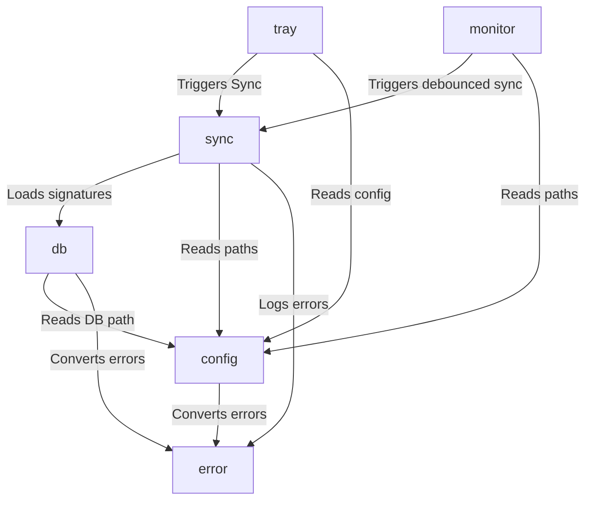
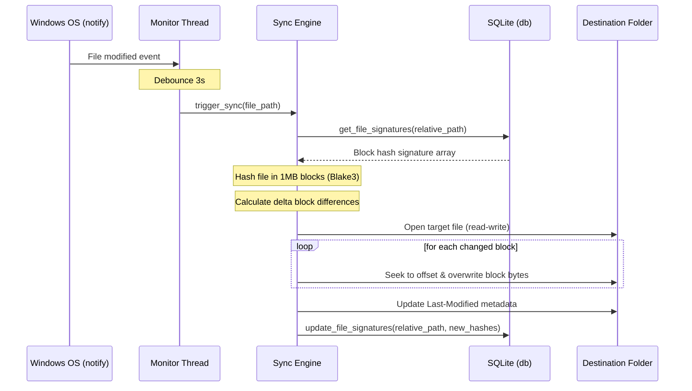
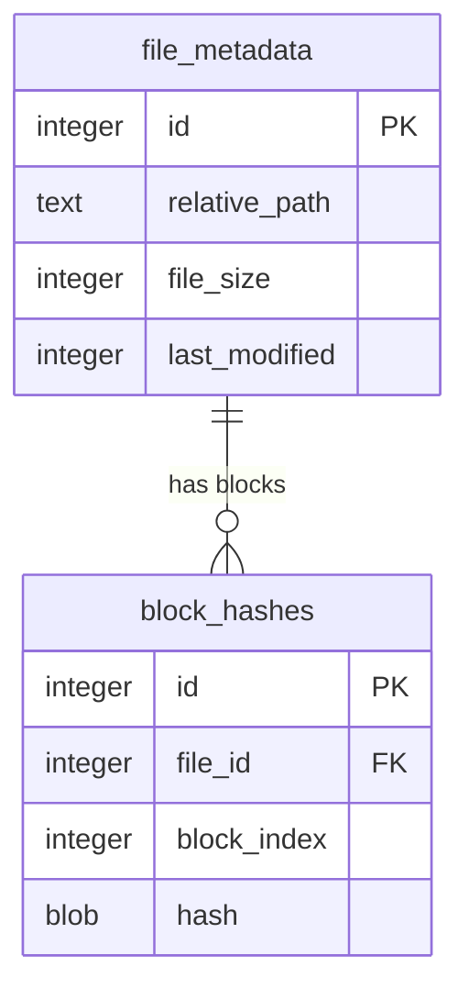

# Project Architecture: syncdir

This document outlines the architecture, design patterns, and contracts for the Windows user-session background sync utility `syncdir`.

## 1. Project Overview
`syncdir` is a lightweight, low-footprint Windows background utility that mirrors a source folder to a destination folder (which can be a local network-mapped share) using block-level delta synchronization. It is written in Rust, runs completely in user-space, and manages its interface via a Windows system tray icon.

## 2. Project Objectives & Key Features

### Primary Objectives
* **Bandwidth Optimization**: Minimize network traffic by only writing modified blocks of large files over the local network (SMB).
* **Zero Admin Requirements**: Run completely within the standard user's Windows login session without needing administrator privileges.
* **Instant & Reliable Sync**: Provide real-time sync for active folders while fallback scans guarantee eventually consistent file states.
* **Sleek UX**: Run silently in the background with a clean Windows system tray interface.

### Key Features
* **In-Place Block-Level Delta Sync**: Divide files >10MB into 1MB chunks and calculate cryptographic hashes (Blake3). Rewrite only modified blocks directly in the destination file using random-access writes.
* **Local Signature Cache**: Maintain a local SQLite database of block hashes for source files. This prevents downloading/reading destination files over the network CIFS/SMB share to verify differences.
* **Real-time File Watching**: Use Windows file change notifications via `ReadDirectoryChangesW` (debounced by 3 seconds) to capture changes immediately.
* **Archive on Deletion**: Move deleted or overwritten destination files to a `.syncdir_archive/` subfolder with a timestamp prefix to enable easy manual restore.
* **System Tray Menu**: Right-click menu containing "Open Config", "View Logs", "Sync Now", and "Exit".

### Non-Goals
* Two-way directory synchronization (strictly one-way source -> destination).
* WAN/Cloud optimization (designed purely for high-speed, local network/SMB shares).
* Complex Graphical Restore Interface (restore is handled manually via standard file explorer).

## 3. Language & Runtime
* **Language**: Rust (Edition 2021)
* **Runtime**: Windows 10 and above (User login session)
* **Toolchain**: `stable-x86_64-pc-windows-msvc` (MSVC Linker)

## 4. Project Layout
```
syncdir/
├── Cargo.toml            # Project dependencies and workspace config
├── GEMINI.md             # Operational rules and workflows
├── architecture.md       # Technical design (this file)
├── spec.md               # Behavioral specifications
├── context.md            # Decisions and history
├── .agents/              # TARS rules, workflows, and scripts
└── src/
    ├── main.rs           # Entry point and initialization
    ├── config.rs         # Configuration parsing and validation
    ├── db.rs             # SQLite local database management
    ├── sync.rs           # Delta sync engine and chunking logic
    ├── monitor.rs        # ReadDirectoryChangesW thread
    ├── tray.rs           # System tray icon event loop
    └── error.rs          # Project-wide error definitions
```

## 5. Module Boundaries

### `config`
* **Owns**: Parsing `config.toml` from `%APPDATA%\syncdir\config.toml`, validation of directory paths, and runtime settings.
* **Does NOT own**: Filesystem synchronization, database access.
* **Trait Interfaces**: None.

### `db`
* **Owns**: Connection management to local SQLite database, SQL schemas, recording and retrieving file metadata and block signatures.
* **Does NOT own**: Calculating block hashes or filesystem read/writes.
* **Trait Interfaces**:
  * `HashStore`: Interface for persisting and querying file block signatures.
* **Mock Availability**: `MockHashStore` will be implemented for sync engine testing.

### `sync`
* **Owns**: Scanning directory trees, comparing source/destination state, hashing files in 1MB blocks via Blake3, performing in-place block updates, and handling deletions (moving to archive).
* **Does NOT own**: Watching directories, UI interactions.
* **Trait Interfaces**:
  * `SyncEngine`: Core sync execution controller.
* **Mock Availability**: `MockSyncEngine` for UI/tray triggers.

### `monitor`
* **Owns**: Starting and running the directory monitoring thread (`ReadDirectoryChangesW`), grouping/debouncing file events.
* **Does NOT own**: Sync execution (delegates to `SyncEngine`).

### `tray`
* **Owns**: Creating the system tray icon, registering menu event handlers, executing the windowless message pump, displaying system toast notifications.
* **Does NOT own**: Filesystem watching or database execution.

---

## 6. Dependency Direction Rules

| Module | May Import | Must NOT Import |
|--------|-----------|-----------------|
| `tray` | `sync`, `config`, `monitor`, `error` | `db` (direct) |
| `monitor` | `sync`, `config`, `error` | `db`, `tray` |
| `sync` | `db` (trait), `config`, `error` | `monitor`, `tray` |
| `db` | `config`, `error` | `sync`, `monitor`, `tray` |
| `config` | `error` | `sync`, `db`, `monitor`, `tray` |
| `error` | None | All |

---

## 7. Toolchain
* **Formatter**: `cargo fmt --check`
* **Linter**: `cargo clippy -- -D warnings`
* **Test Runner**: `cargo test`
* **Verification Command**: `cargo fmt --check && cargo clippy -- -D warnings && cargo test`

## 8. Error Handling Strategy
* We use `thiserror` to define a single project-wide `SyncError` enum.
* Swallowing errors is strictly prohibited. If a sync fails (e.g. network share disconnects), it logs the warning and schedules a retry.
* Error propagation uses the standard `?` operator.

## 9. Observability & Logging
* **Framework**: `tracing` with `tracing-subscriber`.
* **Outputs**:
  * Dev: Stdout
  * Prod: `%APPDATA%\syncdir\sync.log`
* **Log Levels**: `INFO` for sync completion, `WARN` for recoverable errors, `ERROR` for crashes/network loss, `DEBUG` for file block comparisons.

## 10. Testing Strategy
* **Unit Tests**: Co-located `#[cfg(test)]` modules in `src/config.rs`, `src/db.rs`, and `src/sync.rs`.
* **Integration Tests**: `tests/sync_integration.rs` simulating standard files, deletions, and directory updates using `tempfile`.

## 11. Documentation Conventions
* Every public struct, trait, and function must be documented using standard triple-slash `///` comments.
* Module-level documentation must be present at the top of each file.

## 12. Dependencies & External Systems
* `notify` (v6): Cross-platform file monitoring wrapping `ReadDirectoryChangesW` on Windows.
* `rusqlite`: Connection to local embedded SQLite database.
* `blake3`: Extremely fast cryptographic hashing.
* `tray-icon` (v0.14) & `winit` (v0.29): For system tray creation and event loop.
* `serde` & `toml`: Parsing `config.toml`.
* `thiserror`: Unified error handling.

## 13. Architecture Diagrams

### Module Interaction Graph


### Data Flow Diagram (Sync Action)


## 14. Known Constraints & Technical Debt
* **Network Latency**: If the network connection to the destination mapped share drops, `syncdir` will record the failure, skip sync for the file, and attempt to sync during the next periodic scan or when the share becomes reachable.
* **Local DB Location**: Stored in `%APPDATA%\syncdir\sigcache.db`. If deleted, it will rebuild automatically during the next full scan by hashing the source directory.

## 15. Data Model

### SQLite Cache Schema

| Column | Type | Constraints | Notes |
|--------|------|-------------|-------|
| **Table: file_metadata** | | | |
| `id` | INTEGER | PK, AUTOINCREMENT | File record ID |
| `relative_path` | TEXT | NOT NULL, UNIQUE | Relative file path from source root |
| `file_size` | INTEGER | NOT NULL | Last known size of the file |
| `last_modified` | INTEGER | NOT NULL | Last modified Unix timestamp |
| | | | |
| **Table: block_hashes** | | | |
| `id` | INTEGER | PK, AUTOINCREMENT | Block record ID |
| `file_id` | INTEGER | FK (file_metadata.id) ON DELETE CASCADE | Reference to file |
| `block_index` | INTEGER | NOT NULL | Zero-indexed chunk position |
| `hash` | BLOB | NOT NULL | Blake3 256-bit hash (32 bytes) |



### Migration Strategy
Migrations are managed in `src/db.rs` programmatically. At startup, `db` runs a `CREATE TABLE IF NOT EXISTS` statement for both tables to guarantee schema availability.

## 16. Environment Configuration
No external APIs or environment variables are required. Configuration is loaded entirely from `%APPDATA%\syncdir\config.toml` containing:

```toml
source_dir = "C:/Users/username/Documents"
dest_dir = "Z:/Backup"
debounce_seconds = 3
propagate_deletions = true
block_sync_threshold_bytes = 10485760 # 10MB
block_size_bytes = 1048576 # 1MB
verify_writes = true # Verify rewritten blocks by hashing read-back bytes
```
