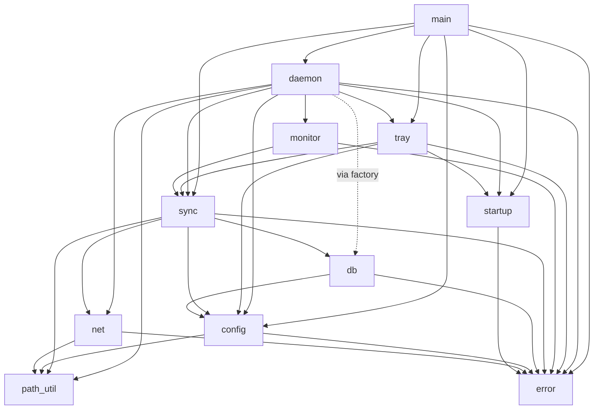
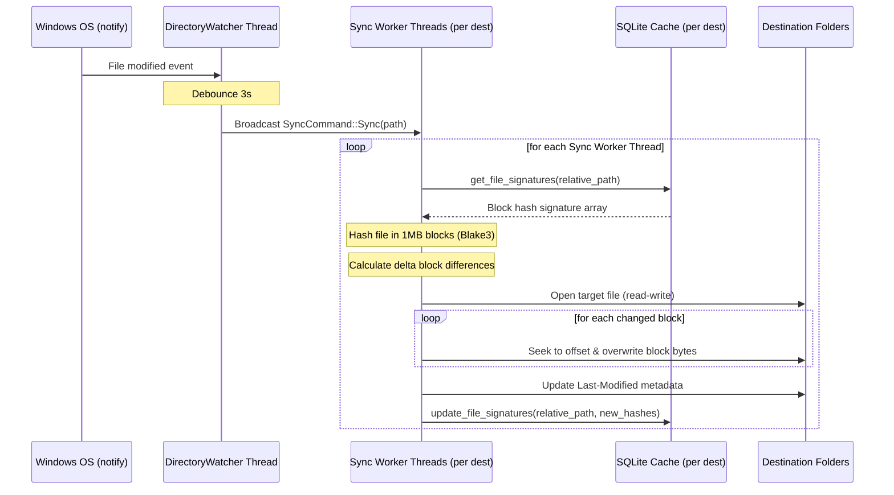
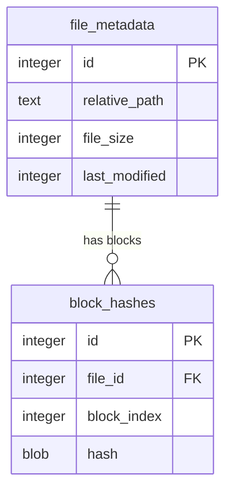

# Project Architecture: syncdir

This document outlines the architecture, design patterns, and contracts for the Windows user-session background sync utility `syncdir`.

## 1. Project Overview
`syncdir` is a lightweight, low-footprint Windows background utility that mirrors a local source folder to one or more destination directories (local folders or mapped network shares) in real-time. It is written in Rust, runs completely in user-space, and manages its user interface and health status indicators via a Windows system tray icon.

## 2. Project Objectives & Key Features

### Primary Objectives
* **Bandwidth Optimization**: Minimize network traffic by only writing modified blocks of large files over the local network (SMB).
* **Zero Admin Requirements**: Run completely within the standard user's Windows login session without needing administrator privileges.
* **Instant & Reliable Sync**: Provide real-time sync for active folders while fallback scans guarantee eventually consistent file states.
* **Sleek UX**: Run silently in the background with a clean Windows system tray interface and dynamic status reporting.

### Key Features
* **In-Place Block-Level Delta Sync**: Divide files >10MB into 1MB chunks and calculate cryptographic hashes (Blake3). Rewrite only modified blocks directly in the target destination files using random-access writes.
* **Local Signature Caches**: Maintain isolated local SQLite databases of block hashes for each destination. This prevents downloading or reading destination files over network CIFS/SMB shares to verify differences.
* **Real-time File Watching**: Use a central Windows directory notification hook via `ReadDirectoryChangesW` (debounced by 3 seconds) that broadcasts events to independent destination workers.
* **Archive on Deletion**: Move deleted or overwritten destination files to a `.syncdir_archive/` subfolder on the target share with a timestamp prefix to enable easy manual restore.
* **Startup Target Telemetry & Diagnostic Logging**: On launch, `syncdir` queries Windows Registry (`HKLM\SOFTWARE\Microsoft\Windows NT\CurrentVersion`) for OS version/edition, build number, arch, hostname, username, and app version (`SystemDiagnosticInfo::collect()`). It tests reachability (`dest.exists()`) for each resolved target and logs `INFO` (online) or `WARN` (unreachable).
* **System Tray Menu**: Right-click menu displaying status details for each configured destination, with options to "Open Config", "Reload Config" (validates configuration, returns `TrayExitReason::Restart` to `main()`, unregisters tray icon, and re-launches process), "View Logs", "Sync Now", "Start on System Startup" (registry auto-start toggle), "About" (version & copyright modal), and "Exit".
* **Single-Instance Process Execution**: On boot, `syncdir` acquires a session-local named Win32 mutex (`Local\syncdir_single_instance`) wrapped in a `SingleInstanceGuard` RAII handle. If another instance is already running, the secondary process outputs a message to stderr and exits with code 0 without spawning duplicate tray icons.

### Non-Goals
* Two-way directory synchronization (strictly one-way source -> destination).
* WAN/Cloud optimization (designed purely for high-speed, local network/SMB shares).
* Complex Graphical Restore Interface (restore is handled manually via standard file explorer).

## 3. Language & Runtime
* **Language**: Rust (Edition 2024)
* **Runtime**: Windows 10 and above (User login session)
* **Toolchain**: `stable-x86_64-pc-windows-msvc` (MSVC Linker)

## 4. Project Layout
```
syncdir/
├── Cargo.toml            # Project dependencies and workspace config
├── Cargo.lock            # Cargo lockfile
├── build.rs              # Windows PE executable resource compilation script (winres)
├── syncdir.ico           # 32x32 32bpp Windows application icon asset
├── LICENSE               # Project MIT license
├── README.md             # Project README documentation
├── architecture.md       # Technical design (this file)
├── spec.md               # Behavioral specifications
├── context.md            # Decisions and history
├── .agents/              # TARS rules, workflows, and scripts
├── tests/
│   ├── integration_tests.rs # Integration testing suite (12 scenarios)
│   ├── property_tests.rs    # Proptest generative invariant suites (8 properties)
│   ├── snapshot_tests.rs    # Insta golden snapshot tests (20 snapshots)
│   └── snapshots/           # Insta snapshot golden files
└── src/
    ├── lib.rs            # Crate library root and module declarations
    ├── main.rs           # Daemon entry point, runner orchestration, and telemetry
    ├── daemon.rs         # Background daemon lifecycle and worker orchestration
    ├── config.rs         # Configuration parsing and TOML path validation
    ├── path_util.rs      # Path canonicalization and normalization leaf
    ├── net.rs            # Win32 network UNC and mapped drive FFI
    ├── db.rs             # SQLite local database cache layer
    ├── error.rs          # Project-wide error definitions
    ├── monitor.rs        # ReadDirectoryChangesW event monitor
    ├── startup.rs        # Platform-specific registry auto-start hook
    ├── sync/             # Block delta sync engine and background workers
    │   ├── mod.rs        # Module facade and public exports
    │   ├── archive.rs    # Deletion archiving and archive retention pruning
    │   ├── delta.rs      # Blake3 block hashing and delta sync logic
    │   ├── engine.rs     # Core SyncEngine trait implementation and file operations
    │   ├── mock.rs       # In-memory MockSyncEngine for unit and integration testing
    │   ├── path_safety.rs# Reparse point and path traversal security checks
    │   ├── scanner.rs    # Recursive directory scanning and change detection
    │   ├── small_file.rs # Fast path small file copying and verification
    │   └── worker.rs     # Worker thread lifecycle, debouncing, and retry queues
    ├── tray.rs           # System tray icon event loop, menus, and process execution
    └── tray/
        └── assets.rs     # Compile-time icon RGBA buffer generation, .rdata tables, and icon cache
```

## 5. Module Boundaries

### `config`
* **Owns**: Parsing `config.toml` from `%APPDATA%\syncdir\config.toml`, strongly-typed path domain modeling via `TargetDir` (`TargetDir::new` enforcing drive roots `R:\`, UNC repair `\\172...`, and slash conversion at construction) and `DestinationCollection` (encapsulating destination lists with Windows case-insensitive deduplication while strictly preserving insertion order), encapsulated `TargetSyncConfig` with private fields and `TargetSyncConfigBuilder` enforcing construction invariants (non-empty destination collections, path format validation, recursive sync loop containment via `validate_target_containment`, strictly positive debounce and retry intervals, block size caps $\le 64$MB and positivity, and `block_sync_threshold_bytes >= block_size_bytes`), zero-copy `destinations()` slice, Serde backward-compatibility bridging via `RawConfig`, quote-aware TOML bracket parsing (`preprocess_config_toml`), strict path format validation (`Config::validate()` and `TargetDir::validate()` enforcing UNC network prefixes `\\` or drive letter targets `C:\`, `X:\`), and runtime settings.
* **Does NOT own**: Network path resolution (delegated to `net`), filesystem synchronization, database access.
* **Trait Interfaces**: None.

### `path_util`
* **Owns**: Crate-private path canonicalization leaf (`normalize_path`), drive root slash repair (`C:` -> `C:\`), single-backslash root normalization (`\` -> `\`), UNC backslash preservation, UNC host/share parsing (`parse_unc_host_and_share`), and lexical parent component collapsing (`collapse_components`). Pure leaf module with zero internal crate dependencies, resolving the historical circular dependency between `config` and `net`.
* **Does NOT own**: Filesystem access, configuration modeling, network resolution.
* **Trait Interfaces**: None.

### `net`
* **Owns**: Win32 network UNC and mapped drive FFI (`WNetGetConnectionW`, `WNetAddConnection2W`), `find_mapped_drive_for_unc` with `GetLogicalDrives()` bitmask optimization and Unicode prefix boundary detection, `try_resolve_alternate_path` translating between drive letters and UNC paths, and stack-allocated `[0u16; 512]` buffer management with clamped slice length.
* **Does NOT own**: Config parsing, database operations, sync worker logic.
* **Trait Interfaces**:
  * `NetworkResolver`: Trait abstraction for UNC alternate path resolution and authenticated SMB sessions.
* **Mock Availability**: `MockNetworkResolver` (implemented in `src/net.rs`) with configurable mappings and simulated SMB connection failures for unit testing.

### `daemon`
* **Owns**: Background daemon lifecycle (`SyncDaemon`), generic worker orchestration via `SyncEngineFactory` (`SqliteEngineFactory`), non-blocking asynchronous startup (deferring network checks to background threads), central directory watcher thread coordination (`spawn_watcher_coordinator`), command broadcasting (`spawn_command_broadcaster`), target sync loop validation against network shares (`SyncDaemon::validate_target_loops` accepting `&dyn NetworkResolver`), reconnection scan triggering, `DaemonHandle`, and RAII shutdown (`perform_shutdown`).
* **Does NOT own**: Low-level delta sync hashing, schema migrations, tray UI event loop.
* **Trait Interfaces**:
  * `SyncEngineFactory`: Abstract factory interface for engine instantiation per target directory.

### `db`
* **Owns**: Connection management to isolated local SQLite databases with WAL mode (`PRAGMA journal_mode = WAL`, `PRAGMA synchronous = NORMAL`, `foreign_keys = ON`), composite index `idx_block_hashes_file_block` on `(file_id, block_index)`, unique index `idx_file_metadata_relative_path`, prepared statement caching (`prepare_cached`), schema versioning (`db_version = "4"`), recording and retrieving file metadata and fixed 32-byte block digests (`BlockHash = [u8; 32]`), path-keyed block hash lookups, single-query bulk metadata preload (`list_all_records`), single-block UPSERT updates with `RETURNING id` (`save_file`), in-place path key sanitization (`.drain()`), and safe directory deletion via exact prefix matching `substr(relative_path, 1, length(?1) + 1) = ?1 || '/'`. Generates separate cache database files (`sigcache_<hash>.db`) named using the Blake3 hash of the target path to prevent collisions.
* **Does NOT own**: Calculating block hashes or filesystem read/writes.
* **Trait Interfaces**:
  * `HashStore`: Interface for persisting and querying file block signatures (`BlockHash`).
* **Mock Availability**: `MockHashStore` (implemented in `src/db.rs`) for in-memory unit testing.

### `sync`
* **Owns**: Scanning directory trees with symlink and intermediate directory junction skipping (`verify_destination_not_reparse` validating all ancestor components) and recursion depth limits (`scan_dir` skipping `PermissionDenied` folders), path safety validation (`is_safe_relative_path`), comparing source/destination state with ±2000 ms SMB timestamp tolerance (`is_metadata_up_to_date_raw`), fast-path metadata bypass before hashing, 64KB streamed small-file write verification (`verify_small_file_write`), worker scratch buffer reuse in delta sync, TOCTOU file length truncation protection using actual streamed byte counts, delta sync destination existence checking, robust chunked reads (`read_block`), hashing files in 1MB blocks via Blake3 returning `BlockHash` arrays, performing in-place block updates, reusable dirty range buffer memory management (`DirtyBlockRange::reset`), decoupled periodic and post-full-scan archive pruning (`prune_archive` enforcing recursion depth $\le 32$), Windows case-insensitive deletion detection in `run_full_scan`, worker sub-components (`DebounceQueue`, `ReachabilityMonitor`, `SyncWorkerState`), thread-safe source presence tracking (`SourceConnectivityTracker`), and running background worker loops (`start_sync_worker`) with exponential backoff retries on `WriteVerificationFailed` and permanent validation error eviction.
* **Submodules**:
  * `sync::engine`: Core `SyncEngine` trait and concrete implementation for file sync/deletion and scan execution.
  * `sync::delta`: In-place delta synchronization, chunked file reading, Blake3 block hashing, and dirty range management.
  * `sync::small_file`: Fast-path atomic small-file streaming, write verification, and staging.
  * `sync::scanner`: Directory traversal, case-insensitive deletion detection, cancellation, and safety threshold checks.
  * `sync::archive`: Retention-based archive subfolder management, timestamped backups, and safe directory pruning.
  * `sync::path_safety`: Win32 reparse point validation, ancestor junction guards, and path traversal defenses.
  * `sync::worker`: Background worker lifecycle, debounce priority queues, exponential backoff, and reachability tracking.
  * `sync::mock`: Thread-safe mock implementation (`MockSyncEngine`) for unit and integration testing.
* **Does NOT own**: Watching directories, UI interactions, daemon lifecycle.
* **Trait Interfaces**:
  * `SyncEngine`: Core sync execution controller (featuring `sync_file`, `sync_file_buffered`, `sync_file_to_dest_buffered`, `delete_file`, `delete_file_from_dest`, `prune_archive`, `run_full_scan`).
  * `SyncStatusObserver`: Decoupled listener interface for target destination connectivity transitions.
* **Mock Availability**: `MockSyncEngine` (implemented in `src/sync/mock.rs`) with dynamic sync/delete handlers, failure injection, and thread-safe call recording.

### `monitor`
* **Owns**: Starting the central directory watcher thread (`ReadDirectoryChangesW`) wrapped in `#[must_use]` `DirectoryWatcher`, empty relative path filtering, debouncing file events, and broadcasting `SyncCommand` events to destination sync workers via crossbeam/std mpsc channels. Visibility of `dispatch_event` restricted to `pub(crate)`. Decoupled from `Config` (ISP fix accepting `impl AsRef<Path>`).
* **Does NOT own**: Config parsing, sync execution (delegates to `SyncEngine` worker threads).

### `main`
* **Owns**: Application entry point, CLI argument parsing, single-instance process mutex acquisition (`acquire_single_instance_mutex` / `SingleInstanceGuard`), dual-writer logging setup, system diagnostic telemetry collection (`SystemDiagnosticInfo::collect()`), panic hook registration, process restart handoff (dropping mutex guard before spawning new process), and `WinitStatusObserver` adapter connecting `start_sync_worker` to the tray event loop.
* **Does NOT own**: Filesystem watching, tray menu construction, or SQLite database operations.

### `tray`
* **Owns**: Creating the system tray icon, registering menu event handlers, executing the windowless message pump, displaying system toast notifications, signaling clean process restart via `TrayExitReason` enum return from `run_tray`, displaying native error modal dialogs (`show_error_dialog`), event dispatching and UI loop abstraction via `TrayController`, managing `TrayState` (pure state container tracking strongly-typed `ConnectivityState` and `WatcherState` domain enum transitions, online destination counts, scan notices, and tooltip text formatting without Win32/winit UI side-effects), `DestinationState` parameter grouping with encapsulated precomputed `display_label`, state-transition-gated repaint Win32 IPC (suppressing duplicate `Shell_NotifyIconW` calls), guarded config reload background thread execution, qualified `%SystemRoot%\explorer.exe` process execution (`open_path`), and toggling Windows startup registration via injected `RegistryBackend` trait (`run_tray<H, R>`).
* **Submodules**:
  * `tray::assets`: Compile-time 32×32 RGBA icon buffer generation (`const fn generate_status_rgba`), static `.rdata` tables (`STATUS_RGBA`), zero-panic array caching (`ICON_CACHE` via `OnceLock<[Icon; EngineStatus::COUNT]>`), and graceful healthy fallback.
* **Does NOT own**: Filesystem watching or database execution.

### `startup`
* **Owns**: Reading, registering, and unregistering Windows startup registry keys (`HKCU\Software\Microsoft\Windows\CurrentVersion\Run`).
* **Does NOT own**: Configuration validation, system diagnostic telemetry collection, or UI execution.
* **Trait Interfaces**:
  * `RegistryBackend`: Interface for Windows startup registry operations.
* **Mock Availability**: `MockStartupRegistry` (implemented in `src/startup.rs`) for cross-platform unit testing.

---

## 6. Dependency Direction Rules

| Module | May Import | Must NOT Import |
|--------|-----------|-----------------|
| `main` | `daemon`, `tray`, `config`, `sync`, `startup`, `error` | `db` (direct) |
| `daemon` | `config`, `net`, `monitor`, `sync`, `db` (via factory), `tray`, `startup`, `path_util`, `error` | `main` |
| `tray` | `sync`, `config`, `error`, `startup` (trait), `tray::assets` | `db` (direct), `main`, `daemon` |
| `tray::assets` | `EngineStatus` (super), `error`, `tray-icon` | All other modules |
| `monitor` | `sync`, `error` | `config`, `db`, `tray`, `main`, `daemon` |
| `sync` | `db` (trait), `config`, `net`, `path_util`, `error` | `monitor`, `tray`, `main`, `daemon` |
| `db` | `config`, `error` | `sync`, `monitor`, `tray`, `main`, `daemon` |
| `startup` | `config`, `error` | `sync`, `db`, `monitor`, `tray`, `main`, `daemon` |
| `net` | `path_util`, `error` | `config`, `sync`, `db`, `monitor`, `tray`, `main`, `daemon` |
| `config` | `path_util`, `error` | `net`, `sync`, `db`, `monitor`, `tray`, `main`, `daemon` |
| `path_util` | `std::path` only | All internal modules |
| `error` | None | All |

> **Cycle Resolution Note**: The historical circular dependency between `config` and `net` is permanently resolved by extracting path canonicalization into `path_util`. `config` imports `path_util` and `error` only; `net` imports `path_util` and `error` only. `monitor` does not import `config`, accepting `impl AsRef<Path>` instead.

---

## 7. Toolchain
* **Formatter**: `cargo fmt --check`
* **Linter**: `cargo clippy -- -D warnings`
* **Test Runner**: `cargo test`
* **Verification Command**: `cargo fmt --check && cargo clippy -- -D warnings && cargo test`

## 8. Error Handling Strategy
* We use `thiserror` to define a single project-wide `SyncError` enum with `#[non_exhaustive]`.
* Swallowing errors is strictly prohibited. If a sync fails (e.g. network share disconnects), it logs the warning and schedules a retry.
* Error propagation uses the standard `?` operator.
* **Causal Error Chains**: `SyncError` variants (`Db`, `Config`, `LockPoison`, `Watcher`, `Tray`, `Registry`) preserve causal error sources via `(String, #[source] Option<Box<dyn std::error::Error + Send + Sync>>)`. Dual constructors (`name` and `name_with_source`) exist for all multi-parameter variants.
* **Write Verification Failure Differentiation**: `SyncError::WriteVerificationFailed { path: PathBuf }` explicitly distinguishes data integrity verification mismatches from fatal syntax/configuration errors, allowing the worker loop to schedule exponential backoff retries rather than evicting files permanently.
* **Lock Poisoning Generalization**: `SyncError::LockPoison` represents general mutex poisoning across all modules rather than being coupled to database locks.
* **Startup Registry Error Handling**: Operations discriminate `std::io::ErrorKind::NotFound` from unexpected errors (e.g., access denied), preserving typed Win32 error causality.
* **Prevention Linting**: An ast-grep rule (`error-stringification-in-map-err`) enforces that errors inside `.map_err()` closures use `_with_source` constructors rather than lossy stringification.
* **Network Disconnect Classification**: `SyncError::is_network_offline()` inspects `std::io::Error::raw_os_error()` for Win32 SMB disconnect codes (53 `ERROR_BAD_NETPATH`, 59 `ERROR_UNEXP_NET_ERR`, 64 `ERROR_NETNAME_DELETED`, 67 `ERROR_BAD_NET_NAME`).
* **Panic-Free Architecture**: Production code contains zero `.unwrap()` or `.expect()` calls. Worker threads return `Result<JoinHandle<()>, SyncError>` and worker execution loops handle errors gracefully with retry queues.
* **Timestamp Safety**: File modification timestamps are normalized via `safe_modified_millis()` (clamping pre-1970 timestamps to 0 with warning logs) and restored via `safe_epoch_duration_millis()` (preventing wrapping integer underflow on `src_mod as u64`).


## 9. Observability & Logging
* **Framework**: `tracing` with `tracing-subscriber`.
* **Outputs**:
  * Dev: Stdout
  * Prod: `%APPDATA%\syncdir\logs\syncdir.log.YYYY-MM-DD` (daily log rotation via `tracing-appender`)
* **Log Levels**: `INFO` for file copy telemetry and target reachability, `WARN` for recoverable errors/unreachable targets, `ERROR` for crashes/network loss, `DEBUG` for file block comparisons.

## 10. Testing Strategy
* **Test Suite Metrics**: 274 total automated tests passing with zero regressions and zero warnings across all targets (224 unit tests in `src/lib.rs`, 3 in `src/main.rs`, 12 integration tests, 8 property tests, 20 snapshot tests, and 7 doc-tests).
* **Unit Tests**: Co-located `#[cfg(test)]` modules across `src/config.rs` (path normalization, mapped drive resolution, block size/threshold validation, builder invariants), `src/net.rs` (Win32 FFI buffer safety and mapped drive lookups), `src/db.rs` (CRUD, exact prefix cascade deletion, BlockHash signatures), `src/path_util.rs` (lexical parent component collapsing, UNC parsing), `src/startup.rs`, `src/tray.rs` (testing `TrayState` status transitions, open_path qualification, and tooltip text formatting), and the decomposed `src/sync/` submodules:
  * `src/sync/engine.rs`: Metadata timestamp tolerances, TOCTOU size protection, and directory creation.
  * `src/sync/delta.rs`: Blake3 chunk hashing, delta sync dirty block updates, and read-back verification.
  * `src/sync/small_file.rs`: Fast-path atomic staging, sampled verification, and zero-byte files.
  * `src/sync/scanner.rs`: Directory traversal recursion limits, permission bypass, and case-insensitive deletion detection.
  * `src/sync/path_safety.rs`: Traversal defense, reserved DOS devices, ADS rejection, and ancestor junction caching.
  * `src/sync/worker.rs`: Debounce min-heap queue stress testing, exponential backoff, and reachability tracking.
  * `src/sync/mock.rs`: Recording mock engine verification.
* **Integration Tests**: `tests/integration_tests.rs` (12 tests) simulating standard files, deletions, directory updates, configuration reload validation, rename event pairing, worker reachability offline drain guards, subsecond precision, and `run_tray` interface compilation.
* **Snapshot Tests**: `tests/snapshot_tests.rs` (20 tests) using `insta` (v1) for regression-guarding snapshot assertions on `Config` debug formatting, validation errors (including zero block size/threshold and zero debounce), `SyncError` display output (including `SyncError::WriteVerificationFailed` and `SyncError::Registry`), `TargetSyncConfig`, and `FileRecord` structures.
* **Property-Based Tests**: `tests/property_tests.rs` (8 tests) using `proptest` (v1) for invariant validation (block boundary division, TOML round-tripping, `is_metadata_up_to_date_raw` timestamp delta evaluation across ±10000ms, `DirtyBlockRange` chunk coalescing, path traversal safety wired directly to `is_safe_relative_path`, sync idempotency, and delta sync single-block isolation).
* **Assertions & Structural Diffing**: `pretty_assertions` (v1) for colorized diff output on test failure assertions across all test modules.
* **Shared Test Fixtures**: `Config::test_default()` helper for consistent test configuration across unit and integration tests.
* **Comprehensive In-Memory Mocks**: Four isolated mock implementations providing 100% test isolation:
  * `MockHashStore` (`src/db.rs`): In-memory signature store without SQLite I/O.
  * `MockStartupRegistry` (`src/startup.rs`): In-memory registry backend without HKCU mutation.
  * `MockNetworkResolver` (`src/net.rs`): In-memory drive/UNC translator and SMB failure simulator.
  * `MockSyncEngine` (`src/sync/mock.rs`): Thread-safe recording sync engine with dynamic handler injection.

## 11. Documentation Conventions
* Every public struct, trait, and function must be documented using standard triple-slash `///` comments.
* Module-level documentation must be present at the top of each file.

## 12. Dependencies & External Systems
* **Production Dependencies**:
  * `notify` (v6): Cross-platform file monitoring wrapping `ReadDirectoryChangesW` on Windows.
  * `rusqlite`: Connection to local embedded SQLite database.
  * `blake3`: Extremely fast cryptographic hashing.
  * `tray-icon` (v0.14) & `winit` (v0.29): For system tray creation and event loop.
  * `serde` & `toml`: Parsing `config.toml`.
  * `thiserror`: Unified error handling.
  * `winres` (v0.1, Windows target build-dependency): Windows PE binary resource compilation embedding `syncdir.ico` application icon.
* **Development & Testing Dependencies**:
  * `tempfile` (v3): Temporary directory creation for integration tests.
  * `pretty_assertions` (v1): Colorized structural diff assertions.
  * `insta` (v1): Snapshot testing engine.
  * `proptest` (v1): Generative property-based testing framework.
* **Developer & Agent Tooling**:
  * `Narsil MCP`: Code intelligence for blast radius analysis, import graph, symbol discovery, and security scanning.
  * `Sequential Thinking MCP`: Structured multi-step reasoning for planning and audit phases.
  * `Context7 MCP`: Upstream documentation lookup for external crate APIs.
  * `Knowledge-RAG MCP` (`search_knowledge`): Local knowledge index for pre-ingested dependency API docs and TARS rule context. Query-first convention across `/toolcheck`, `/build`, `/plan-making`, `/feature`, `/issue`.

## 13. Architecture Diagrams

### Module Interaction Graph

```mermaid
graph TD
    main --> daemon & tray & config & sync & startup & error
    daemon --> config & net & monitor & sync & tray & startup & path_util & error
    daemon -.->|via factory| db
    tray --> sync & config & error & startup
    monitor --> sync & error
    sync --> db & config & net & path_util & error
    db --> config & error
    config --> path_util & error
    net --> path_util & error
    startup --> error
```

### Data Flow Diagram (Sync Action)

```mermaid
sequenceDiagram
    participant OS as Windows OS (notify)
    participant Mon as DirectoryWatcher Thread
    participant Workers as Sync Worker Threads (per dest)
    participant DB as SQLite Cache (per dest)
    participant FS as Destination Folders
    
    OS->>Mon: File modified event
    Note over Mon: Debounce 3s
    Mon->>Workers: Broadcast SyncCommand::Sync(path)
    loop for each Sync Worker Thread
        Workers->>DB: get_file_signatures(relative_path)
        DB-->>Workers: Block hash signature array
        Note over Workers: Hash file in 1MB blocks (Blake3)
        Note over Workers: Calculate delta block differences
        Workers->>FS: Open target file (read-write)
        loop for each changed block
            Workers->>FS: Seek to offset & overwrite block bytes
        end
        Workers->>FS: Update Last-Modified metadata
        Workers->>DB: update_file_signatures(relative_path, new_hashes)
    end
```

## 14. Known Constraints & Technical Debt
* **Network Latency & Disconnect Resiliency**: If the network connection to a destination mapped share drops, `syncdir` records the failure for that specific target worker, falls back to the resolved UNC path via `NetworkResolver`, skips sync for the file, and retries with exponential backoff or during the next periodic scan when the share becomes reachable.
* **Local DB Location**: Stored in `%APPDATA%\syncdir\sigcache_<hash>.db` (where `<hash>` is the Blake3 hash of the destination directory path). If deleted, it will rebuild automatically during the next full scan by hashing the source directory.
* **UNC Path TOML Escaping Gotcha**: In standard TOML, double-quoted strings (`"\\172.16.0.60\share"`) unescape `\\` to a single backslash (`\172.16...`). `syncdir` works around this by pre-processing TOML strings to convert `\\` to `\\\\` before parsing, defensively auto-correcting single-leading-backslash UNC paths (`\172...` -> `\\172...`), and recommending single-quoted literal strings (`'\\172.16.0.60\share'`) or forward slashes (`"//172.16.0.60/share"`).
* **Startup Registry Decoupling**: Fully resolved via DIP refactoring (`run_tray<H, R>` receives registry backend implementation by value, decoupling UI from static Win32 registry calls).
* **Database Version 4 & Schema Optimization**: With `db_version` bumped to `"4"`, SQLite PRAGMAs enable WAL mode, foreign keys, normal synchronization, composite indexing on `block_hashes(file_id, block_index)`, exact prefix matching `substr(relative_path, 1, length(?1) + 1) = ?1 || '/'`, and `RETURNING id` UPSERTs. Old caches from previous schema versions are automatically invalidated and rebuilt on startup.
* **Intermediate Ancestor Junction Protection**: Windows directory junctions and symlinks are actively audited via `verify_destination_not_reparse` along every ancestor component between the destination root and the target file, guarding against junction traversal attacks.

## 15. Data Model

### SQLite Cache Schema

| Column | Type | Constraints | Notes |
|--------|------|-------------|-------|
| **Table: file_metadata** | | | |
| `id` | INTEGER | PK, AUTOINCREMENT | File record ID |
| `relative_path` | TEXT | NOT NULL, UNIQUE | Relative file path from source root |
| `file_size` | INTEGER | NOT NULL | Last known size of the file |
| `last_modified` | INTEGER | NOT NULL | Last modified Unix timestamp |
| | | | |
| **Table: block_hashes** | | | |
| `id` | INTEGER | PK, AUTOINCREMENT | Block record ID |
| `file_id` | INTEGER | FK (file_metadata.id) ON DELETE CASCADE | Reference to file |
| `block_index` | INTEGER | NOT NULL | Zero-indexed chunk position |
| `hash` | BLOB | NOT NULL | Blake3 256-bit hash (32 bytes: `BlockHash`) |

* **Indexes**: `idx_block_hashes_file_block` on `block_hashes (file_id, block_index)` for O(log N) block lookup performance.
* **PRAGMAs**: `journal_mode = WAL`, `synchronous = NORMAL`, `foreign_keys = ON`, `temp_store = MEMORY`.


```mermaid
erDiagram
    file_metadata ||--o{ block_hashes : "has blocks"
    file_metadata {
        integer id PK
        text relative_path
        integer file_size
        integer last_modified
    }
    block_hashes {
        integer id PK
        integer file_id FK
        integer block_index
        blob hash
    }
```

### Migration Strategy
Migrations are managed in `src/db.rs` programmatically. At startup, `db` runs a `CREATE TABLE IF NOT EXISTS` statement for both tables and creates the composite index to guarantee schema availability. Metadata table checks enforce `db_version` compatibility.

## 16. Environment Configuration
No external APIs or environment variables are required. Configuration is loaded entirely from `%APPDATA%\syncdir\config.toml` containing:

```toml
source_dir = "C:/Users/username/Documents"

# Multiple destinations:
dest_dirs = [
    "Z:/Backup",
    "Y:/SecondaryBackup"
]

# Single destination fallback (backward-compatible):
# dest_dir = "Z:/Backup"

debounce_seconds = 3
retry_interval_seconds = 10
propagate_deletions = true
block_sync_threshold_bytes = 10485760 # 10MB
block_size_bytes = 1048576 # 1MB
verify_writes = true # Verify rewritten blocks by hashing read-back bytes
```
