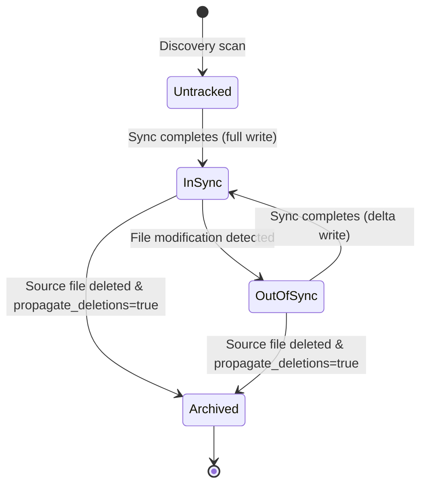
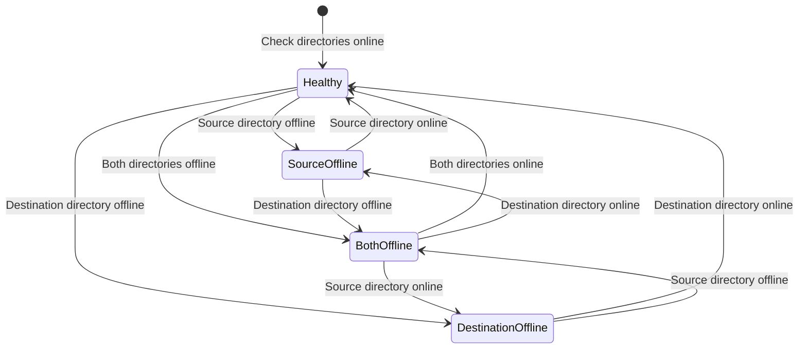

# Behavioral Specification: syncdir
 
> Last verified against: 09bf1e0
 
| Field | Value |
|-------|-------|
| **Project** | syncdir |
| **Version** | 1 |
| **Last Updated** | 2026-07-14 |

---

## Module/Component Contracts

### 1. Config Module
 
> Handles configuration file loading and validation.
 
#### Public API
 
| Function | Signature | Returns | Errors |
|----------|-----------|---------|--------|
| `Config::load` | `(path: &Path) -> Result<Config, SyncError>` | `Config` | `SyncError::Io` (read failed), `SyncError::Config` (parse failure) |
| `Config::validate` | `(&self) -> Result<(), SyncError>` | `()` | `SyncError::Validation` (Invalid parameters like zero debounce/retry interval) |
 
#### Behavioral Scenarios
 
[HAPPY] Config file successfully loaded and validated
GIVEN a configuration file at a valid path with source "C:/Src" and destination "D:/Dest" (both accessible folders)
WHEN `load` is called followed by `validate`
THEN a valid `Config` struct is returned
AND validation succeeds
 
[HAPPY] Missing source directory at startup (soft validation)
GIVEN a config where `source_dir` points to a non-existent path "X:/Invalid"
WHEN `validate` is called
THEN validation succeeds
AND a warning is logged
 
[ERROR] Zero debounce seconds
GIVEN a config where `debounce_seconds` is zero
WHEN `validate` is called
THEN `SyncError::Validation("Debounce seconds must be greater than zero")` is returned

[ERROR] Zero retry interval seconds
GIVEN a config where `retry_interval_seconds` is zero
WHEN `validate` is called
THEN `SyncError::Validation("Retry interval seconds must be greater than zero")` is returned


### 2. DB Module (HashStore)

> Manages the local persistence of file signatures and metadata.

#### Public API

| Function | Signature | Returns | Errors |
|----------|-----------|---------|--------|
| `get_file` | `(&self, path: &str) -> Result<Option<FileRecord>, SyncError>` | `Option<FileRecord>` | `SyncError::Db` |
| `save_file` | `(&self, record: &FileRecord, hashes: &[Vec<u8>]) -> Result<(), SyncError>` | `()` | `SyncError::Db` |
| `delete_file` | `(&self, path: &str) -> Result<(), SyncError>` | `()` | `SyncError::Db` |

#### Behavioral Scenarios

[HAPPY] Retrieve existing file signatures
GIVEN a SQLite database containing file metadata and hashes for "documents/notes.txt"
WHEN `get_file` is called with path "documents/notes.txt"
THEN a `FileRecord` is returned containing the matching file size, last modified time, and block hashes

[HAPPY] Save new file signatures
GIVEN a file "notes.txt" with size 1500 bytes and two block hashes
WHEN `save_file` is called
THEN the record is written to `file_metadata` and the hashes are written to `block_hashes` with correct foreign keys
AND subsequent calls to `get_file` return the written data

[HAPPY] Delete file metadata
GIVEN an existing record for "notes.txt" in the database
WHEN `delete_file` is called
THEN the metadata record and all associated block hashes are deleted (cascaded) from the database

### 3. Sync Module (SyncEngine)
 
> Performs delta comparison, block-level updates, and runs the background daemon queue processing.
 
#### Public API
 
| Function / Component | Signature | Returns | Errors |
|----------------------|-----------|---------|--------|
| `sync_file` | `(&self, relative_path: &str) -> Result<(), SyncError>` | `()` | `SyncError::Io`, `SyncError::Db` |
| `delete_file` | `(&self, relative_path: &str) -> Result<(), SyncError>` | `()` | `SyncError::Io` |
| `run_full_scan` | `(&self) -> Result<(), SyncError>` | `()` | `SyncError::Io`, `SyncError::Db` |
| `start_sync_worker` | `(config: Config, db: S, rx: Receiver<SyncCommand>, tx: Sender<SyncCommand>, event_proxy: Option<EventLoopProxy<UserEvent>>) -> JoinHandle<()>` | `JoinHandle<()>` | — |
 
#### Behavioral Scenarios
 
[HAPPY] Sync large modified file with block delta sync and write verification
GIVEN a source file of size 12MB (threshold is 10MB) where block 3 (offset 2MB-3MB) was modified
AND the destination file exists
AND the local database has signatures matching the old state
AND `verify_writes = true` in config
WHEN `sync_file` is called
THEN block 3 is hashed, compared, and identified as modified
AND the destination file is opened in place, seeked to offset 2,097,152 (2MB), and modified with the new 1MB block data
AND the engine seeks back to offset 2,097,152 on the destination, reads the written block back, and verifies its Blake3 hash matches the source block hash
AND other blocks are NOT sent over the network
AND the database is updated with the new block 3 signature
 
[HAPPY] Timestamp alignment on successful sync
GIVEN a successful file sync operation
WHEN all sync writes complete
THEN the engine sets the destination file's last-modified timestamp to exactly match the source file's last-modified timestamp
AND the local SQLite cache is updated with this matching timestamp
 
[HAPPY] Sync small modified file using standard copy
GIVEN a source file of size 5MB (below threshold) with a modified timestamp
WHEN `sync_file` is called
THEN the entire file is copied to the destination path
AND the destination file's last-modified timestamp is set to match the source file's
AND the local database metadata is updated with size and modification timestamp
 
[HAPPY] Handle source deletion with propagate_deletions enabled
GIVEN `propagate_deletions = true` in config
AND a file "documents/notes.txt" was deleted in the source
WHEN `delete_file` is called for "documents/notes.txt"
THEN the destination file is moved to `.syncdir_archive/<timestamp>_documents/notes.txt`
AND the metadata record is deleted from the database
 
[EDGE] Destination file is missing on share
GIVEN a source file "notes.txt" with signatures in the local database
AND the destination file is missing on the network share
WHEN `sync_file` is called
THEN a full copy of the file is created at the destination
AND the destination file's last-modified timestamp is set to match the source file's
AND the local database signatures are regenerated and saved

[HAPPY] Status signaling on directory state change
GIVEN a running background worker
WHEN the source or destination directory changes state (e.g., source goes offline)
THEN `EngineStatus` is updated
AND a `UserEvent::Status(...)` message is dispatched to the system tray event proxy

[HAPPY] Watcher lifecycle bound to source directory presence
GIVEN the source directory goes offline during daemon execution
WHEN the periodic status polling executes
THEN the `DirectoryWatcher` is dropped (releasing OS handles)
AND when the source directory comes back online, a new `DirectoryWatcher` is dynamically spawned

[HAPPY] Delay sync operation when source or destination is offline
GIVEN a modified file event is queued
AND the destination or source directory is offline when the debounce deadline expires
THEN the sync operation is skipped
AND the sync is re-inserted into the pending queue with a new debounce deadline

[HAPPY] Skip full scan when source directory is offline
GIVEN a `SyncCommand::TriggerFullScan` command is received
AND the source directory is offline
WHEN the command is processed
THEN the full scan execution is skipped
AND a warning is logged

[HAPPY] Empty source safety threshold check
GIVEN a source directory that is empty (0 files)
AND the local SQLite cache contains tracked files
AND `propagate_deletions = true` in configuration
WHEN a full scan is executed
THEN deletion propagation is skipped to prevent accidental target wipe
AND a warning is logged


### 4. Startup Module

> Manages Windows startup registry integration.

#### Public API

| Function | Signature | Returns | Errors |
|----------|-----------|---------|--------|
| `StartupRegistry::is_registered` | `() -> Result<bool, SyncError>` | `bool` | `SyncError::Io` (failed to get current exe path) |
| `StartupRegistry::register` | `() -> Result<(), SyncError>` | `()` | `SyncError::Config` (registry write failure) |
| `StartupRegistry::unregister` | `() -> Result<(), SyncError>` | `()` | — |

#### Behavioral Scenarios

[HAPPY] Register application for startup on Windows
GIVEN the application is not registered in startup registry
WHEN `register` is called on Windows
THEN a registry value named "syncdir" is created under HKCU `Software\Microsoft\Windows\CurrentVersion\Run` containing the current executable path with the `--autostart` suffix
AND `is_registered` subsequently returns `true`

[HAPPY] Unregister application from startup on Windows
GIVEN the application is registered in startup registry
WHEN `unregister` is called on Windows
THEN the registry value named "syncdir" is deleted
AND `is_registered` subsequently returns `false`

### 5. Monitor Module
 
> Watches the source directory for file modifications, creations, deletions, and renames.
 
#### Public API
 
| Function | Signature | Returns | Errors |
|----------|-----------|---------|--------|
| `DirectoryWatcher::start` | `(config: &Config, tx: Sender<SyncCommand>) -> Result<DirectoryWatcher, SyncError>` | `DirectoryWatcher` | `SyncError::Watcher` (failed to set up watcher) |
 
#### Behavioral Scenarios
 
[HAPPY] Watcher generates modify sync command for created or modified files
GIVEN the watcher is running on the source directory
WHEN a file "notes.txt" is created or written to
THEN `SyncCommand::FileModified("notes.txt")` is sent to the sync channel
 
[HAPPY] Watcher generates deletion sync command for removed files
GIVEN the watcher is running on the source directory
WHEN a file "notes.txt" is deleted from the source directory
THEN `SyncCommand::FileDeleted("notes.txt")` is sent to the sync channel
 
[HAPPY] Watcher generates paired deletion and modification commands for rename events
GIVEN the watcher is running on the source directory
WHEN a file "old.txt" is renamed to "new.txt"
THEN `SyncCommand::FileDeleted("old.txt")` and `SyncCommand::FileModified("new.txt")` are sent to the sync channel

### 6. Tray Module

> Manages the system tray icon, tooltips, checkable context menus, and event notifications.

#### Public API

| Function / Component | Signature | Returns | Errors |
|----------------------|-----------|---------|--------|
| `run_tray` | `(event_loop: EventLoop<UserEvent>, config_path: PathBuf, log_dir: PathBuf, tx: Sender<SyncCommand>) -> Result<(), SyncError>` | `()` | `SyncError::Tray` |
| `EngineStatus` | `enum` | — | — |
| `UserEvent` | `enum` | — | — |

#### Behavioral Scenarios

[HAPPY] Update icon and tooltip on status change
GIVEN the system tray event loop receives a `UserEvent::Status(status)` event
WHEN the event is processed
THEN the tray icon is regenerated with status-specific colors (Healthy: Blue, Source Offline: Red, Destination Offline: Yellow, Both Offline: Gray)
AND the hover tooltip is updated with the status description

[HAPPY] Toggle startup registry via menu click
GIVEN the startup menu item is toggled by the user
WHEN the menu click event is received
THEN `StartupRegistry` is updated to register or unregister the startup path
AND if registry write fails, the checkable state of the menu item is restored to its previous value
 
---
 
## Data Models
 
### Config
Represents the runtime parameters loaded from `config.toml`.
- `source_dir`: PathBuf (validated to exist and be a directory)
- `dest_dir`: PathBuf
- `debounce_seconds`: u64 (must be > 0)
- `retry_interval_seconds`: u64 (must be > 0)
- `propagate_deletions`: bool
- `block_sync_threshold_bytes`: u64
- `block_size_bytes`: u64
- `verify_writes`: bool
 
### FileRecord
Represents a file tracked in the signature database.
- `id`: Option<i64> (database rowid)
- `relative_path`: String (unique identifier)
- `file_size`: i64
- `last_modified`: i64

### EngineStatus
Represents the online/offline presence state of sync directories.
- `Healthy` (both source and destination are online)
- `SourceOffline` (source directory offline)
- `DestinationOffline` (destination directory offline)
- `BothOffline` (both directories offline)

### UserEvent
Custom events processed by the winit main thread UI event loop.
- `Menu(MenuEvent)`
- `Status(EngineStatus)`
 
### SyncCommand
Commands passed to the worker channel.
- `FileModified(PathBuf)`
- `FileDeleted(PathBuf)`
- `TriggerFullScan`
 
---
 
## State Machines
 
### File Synchronization State
 

 
| From | To | Trigger | Side Effects |
|------|----|---------|--------------|
| Untracked | InSync | First sync write success | Record size, mod-time, and hashes in SQLite |
| InSync | OutOfSync | Real-time file system notification | Queue for sync event debouncer |
| OutOfSync | InSync | Delta sync execution success | Overwrite changed blocks, update SQLite metadata |
| InSync | Archived | Source deletion event | Move target file to `.syncdir_archive/`, delete SQLite metadata |

### Tray Engine Status State Machine



| From | To | Trigger | Side Effects |
|------|----|---------|--------------|
| — | Healthy | Periodic check: both directories exist | Tray tooltip set to "Healthy", icon set to blue |
| Healthy | SourceOffline | Periodic check: source directory missing | Drop DirectoryWatcher, tray tooltip set to warning, icon set to red |
| Healthy | DestinationOffline | Periodic check: destination directory missing | Tray tooltip set to warning, icon set to yellow |
| Healthy | BothOffline | Periodic check: both directories missing | Drop DirectoryWatcher, tray tooltip set to error, icon set to gray |
 
---
 
## Command/CLI Contracts
 
The daemon runs in the background. It is invoked with options:
```sh
syncdir [OPTIONS]
```
 
| Option | Description | Action | Exit Code |
|--------|-------------|--------|-----------|
| `--help`, `-h` | Prints help and usage details | Prints to stdout | `0` |
| `--version`, `-v` | Prints current package version | Prints to stdout | `0` |
| `--register-startup` | Registers the daemon in Windows startup registry | Writes HKCU run key (with `--autostart` suffix) | `0` (success), `1` (registry error) |
| `--unregister-startup` | Unregisters the daemon from Windows startup registry | Deletes HKCU run key | `0` (success), `1` (registry error) |
| `--autostart` | Windows Auto-Start trigger | Starts background sync daemon | — |
 
If no options are specified, the daemon starts the background sync. It defaults to looking for `%APPDATA%\syncdir\config.toml` (loading configuration and initializing DB / tray loop).
 
---
 
## Integration Points
 
### 1. SQLite Database (`sigcache.db`)
Local cache storing block hashes and file metadata. Validates configuration parameters `block_size_bytes` and `block_sync_threshold_bytes` to prevent database schema/metadata configuration drift.
 
### 2. Filesystem / Network Shares
Local network shares mounted as folder paths. Delta synchronization reads 1MB block chunks, compares Blake3 hashes, and writes verified offsets.
 
### 3. Windows System Notification Area (System Tray)
User interface tray-icon utilizing the `tray-icon` and `winit` crates for controlling/viewing background sync status. Displays RGBA-rendered visual presence indicators and status tooltips.
