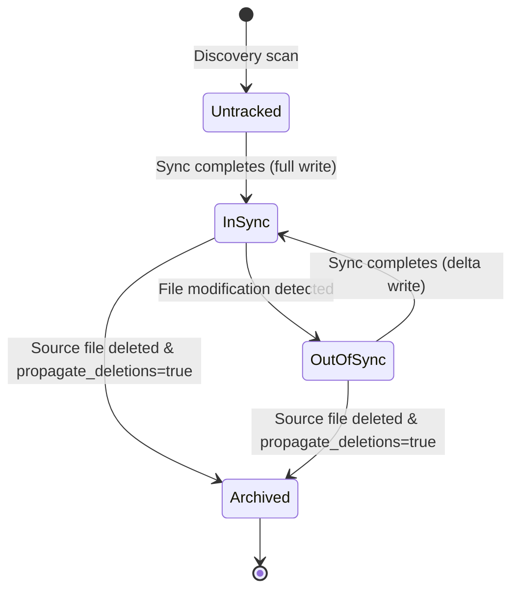

# Behavioral Specification: syncdir

| Field | Value |
|-------|-------|
| **Project** | syncdir |
| **Version** | 1 |
| **Last Updated** | 2026-07-14 |

---

## 1. Config Module

> Handles configuration file loading and validation.

### Public API

| Function | Signature | Returns | Errors |
|----------|-----------|---------|--------|
| `load_config` | `(path: &Path) -> Result<Config, SyncError>` | `Config` | `ConfigError` (Invalid path, parse failure) |
| `validate_config` | `(config: &Config) -> Result<(), SyncError>` | `()` | `ValidationError` (Missing/inaccessible paths) |

### Behavioral Scenarios

[HAPPY] Config file successfully loaded and validated
GIVEN a configuration file at a valid path with source "C:/Src" and destination "D:/Dest" (both accessible folders)
WHEN `load_config` is called followed by `validate_config`
THEN a valid `Config` struct is returned
AND validation succeeds

[ERROR] Source folder does not exist
GIVEN a config where `source_dir` points to a non-existent path "X:/Invalid"
WHEN `validate_config` is called
THEN `SyncError::ValidationError("Source directory does not exist")` is returned

[ERROR] Destination folder is inaccessible
GIVEN a config where `dest_dir` points to a path "Z:/Backup" which is not readable or writeable
WHEN `validate_config` is called
THEN `SyncError::ValidationError("Destination directory is inaccessible")` is returned

---

## 2. DB Module (HashStore)

> Manages the local persistence of file signatures and metadata.

### Public API

| Function | Signature | Returns | Errors |
|----------|-----------|---------|--------|
| `get_file` | `(&self, path: &str) -> Result<Option<FileRecord>, SyncError>` | `Option<FileRecord>` | `DbError` |
| `save_file` | `(&self, record: &FileRecord, hashes: &[Blake3Hash]) -> Result<(), SyncError>` | `()` | `DbError` |
| `delete_file` | `(&self, path: &str) -> Result<(), SyncError>` | `()` | `DbError` |

### Behavioral Scenarios

[HAPPY] Retrieve existing file signatures
GIVEN a SQLite database containing file metadata and hashes for "documents/notes.txt"
WHEN `get_file` is called with path "documents/notes.txt"
THEN a `FileRecord` is returned containing the matching file size, last modified time, and block hashes

[HAPPY] Save new file signatures
GIVEN a file "notes.txt" with size 1500 bytes and two block hashes
WHEN `save_file` is called
THEN the record is written to `file_metadata` and the hashes are written to `block_hashes` with correct foreign keys
AND subsequent calls to `get_file` return the written data

[HAPPY] Delete file metadata
GIVEN an existing record for "notes.txt" in the database
WHEN `delete_file` is called
THEN the metadata record and all associated block hashes are deleted (cascaded) from the database

---

## 3. Sync Module (SyncEngine)

> Performs delta comparison and block-level updates.

### Public API

| Function | Signature | Returns | Errors |
|----------|-----------|---------|--------|
| `sync_file` | `(&self, relative_path: &str) -> Result<SyncStatus, SyncError>` | `SyncStatus` | `IoError`, `DbError` |
| `delete_file` | `(&self, relative_path: &str) -> Result<(), SyncError>` | `()` | `IoError` |
| `run_full_scan` | `(&self) -> Result<ScanReport, SyncError>` | `ScanReport` | `IoError`, `DbError` |

### Behavioral Scenarios

[HAPPY] Sync large modified file with block delta sync and write verification
GIVEN a source file of size 12MB (threshold is 10MB) where block 3 (offset 2MB-3MB) was modified
AND the destination file exists
AND the local database has signatures matching the old state
AND `verify_writes = true` in config
WHEN `sync_file` is called
THEN block 3 is hashed, compared, and identified as modified
AND the destination file is opened in place, seeked to offset 2,097,152 (2MB), and modified with the new 1MB block data
AND the engine seeks back to offset 2,097,152 on the destination, reads the written block back, and verifies its Blake3 hash matches the source block hash
AND other blocks are NOT sent over the network
AND the database is updated with the new block 3 signature

[HAPPY] Timestamp alignment on successful sync
GIVEN a successful file sync operation
WHEN all sync writes complete
THEN the engine sets the destination file's last-modified timestamp to exactly match the source file's last-modified timestamp
AND the local SQLite cache is updated with this matching timestamp

[HAPPY] Sync small modified file using standard copy
GIVEN a source file of size 5MB (below threshold) with a modified timestamp
WHEN `sync_file` is called
THEN the entire file is copied to the destination path
AND the destination file's last-modified timestamp is set to match the source file's
AND the local database metadata is updated with size and modification timestamp

[HAPPY] Handle source deletion with propagate_deletions enabled
GIVEN `propagate_deletions = true` in config
AND a file "documents/notes.txt" was deleted in the source
WHEN `delete_file` is called for "documents/notes.txt"
THEN the destination file is moved to `.syncdir_archive/<timestamp>_documents/notes.txt`
AND the metadata record is deleted from the database

[EDGE] Destination file is missing on share
GIVEN a source file "notes.txt" with signatures in the local database
AND the destination file is missing on the network share
WHEN `sync_file` is called
THEN a full copy of the file is created at the destination
AND the destination file's last-modified timestamp is set to match the source file's
AND the local database signatures are regenerated and saved

---

## 4. State Machines

### File Synchronization State

| From | To | Trigger | Side Effects |
|------|----|---------|--------------|
| Untracked | InSync | First sync write success | Record size, mod-time, and hashes in SQLite |
| InSync | OutOfSync | Real-time file system notification | Queue for sync event debouncer |
| OutOfSync | InSync | Delta sync execution success | Overwrite changed blocks, update SQLite metadata |
| InSync | Archived | Source deletion event | Move target file to `.syncdir_archive/`, delete SQLite metadata |
