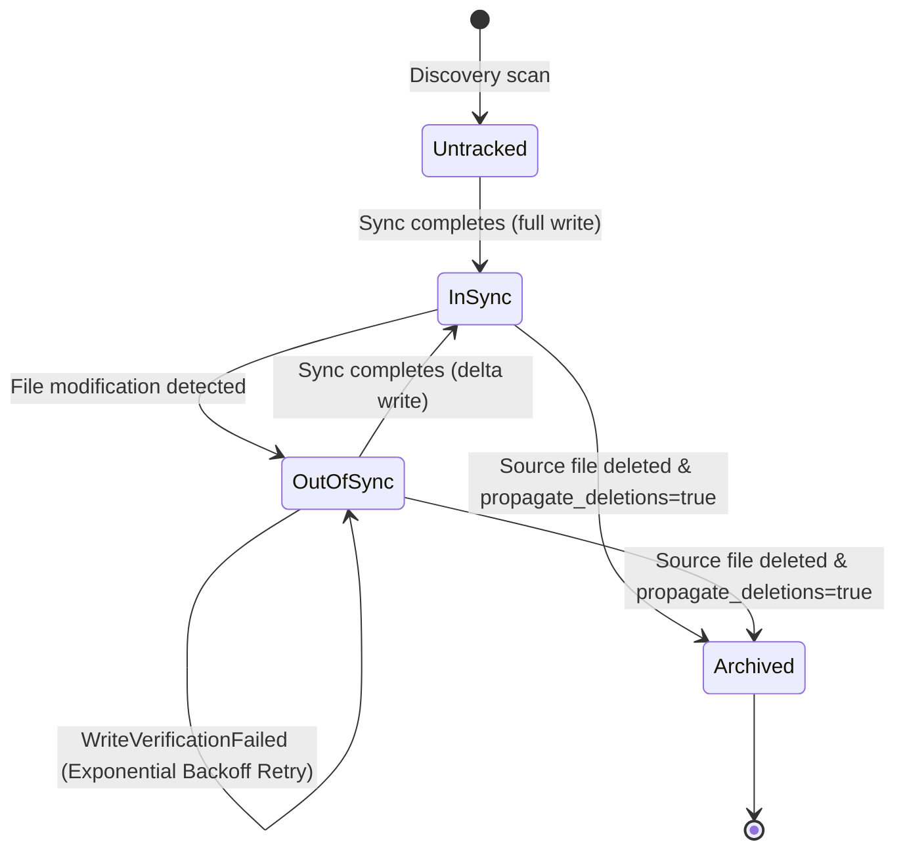
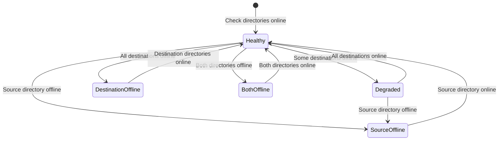

# Behavioral Specification: syncdir
 
> Last verified against: 59c2d25
 
| Field | Value |
|-------|-------|
| **Project** | syncdir |
| **Version** | 0.1.13 |
| **Last Updated** | 2026-09-12 |

---

## Module/Component Contracts

### 1. Config Module
 
> Handles configuration file loading, path sanitization, domain type modeling, boundary validation, and invariant validation. Decomposed into `src/config/{mod, target, validation, raw, builder, tests}.rs`.
 
#### Public API
 
| Function / Struct | Signature | Returns | Errors |
|-------------------|-----------|---------|--------|
| `Config::load` | `(path: &Path) -> Result<Config, SyncError>` | `Config` | `SyncError::Io` (read failed), `SyncError::Config` (parse failure) |
| `Config::validate` | `(&self) -> Result<(), SyncError>` | `()` | `SyncError::Validation` (invalid parameters, relative paths, or missing destination directories) |
| `Config::source_dir` | `(&self) -> &Path` | `&Path` | — (primary non-blocking getter) |
| `Config::resolved_source_dir` | `(&self) -> &Path` | `&Path` | — (deprecated in favor of `source_dir`) |
| `Config::destinations` | `(&self) -> &[TargetDir]` | `&[TargetDir]` | — (zero-copy canonical destination slice) |
| `Config::resolved_dest_dirs` | `(&self) -> Vec<PathBuf>` | `Vec<PathBuf>` | — |
| `Config::dest_dirs` | `(&self) -> Option<Vec<PathBuf>>` | `Option<Vec<PathBuf>>` | — (deprecated in favor of `destinations()` or `resolved_dest_dirs()`) |
| `Config::target_configs` | `(&self) -> Vec<TargetSyncConfig>` | `Vec<TargetSyncConfig>` | — |
| `Config::builder` | `(source_dir: impl Into<PathBuf>) -> ConfigBuilder` | `ConfigBuilder` | — |
| `ConfigBuilder::new` | `(source_dir: impl Into<PathBuf>) -> Self` | `ConfigBuilder` | — |
| `ConfigBuilder::dest_dir` | `(mut self, dest: impl Into<PathBuf>) -> Self` | `ConfigBuilder` | — |
| `ConfigBuilder::dest_dirs` | `(mut self, dirs: impl IntoIterator<Item = impl Into<PathBuf>>) -> Self` | `ConfigBuilder` | — |
| `ConfigBuilder::add_dest_dir` | `(mut self, dir: impl Into<PathBuf>) -> Self` | `ConfigBuilder` | — |
| `ConfigBuilder::build` | `(self) -> Result<Config, SyncError>` | `Config` | `SyncError::Validation` (validates all configuration invariants) |
| `ConfigBuilder::build_unvalidated` | `(self) -> Config` | `Config` | — (bypasses invariant validation; test fixtures only) |
| `ConfigBuilder::try_build` | `(self) -> Result<Config, SyncError>` | `Config` | `SyncError::Validation` (alias for `build`) |
| `TargetDir::try_new` | `(path: impl Into<PathBuf>, role: TargetRole) -> Result<Self, SyncError>` | `TargetDir` | `SyncError::Validation` (validates syntax, drive root, or UNC format; annotated with `#[must_use]`) |
| `TargetDir::try_from` | `(PathBuf / &Path / &str) -> Result<Self, SyncError>` | `TargetDir` | `SyncError::Validation` (fallible conversion enforcing syntax validation; unvalidated `From` removed) |
| `TargetDir::new` | `(path: impl Into<PathBuf>) -> Self` | `TargetDir` | — (deprecated in favor of `TargetDir::try_new`) |
| `TargetDir::validate` | `(&self, role: &str) -> Result<(), SyncError>` | `()` | `SyncError::Validation` (invalid drive or UNC syntax) |
| `TargetDir::as_path` | `(&self) -> &Path` | `&Path` | — |
| `TargetDir::to_path_buf` | `(&self) -> PathBuf` | `PathBuf` | — |
| `DestinationCollection::new` | `(destinations: impl IntoIterator<Item = TargetDir>) -> Self` | `DestinationCollection` | — (case-insensitive dedup preserving order) |
| `DestinationCollection::iter` | `(&self) -> impl Iterator<Item = &TargetDir>` | `Iterator` | — (annotated with `#[must_use]`) |
| `DestinationCollection::len` | `(&self) -> usize` | `usize` | — (annotated with `#[must_use]`) |
| `DestinationCollection::is_empty` | `(&self) -> bool` | `bool` | — (annotated with `#[must_use]`) |
| `DestinationCollection::as_slice` | `(&self) -> &[TargetDir]` | `&[TargetDir]` | — (annotated with `#[must_use]`) |
| `DestinationCollection::to_path_bufs` | `(&self) -> Vec<PathBuf>` | `Vec<PathBuf>` | — |
| `TargetSyncConfig::from_config` | `(config: &Config, dest_dir: impl Into<TargetDir>) -> Result<Self, SyncError>` | `TargetSyncConfig` | `SyncError::Validation` (validates invariants via builder) |
| `TargetSyncConfig::builder` | `(source_dir: impl Into<TargetDir>, dest_dir: impl Into<TargetDir>) -> TargetSyncConfigBuilder` | `TargetSyncConfigBuilder` | — (annotated with `#[must_use]`) |
| `TargetSyncConfig::source_dir` | `(&self) -> &Path` | `&Path` | — (returns path reference to validated source TargetDir; `#[must_use]`) |
| `TargetSyncConfig::source_target_dir` | `(&self) -> &TargetDir` | `&TargetDir` | — (returns borrowed reference to underlying TargetDir; `#[must_use]`) |
| `TargetSyncConfig::block_size_nonzero` | `(&self) -> std::num::NonZeroU64` | `NonZeroU64` | — (safely defaults to 64KB on zero; `#[must_use]`) |
| `TargetSyncConfig::with_verify_writes` | `(mut self, verify_writes: bool) -> Self` | `Self` | — (mutation helper for test fixtures; `#[must_use]`) |
| `TargetSyncConfigBuilder::build` | `(self) -> Result<TargetSyncConfig, SyncError>` | `TargetSyncConfig` | `SyncError::Validation` (annotated with `#[must_use]`) |
| `StoreConfig::new` | `(block_size_bytes: u64, block_sync_threshold_bytes: u64) -> Self` | `StoreConfig` | Storage-decoupled value object constructed directly without `config` dependency |
| `validate_sync_boundaries` | `(source: &Path, dest: &Path) -> Result<(), SyncError>` | `()` | `SyncError::Validation` (rejects identical or nested source/dest) |
| `preprocess_config_toml` | `(raw_toml: &str) -> String` | `String` | — (preserves multi-line arrays and quotes) |

#### Behavioral Scenarios

[HAPPY] Config file successfully loaded and validated
GIVEN a configuration file at a valid path with source "C:/Src" and destination "D:/Dest" (both accessible folders)
WHEN `load` is called followed by `validate`
THEN a valid `Config` struct is returned
AND validation succeeds

[HAPPY] Single-backslash UNC path normalization
GIVEN a destination path configured with a single leading backslash `"\172.16.0.60\scada_data"`
WHEN `resolved_dest_dirs` is called
THEN the path is automatically normalized to double-backslash UNC `"\\172.16.0.60\scada_data"`
AND a warning is logged

[HAPPY] Missing source directory at startup (soft validation)
GIVEN a config where `source_dir` points to a non-existent path "X:/Invalid"
WHEN `validate` is called
THEN validation succeeds
AND a warning is logged
 
[ERROR] Zero debounce seconds
GIVEN a config where `debounce_seconds` is zero
WHEN `validate` is called
THEN `SyncError::Validation` with `ValidationKind::Invariant` is returned
 
[ERROR] Zero retry interval seconds
GIVEN a config where `retry_interval_seconds` is zero
WHEN `validate` is called
THEN `SyncError::Validation` with `ValidationKind::Invariant` is returned

[ERROR] No destination directory specified
GIVEN a config where `dest_dir` is `None` and `dest_dirs` is `None` (or empty)
WHEN `validate` is called
THEN `SyncError::Validation` with `ValidationKind::Invariant` is returned

[ERROR] Invalid relative destination path
GIVEN a config where destination path is a relative path "relative/folder/path" (not starting with `C:\` or `\\`)
WHEN `validate` is called
THEN `SyncError::Validation` with `ValidationKind::Invariant` is returned rejecting the invalid destination path format

[ERROR] Structural UNC path validation missing share name
GIVEN a destination path `\\hostname` without a share name component
WHEN `validate` is called on `TargetDir`
THEN `SyncError::Validation` is returned rejecting the path

[ERROR] TargetSyncConfigBuilder validation invariants failure
GIVEN a `TargetSyncConfigBuilder` configured with a recursive sync loop (`source == dest` or nested paths), zero timeouts, or `block_sync_threshold_bytes < block_size_bytes`
WHEN `build` is called
THEN `SyncError::Validation` is returned
AND construction fails

[ERROR] ConfigBuilder immediate invariant validation failure
GIVEN a `ConfigBuilder` configured with invalid parameters (zero debounce, zero retry interval, block size > 64MB, `block_sync_threshold_bytes < block_size_bytes`, missing destination, or recursive directory containment)
WHEN `build` is called
THEN `SyncError::Validation` is returned
AND construction fails immediately

---

### 2. Path Util Module
 
> Pure leaf module providing path canonicalization, slash normalization, component collapsing, hierarchy checks, and UNC parsing.
 
#### Public API
 
| Function / Struct | Signature | Returns | Notes |
|-------------------|-----------|---------|-------|
| `RelativePath::try_new` | `(path: impl Into<PathBuf>) -> Result<Self, SyncError>` | `RelativePath` | Canonical constructor enforcing path safety, forward-slash normalization, rejecting traversal, devices, ADS, and whitespace |
| `RelativePath::new` | `(path: impl Into<PathBuf>) -> Result<Self, SyncError>` | `RelativePath` | Inline non-deprecated convenience wrapper delegating to `try_new` |
| `RelativePath::as_path` | `(&self) -> &Path` | `&Path` | Returns borrowed `&Path` slice |
| `RelativePath::as_str` | `(&self) -> &str` | `&str` | Returns canonical forward-slash string slice |
| `RelativePath::as_forward_slash_str` | `(&self) -> &str` | `&str` | Returns zero-allocation canonical forward-slash string slice (annotated with `#[must_use]`) |
| `RelativePath::to_storage_key` | `(&self) -> String` | `String` | Returns storage-agnostic owned string key (annotated with `#[must_use]`) |
| `RelativePath::to_sqlite_key` | `(&self) -> String` | `String` | Deprecated backward-compatible shim delegating to `to_storage_key()` |
| `RelativePath::to_path_buf` | `(&self) -> PathBuf` | `PathBuf` | Converts to owned PathBuf |
| `RelativePath::eq (PartialEq)` | `(&self, other: &PathBuf / &Path) -> bool` | `bool` | Bidirectional equality comparison with `PathBuf` and `Path` |
| `normalize_path` | `(path: impl AsRef<Path>) -> PathBuf` | `PathBuf` | Replaces `/` with `\`, normalizes root backslashes, collapses `.` |
| `parse_unc_host_and_share` | `(path: impl AsRef<Path>) -> Option<(&str, &str)>` | `Option<(&str, &str)>` | Extracts host and share from UNC paths |
| `collapse_components` | `(path: impl AsRef<Path>) -> PathBuf` | `PathBuf` | Lexically resolves `..` parent segments without disk I/O |
| `is_same_or_descendant` | `(base: &Path, target: &Path) -> bool` | `bool` | Evaluates path hierarchy without I/O or canonicalization |
| `is_safe_relative_path` | `(path: &Path) -> bool` | `bool` | Validates relative path safety against traversal, devices, ADS, and root prefixes |
| `normalize_superscripts_cow` | `(s: &str) -> Cow<'_, str>` | `Cow<'_, str>` | Zero-allocation superscript normalization (allocates only if superscripts present) |

#### Behavioral Scenarios

[HAPPY] Root backslash normalization
GIVEN a single backslash path `"\\"` or `"/"`
WHEN `normalize_path` is called
THEN it returns `"\\"` without generating triple backslashes

[HAPPY] UNC Host and Share extraction
GIVEN a valid UNC path `"\\\\server\\share\\sub\\file.txt"`
WHEN `parse_unc_host_and_share` is called
THEN `Some(("server", "share"))` is returned

[HAPPY] Component collapsing of parent traversal
GIVEN a path `"C:\\source\\subdir\\..\\dest"`
WHEN `collapse_components` is called
THEN it returns `"C:\\source\\dest"`

[HAPPY] Path hierarchy comparison
GIVEN a base path `"C:\\Backup"` and a target path `"C:\\Backup\\Subfolder\\file.txt"`
WHEN `is_same_or_descendant` is called
THEN it returns `true`
AND unrelated paths return `false`

---

### 3. DB Module (HashStore)

> Manages the local persistence of file signatures and metadata via SQLite.

#### Public API

| Function / Struct | Signature | Returns | Errors |
|-------------------|-----------|---------|--------|
| `FileRecord::new` | `(relative_path: impl Into<RelativePath>, file_size: u64, last_modified: i64) -> Self` | `FileRecord` | — (strictly encapsulated with private fields) |
| `FileRecord::with_id` | `(mut self, id: i64) -> Self` | `Self` | — |
| `FileRecord::with_optional_id` | `(mut self, id: Option<i64>) -> Self` | `Self` | — |
| `FileRecord::relative_path` | `(&self) -> &RelativePath` | `&RelativePath` | — |
| `FileRecord::file_size` | `(&self) -> u64` | `u64` | — (unsigned file size in bytes) |
| `FileRecord::last_modified` | `(&self) -> i64` | `i64` | — (epoch milliseconds) |
| `FileRecord::id` | `(&self) -> Option<i64>` | `Option<i64>` | — |
| `FileRecord::is_tracked` | `(&self) -> bool` | `bool` | — (`id.is_some()`) |
| `HashStore::get_file` | `(&self, path: &Path) -> Result<Option<FileRecord>, SyncError>` | `Option<FileRecord>` | `SyncError::Db` |
| `HashStore::save_file` | `(&self, record: &FileRecord, hashes: &[BlockHash]) -> Result<(), SyncError>` | `()` | `SyncError::Db` |
| `HashStore::save_files_batch` | `(&self, records: &[(&FileRecord, &[BlockHash])]) -> Result<(), SyncError>` | `()` | `SyncError::Db` (batch atomic UPSERT) |
| `HashStore::get_block_hashes` | `(&self, file_id: i64) -> Result<Vec<BlockHash>, SyncError>` | `Vec<BlockHash>` | `SyncError::Db` |
| `HashStore::delete_file` | `(&self, path: &Path) -> Result<(), SyncError>` | `()` | `SyncError::Db` (atomic transaction with rollback) |
| `HashStore::delete_files_batch` | `(&self, paths: &[&Path]) -> Result<(), SyncError>` | `()` | `SyncError::Db` (atomic batch deletion transaction) |
| `HashStore::list_files` | `(&self) -> Result<Vec<RelativePath>, SyncError>` | `Vec<RelativePath>` | `SyncError::Db` |
| `HashStore::list_all_records` | `(&self) -> Result<Vec<FileRecord>, SyncError>` | `Vec<FileRecord>` | `SyncError::Db` (zero-allocation bulk record preload) |
| `SqliteHashStore::new` | `(db_path: &Path, config: impl Into<StoreConfig>) -> Result<Self, SyncError>` | `SqliteHashStore` | `SyncError::Db` |
| `SqliteHashStore::cache_db_path` | `(app_dir: &Path, target_dest: &Path) -> PathBuf` | `PathBuf` | — (deterministic `sigcache_<blake3>.db` path generation) |
| `MockHashStore::new` | `() -> Self` | `MockHashStore` | — |
| `path_to_sqlite_key` | `(path: &Path) -> Result<String, SyncError>` | `String` | `SyncError::Validation` |
| `StoreConfig::new` | `(block_size_bytes: u64, block_sync_threshold_bytes: u64) -> Self` | `StoreConfig` | — |

#### Behavioral Scenarios

[HAPPY] Canonical path key conversion for SQLite
GIVEN a relative path with Windows backslashes `r"documents\subfolder\notes.txt"`
WHEN `path_to_sqlite_key` is called
THEN the path is returned as a forward-slash key `"documents/subfolder/notes.txt"`

[HAPPY] Exact Unicode superscript key preservation
GIVEN a relative path with Unicode superscript characters `r"notes\doc¹.txt"`
WHEN `path_to_sqlite_key` is called
THEN the exact Unicode characters are preserved as `"notes/doc¹.txt"` without lossy normalization

[HAPPY] Safe directory deletion without wildcard expansion
GIVEN records for `"test_1/file.txt"` and `"test-1/file.txt"` in SQLite
WHEN `delete_file` is called for `"test_1"`
THEN only `"test_1/file.txt"` is removed using exact prefix `substr(relative_path, 1, length(?1) + 1) = ?1 || '/'`
AND `"test-1/file.txt"` remains intact

[ERROR] Atomic rollback on single file deletion failure
GIVEN an existing record with block hashes in SQLite
WHEN `delete_file` encounters a database failure or trigger abort
THEN the deletion transaction is rolled back completely
AND the record and block hashes remain preserved in SQLite

[HAPPY] Flat record enumeration for zero-allocation cache lookup
GIVEN multiple records stored in the SQLite database
WHEN `list_all_records` is called
THEN records are returned as a flat `Vec<FileRecord>` ready for borrowed zero-allocation slice iteration in `FullScanCoordinator`

[HAPPY] Efficient UPSERT with RETURNING id
GIVEN a new file record saved via `save_file`
WHEN SQLite executes the UPSERT statement
THEN `RETURNING id` provides the row ID directly without an extra `SELECT id` query

---

### 4. Sync Module (SyncEngine & Role Traits)
 
> Performs streaming delta sync, single-pass I/O, contiguous block coalescing, reparse checks, role-segregated synchronization, and worker queue processing.
 
#### Public API
 
| Function / Component | Signature | Returns | Errors |
|----------------------|-----------|---------|--------|
| `FileSynchronizer::sync_file` | `(&self, rel_path: &Path) -> Result<Option<FileRecord>, SyncError>` | `Option<FileRecord>` | `SyncError::Io`, `SyncError::Db`, `SyncError::WriteVerificationFailed` |
| `FileDeleter::delete_file` | `(&self, rel_path: &Path) -> Result<(), SyncError>` | `()` | `SyncError::Io` |
| `BatchFlusher::flush_batch` | `(&self) -> Result<(), SyncError>` | `()` | `SyncError::Db` |
| `ScanEngine::run_cancellable_full_scan` | `(&self, cancel_flag: &AtomicBool) -> Result<ScanOutcome, SyncError>` | `ScanOutcome` | `SyncError::Io`, `SyncError::Db` |
| `ArchiveEngine::prune_archives` | `(&self) -> Result<(), SyncError>` | `()` | `SyncError::Io` |
| `SyncEngine` | `trait: FileSynchronizer + FileDeleter + BatchFlusher + ScanEngine + ArchiveEngine` | — | Composite synchronization supertrait with blanket implementations |
| `SyncEngine::invalidate_verified_dirs` | `(&self)` | `()` | — (default no-op clearing directory safety cache) |
| `LocalSyncEngine::new` | `(db: S, config: TargetSyncConfig) -> Self` | `LocalSyncEngine<S>` | — (composes collaborating transfer/scan engines; fields private) |
| `LocalSyncEngine::run_configured_full_scan` | `(&self) -> Result<ScanOutcome, SyncError>` | `ScanOutcome` | `SyncError::Io`, `SyncError::Db` (runs scan against configured destination) |
| `LocalSyncEngine::run_full_scan` | `(&self) -> Result<ScanOutcome, SyncError>` | `ScanOutcome` | Deprecated: use `run_configured_full_scan` instead |
| `LocalSyncEngine::acquire_dirty_range_lease` | `(&self) -> DirtyRangeLease<'_>` | `DirtyRangeLease<'_>` | — (pub(crate) reusable scratch buffer lease for zero-lock streaming) |
| `LocalSyncEngine::invalidate_verified_dirs` | `(&self)` | `()` | — (clears reparse cache) |
| `LocalSyncEngine::evict_verified_dir` | `(&self, dir: &Path)` | `()` | — (evicts dir and descendants from cache) |
| `LocalSyncEngine::reparse_cache` | `(&self) -> &Arc<ReparseCache>` | `&Arc<ReparseCache>` | — (public accessor returning re-exported ReparseCache) |
| `FullScanDriver` | `trait: Send + Sync` | — | Decoupled driver abstraction required by `FullScanCoordinator` |
| `MockFullScanDriver::new` | `() -> Self` | `MockFullScanDriver` | Internal test double for `FullScanCoordinator` tests (scoped to `sync::full_scan::tests`) |
| `FullScanCoordinator::new` | `(driver: &'a D, dest_dir: &'a Path, cancel: &'a AtomicBool) -> Self` | `FullScanCoordinator<'a, D>` | — (decomposed pipeline coordinator for full directory scans) |
| `FullScanCoordinator::run` | `(self) -> Result<ScanOutcome, SyncError>` | `ScanOutcome` | `SyncError::Io`, `SyncError::Db` (deletion reconciliation guarded by `scan_complete`) |
| `start_sync_worker` | `<E: SyncEngine + 'static>(context: SyncWorkerContext<E>) -> Result<JoinHandle<()>, SyncError>` | `Result<JoinHandle<()>, SyncError>` | `SyncError::Io` (thread spawn failure) |
| `SyncWorkerRunner::new` | `(context: SyncWorkerContext<E>) -> Self` | `SyncWorkerRunner<E>` | — (discrete, testable worker state machine with `pub(crate)` fields) |
| `SyncWorkerRunner::handle_command` | `(&mut self, cmd: SyncCommand) -> bool` | `bool` | — (false indicates shutdown requested) |
| `SyncWorkerRunner::tick` | `(&mut self, now: Instant) -> Result<WorkerTickOutcome, SyncError>` | `WorkerTickOutcome` | `SyncError` (immediate NotFound eviction, 10-retry IO ceiling) |
| `SyncWorkerContext::builder` | `(target_index: usize, config: impl Into<TargetSyncConfig>, engine: E, rx: Receiver<SyncCommand>, source_conn: impl Into<SourceConnectivityTracker>) -> SyncWorkerContextBuilder<E>` | `SyncWorkerContextBuilder<E>` | — (entrypoint for builder construction) |
| `SyncWorkerContextBuilder::build` | `(self) -> Result<SyncWorkerContext<E>, SyncError>` | `SyncWorkerContext<E>` | `SyncError::Validation` (requires `max_pending_queue > 0`) |
| `ReparseCache::new` | `(shallow_capacity: usize, deep_capacity: usize) -> Self` | `ReparseCache` | — (two-tier relative-depth ancestor cache under RwLock; re-exported in `syncdir::sync`) |
| `ReparseCache::contains` | `(&self, path: &Path) -> bool` | `bool` | — |
| `ReparseCache::insert_ancestor` | `(&self, path: PathBuf, depth: usize)` | `()` | — |
| `ReparseCache::evict_dir` | `(&self, dir: &Path)` | `()` | — |
| `ReparseCache::clear` | `(&self)` | `()` | — |
| `SmallFileTransferEngine::new` | `(config: TargetSyncConfig) -> Self` | `SmallFileTransferEngine` | — (pub(crate) atomic small-file streaming with splitmix64 nonces) |
| `DeltaTransferEngine::new` | `(db: S, config: TargetSyncConfig) -> Self` | `DeltaTransferEngine<S>` | — (pub(crate) in-place delta sync with chunk hashing) |
| `ArchiveManager::new` | `(config: TargetSyncConfig, reparse_cache: Arc<ReparseCache>) -> Self` | `ArchiveManager` | — (pub(crate) timestamped backup management and safe pruning with ReparseCache) |
| `DirectoryScanner::new` | `(config: TargetSyncConfig) -> Self` | `DirectoryScanner` | — (pub(crate) directory recursion, batch record saves, and single path allocations) |
| `DirtyBlockRange::new` | `(block_size: NonZeroU64) -> Self` | `DirtyBlockRange` | — (infallible zero-panic constructor) |
| `DirtyBlockRange::try_new` | `(block_size: u64) -> Result<Self, SyncError>` | `DirtyBlockRange` | `SyncError::Validation` (if `block_size == 0`) |
| `FileMetadataSnapshot::new` | `(size: u64, modified_epoch_millis: i64) -> Self` | `FileMetadataSnapshot` | `size` standardized to unsigned `u64` |
| `FileMetadataSnapshot::from_metadata` | `(meta: &fs::Metadata) -> Result<Self, SyncError>` | `FileMetadataSnapshot` | `SyncError::Io` (safely parses metadata) |
| `FileMetadataSnapshot::is_up_to_date` | `(&self, dest: &FileMetadataSnapshot, record: Option<&FileRecord>) -> bool` | `bool` | Evaluates SMB ±2000ms timestamp tolerance |
| `verify_destination_not_reparse_cached` | `(dest_dir: &Path, rel_path: &Path, cache: &ReparseCache) -> Result<Option<Metadata>, SyncError>` | `Option<Metadata>` | Zero-allocation `.peekable()` ancestor component traversal |
| `verify_source_not_reparse_cached` | `(source_dir: &Path, rel_path: &Path, cache: &ReparseCache) -> Result<(), SyncError>` | `()` | Zero-allocation `.peekable()` ancestor component traversal |
| `FileSyncTask<'a>` | `struct` | — | Borrowed task bundle with typed `rel_path: &'a RelativePath` |
| `FileSyncTaskBuilder<'a>` | `struct` | — | Fluent builder requiring source, dest, and staging paths |
| `safe_modified_millis` | `(metadata: &std::fs::Metadata) -> Result<i64, SyncError>` | `i64` | `SyncError::Io` (safely extracts epoch millis) |
| `safe_epoch_duration_millis` | `(millis: i64) -> std::time::Duration` | `Duration` | Clamps negative millis to zero Duration |
 
#### Behavioral Scenarios

[RECOVERY] Immediate eviction of transient deleted source files
GIVEN a source file deleted during the write debounce period
WHEN `SyncWorkerRunner::tick` processes the sync task and receives `io::ErrorKind::NotFound` with `!source.exists()`
THEN the path is immediately evicted from retry queues without scheduling retries
AND its failure tracking state is cleared

[RECOVERY] Generic I/O retry ceiling and observer notification
GIVEN a persistent generic I/O failure (`SyncError::Io`) during file synchronization or deletion
WHEN the operation fails repeatedly
THEN it is retried with exponential backoff up to 10 attempts
AND upon the 11th attempt, the path is permanently evicted from retry queues
AND `SyncStatusObserver::on_write_verification_failed` is invoked to notify observers

[RECOVERY] PartialFailure reachability synchronization
GIVEN a full scan triggered via `SyncCommand::TriggerFullScan`
WHEN `run_cancellable_full_scan` returns `ScanOutcome::PartialFailure` (individual file access failures on an active target)
THEN `ReachabilityMonitor::mark_online` is explicitly invoked
AND destination reachability transitions to Online, unblocking subsequent queue draining

[PERFORMANCE] Catch-up full scan failure exponential backoff throttling
GIVEN a directory watcher buffer overflow requiring a catch-up scan
WHEN `run_cancellable_full_scan` fails with `ScanOutcome::DestinationUnreachable` or an error
THEN `SyncWorkerState.record_catchup_scan_failure` schedules an exponential backoff timestamp starting at `retry_interval_seconds`
AND tight 50ms CPU spin-loops are prevented

[HAPPY] Case-only file renaming destination alignment
GIVEN a file renamed on source with casing changes only (e.g. `report.docx` -> `Report.docx`) on Windows
WHEN `sync_file_to_dest_core` verifies metadata equality
THEN `align_dest_file_casing_if_needed` detects the directory entry casing discrepancy
AND performs an atomic two-step rename (`*.syncdir_casetmp_*`) on the destination share
AND updates the SQLite database record with `relative_path = excluded.relative_path` preserving existing block signatures

[SECURITY] Symmetrical ReparseCache eviction on deletion (CWE-59)
GIVEN a file deletion operation via `delete_file_from_dest`
WHEN the target file is removed and archived
THEN `dest_path.parent()` is evicted from `ReparseCache`
AND `source_path.parent()` is symmetrically evicted from `ReparseCache`
AND any subsequent replacement with an NTFS junction forces full re-validation

[SECURITY] Full scan deletion reconciliation guard
GIVEN a full directory scan executed via `FullScanCoordinator`
WHEN `scan_source_files` encounters an I/O error or cancellation signal (`scan_complete == false`)
THEN `reconcile_deletions` is aborted without deleting any destination files
AND destination files are protected from accidental pruning

[SECURITY] Archive prune root junction protection
GIVEN an archive directory that is an NTFS junction or symlink
WHEN `prune_archive` is called
THEN `fs::symlink_metadata` inspects the root path before traversal
AND `SyncError::Validation` is returned, refusing to prune arbitrary directories outside the destination tree

[HAPPY] Truncated or corrupted destination file repair
GIVEN a destination file whose size does not match the source (`dest_size != src_size`) or whose timestamp drift exceeds 2000ms
WHEN `sync_file_to_dest_core` executes
THEN the engine actively repairs and synchronizes the corrupted destination file rather than bypassing it via fast-path check

[PERFORMANCE] Two-phase directory reparse verification
GIVEN a directory path verification check via `LocalSyncEngine::verify_destination_cached`
WHEN cache membership is verified
THEN the mutex lock is released before querying remote filesystem metadata
AND re-acquired only to record newly verified paths, preventing remote SMB lock contention

[TESTABILITY] SyncWorkerRunner discrete tick processing
GIVEN a `SyncWorkerRunner` state machine and an event queue
WHEN `tick(now)` is called with synthetic timestamps
THEN reachability, debounce expiry, file transfer, and retry backoff are processed deterministically without thread sleeps

[RECOVERY] Directory reparse cache invalidation
GIVEN a cached directory set in `LocalSyncEngine`
WHEN `invalidate_verified_dirs` is called (upon reconnect or full scan)
THEN all cached entries are cleared
AND when `evict_verified_dir(dir)` is called (upon file deletion)
THEN `dir` and all its descendants are purged from the cache

[HAPPY] Single-pass streaming delta sync with contiguous block coalescing
GIVEN a source file $\ge$ 10MB where blocks 2 and 3 were modified
AND the destination file exists
WHEN `sync_file` is called
THEN the file is read in a single streaming pass
AND modified blocks 2 and 3 are coalesced into a single contiguous `DirtyBlockRange` write (2MB seek and 2MB write)
AND destination file length is trimmed via `set_len` to avoid tail remnants

[HAPPY] Write verification retry with exponential backoff
GIVEN a file whose write verification fails (`SyncError::WriteVerificationFailed`)
WHEN the sync worker processes the error
THEN the file is retained in `DebounceQueue`
AND scheduled for retry with exponential backoff delay (capped at 300s)
AND not permanently evicted from the sync queue

[HAPPY] Streamed 64KB small-file write verification
GIVEN a small file (< 10MB) synchronized with `verify_writes = true`
WHEN `verify_small_file_write` executes
THEN the file is streamed in 64KB stack chunks into a Blake3 hasher without allocating a full-file heap buffer

[HAPPY] Ancestor directory reparse point traversal protection
GIVEN a destination path containing intermediate directory junctions or symlinks
WHEN `verify_destination_not_reparse` executes
THEN all ancestor directory components between `dest_dir` and the target file are verified
AND any directory junction is rejected with `SyncError::Validation`

[SECURITY/VALIDATION] DirtyBlockRange zero block size rejection
GIVEN an invocation of `DirtyBlockRange::try_new(0)`
WHEN the constructor validates the block size
THEN `SyncError::Validation` is returned
AND `new` requires `NonZeroU64`, preventing zero block size values at compile time

[CONCURRENCY] SyncWorker non-spinning poll timeout during network offline
GIVEN a worker queue with expired debounce items
AND the target destination or source is detected as offline
WHEN `calculate_worker_poll_timeout` determines the receiver timeout
THEN a minimum sleep of 1 second is enforced to prevent 100% CPU busy-spinning

[PERFORMANCE] LocalSyncEngine signature cache hit fast-path
GIVEN a file synchronization task where the local SQLite record matches source file size and modification time
WHEN `sync_file_to_dest_core` executes
THEN `Ok(None)` is returned immediately without querying remote SMB file metadata or performing redundant reparse traversals
AND on-disk casing alignment directory traversals (`align_dest_file_casing_if_needed`) are bypassed when relative path casing matches

[CONCURRENCY] RAII DirtyRangeLease zero-lock streaming
GIVEN a multi-gigabyte delta sync operation
WHEN `acquire_dirty_range_lease` checks out a `DirtyBlockRange` buffer
THEN the engine mutex is released before disk reads, Blake3 hashing, and network I/O begin
AND the buffer is automatically returned to the pool upon lease drop

[HAPPY] Decoupled archive pruning with depth limit 32
GIVEN a deleted file operation
WHEN `delete_file_from_dest` executes
THEN the target file is renamed to `.syncdir_archive` without triggering an immediate full archive crawl
AND archive pruning is executed periodically (hourly) and post-full-scan
AND `prune_archive` ignores symlinks/junctions and enforces recursion depth $\le 32$

[HAPPY] Archive pruning filename timestamp anchor & nested directory inheritance
GIVEN an archive directory containing files moved via NTFS rename whose original filesystem creation timestamps are older than `max_age_days`
AND the filename prefix `{timestamp}_` reflects recent archival within retention limits
WHEN `prune_archive` executes
THEN the file is retained based on its filename timestamp anchor
AND files in nested subdirectories inherit the timestamp anchor from the top-level archived folder

[CONCURRENCY] DebounceQueue action replacement at capacity
GIVEN a `DebounceQueue` at maximum capacity (`pending_count >= max_capacity`)
AND a path currently pending in `pending_deletes` receives a sync notification (or vice-versa)
WHEN `enqueue_sync` is called
THEN the action replacement succeeds without rejecting the modification
AND dead queue entries in the min-heap are pruned via `compact_heaps`

[HAPPY] Resilient full directory scan
GIVEN a directory scan encountering locked or `PermissionDenied` folders
WHEN `scan_dir` executes
THEN the inaccessible folder is logged and skipped
AND the remainder of the directory tree continues to be scanned

[HAPPY] Windows case-insensitive deletion detection
GIVEN a file renamed from "Notes.txt" to "notes.txt" on Windows
WHEN `run_full_scan` executes
THEN case-insensitive path tracking recognizes the file as present
AND does not issue a false-positive file deletion command

[HAPPY] Disjoint path resolution worker routing
GIVEN a destination path whose mapped drive letter is disconnected
WHEN the worker processes sync and delete commands
THEN operations are executed against the active resolved UNC share path

[PERFORMANCE] Fast-path casing alignment bypass on matching relative path
GIVEN a file synchronization task where the local SQLite record matches source file size and modification time
AND the recorded relative path casing exactly matches the source relative path (`file_record.relative_path() == &safe_rel`)
WHEN `LocalSyncEngine::sync_file_to_dest_core` executes
THEN `align_dest_file_casing_if_needed` is bypassed completely without issuing remote SMB directory listings (`read_dir`)

[SECURITY] ReparseCache non-existent directory exclusion
GIVEN a destination directory path that does not yet exist on disk
WHEN `verify_destination_not_reparse_cached` evaluates ancestor safety
THEN `symlink_metadata` returns `NotFound` and the non-existent path is NOT inserted into `ReparseCache`

[SECURITY] Archive directory ancestor reparse point validation prior to creation
GIVEN an archive backup operation for a destination file
WHEN `ArchiveManager::archive_dest_file_only` executes
THEN ancestor path safety is verified via `verify_destination_not_reparse_cached` before invoking `fs::create_dir_all`

[SECURITY] Archive pruning TOCTOU symlink verification prior to deletion
GIVEN an archive retention pruning pass collecting candidate expired files
WHEN `prune_archive` prepares to delete a candidate file via `fs::remove_file`
THEN `symlink_metadata` is checked immediately before removal, rejecting any candidate substituted with a junction or symlink

[LOGIC] FullScanCoordinator local error classification as PartialFailure
GIVEN a full scan operation where all source file transfers fail due to local file locks or permission errors
WHEN `FullScanCoordinator::run` calculates the scan outcome
THEN `ScanOutcome::PartialFailure` is returned rather than false `DestinationUnreachable`

[PERFORMANCE] Scanner Windows cached file_type query without path allocation
GIVEN a recursive directory scan via `DirectoryScanner`
WHEN directory entries are enumerated
THEN `entry.file_type()?` is inspected directly from Windows directory enumerator records before allocating `entry.path()`

[PERFORMANCE] ReparseCache evict_dir read-lock early return probe
GIVEN a file deletion operation invalidating cached directory ancestors
WHEN `ReparseCache::evict_dir` is called
THEN cache contents are probed under a read lock first, returning immediately without write lock acquisition when no prefix matches

[LOGIC] SyncWorker catch-up scan flag reset upon full scan completion
GIVEN a sync worker whose `needs_catchup_scan` flag was set by offline changes
WHEN a full scan is triggered and successfully completes
THEN `needs_catchup_scan` is reset to `false`, preventing infinite full-scan recurrence

[SECURITY] CWE-117 log injection prevention via Debug path formatting
GIVEN filesystem entries containing carriage return or line feed characters
WHEN scanner and archive operations log warnings or instrument tracing spans
THEN paths are formatted using Debug representation (`?path`, `?dir`), escaping raw CRLF injection tokens

---

### 5. Startup Module

> Manages Windows startup registry integration.

#### Public API

| Function / Trait | Signature | Returns | Errors |
|------------------|-----------|---------|--------|
| `StartupRegistry::is_registered` | `() -> Result<bool, SyncError>` | `bool` | `SyncError::Io` (failed to get current exe path) |
| `StartupRegistry::register` | `() -> Result<(), SyncError>` | `()` | `SyncError::Config` (registry write failure) |
| `StartupRegistry::unregister` | `() -> Result<(), SyncError>` | `()` | — |
| `RegistryBackend` | `trait: Send + Sync` | — | — |
| `MockStartupRegistry::new` | `(initial: bool) -> Self` | `MockStartupRegistry` | — |

---

### 6. Monitor Module
 
> Watches the source directory for file modifications, creations, deletions, and renames.
 
#### Public API
 
| Function / Trait | Signature | Returns | Errors |
|------------------|-----------|---------|--------|
| `DirectoryWatcher::start` | `(source_path: impl AsRef<Path>, tx: Sender<SyncCommand>) -> Result<DirectoryWatcher, WatcherError>` | `DirectoryWatcher` | `WatcherError` (failed to set up OS hook or path missing) |
| `trait FileWatcher` | `Send + 'static` | — | Abstraction for directory watchers (`is_watching(&self) -> bool`) |
| `trait WatcherFactory` | `Send + Sync + 'static` | — | Factory interface for creating mockable `FileWatcher` instances |
| `RecommendedWatcherFactory` | `struct` | `RecommendedWatcherFactory` | Production `WatcherFactory` creating `DirectoryWatcher` |
| `WatcherError` | `enum: Notify, PathNotFound, ChannelDisconnected, Other` | `WatcherError` | Strongly-typed watcher failure domain enum |

#### Behavioral Scenarios

[RECOVERY] Watcher buffer overflow recovery full scan trigger
GIVEN a directory watcher encountering an OS buffer overflow error (`notify::Error` from `ReadDirectoryChangesW`)
WHEN `handle_watcher_result` processes the error
THEN a warning is logged
AND `SyncCommand::TriggerFullScan` is dispatched to the sync worker channel to guarantee eventually consistent state

---

### 7. Tray Module

> Manages the system tray icon, tooltips, checkable context menus, and event notifications. Decomposed into `src/tray/{mod, state, dialog, menu, event_loop, assets}.rs`. All windowing types (`winit`, `UserEvent`) are encapsulated behind `TrayEventLoop`.

#### Public API

| Function / Component | Signature | Returns | Errors |
|----------------------|-----------|---------|--------|
| `TrayEventLoop::new` | `() -> Result<Self, SyncError>` | `TrayEventLoop` | `SyncError::Tray` (event loop initialization failure) |
| `TrayEventLoop::run` | `<H: TrayActionHandler + ?Sized>(self, destinations: Vec<DestinationState>, handler: Arc<H>) -> Result<TrayExitReason, SyncError>` | `TrayExitReason` | `SyncError::Tray` |
| `TrayEventLoop::status_observer` | `(&self) -> Arc<dyn SyncStatusObserver>` | `Arc<dyn SyncStatusObserver>` | Encapsulates `winit` event loop proxy |
| `DestinationState::new` | `(path: impl Into<PathBuf>, is_online: impl Into<ConnectivityState>) -> Self` | `DestinationState` | — |
| `DestinationState::with_resolved_unc` | `(mut self, resolved_unc: impl Into<Option<PathBuf>>) -> Self` | `DestinationState` | — |
| `DestinationState::path` | `(&self) -> &Path` | `&Path` | — |
| `DestinationState::is_online` | `(&self) -> ConnectivityState` | `ConnectivityState` | — |
| `DestinationState::resolved_unc` | `(&self) -> Option<&Path>` | `Option<&Path>` | — |
| `DestinationState::display_label` | `(&self) -> &str` | `&str` | Precomputed display label |
| `TrayState::new` | `(initial_dest_online: impl IntoIterator<Item = impl Into<ConnectivityState>>) -> Self` | `TrayState` | — |
| `TrayState::empty` | `() -> Self` | `TrayState` | — |
| `TrayState::update_target_status` | `(&mut self, target_index: usize, online: impl Into<ConnectivityState>) -> bool` | `bool` (changed) | — |
| `TrayState::update_watcher_status` | `(&mut self, source_online: ConnectivityState, watcher_active: WatcherState) -> bool` | `bool` (changed) | — |
| `TrayState::set_scan_notice` | `(&mut self, notice: Option<String>) -> bool` | `bool` | — |
| `TrayState::overall_status` | `(&self) -> EngineStatus` | `EngineStatus` | — |
| `TrayState::tooltip_text` | `(&self) -> String` | `String` | — |
| `format_explorer_args` | `(path: &Path, is_dir: bool) -> Vec<OsString>` | `Vec<OsString>` | Formats directory path as-is, file without whitespace as `/select,<path>`, and file with whitespace as `/select,"<path>"` |
| `open_path` | `(path: &Path) -> std::io::Result<()>` | `()` | Launches default Windows shell application via `%SystemRoot%\explorer.exe` using Win32 `raw_arg` for `/select,"<path>"` |

#### Behavioral Scenarios

[HAPPY] Explorer argument formatting for directories
GIVEN a path representing a directory `C:\Program Files\SyncDir`
WHEN `format_explorer_args(path, true)` is called
THEN the argument vector contains exactly one element equal to the directory path as-is

[HAPPY] Explorer argument formatting for file without whitespace
GIVEN a path representing a file `C:\folder\file.txt`
WHEN `format_explorer_args(path, false)` is called
THEN the argument vector contains exactly `/select,C:\folder\file.txt`

[HAPPY] Explorer argument formatting for file with whitespace
GIVEN a path representing a file `C:\Program Files\App Data\log file.txt`
WHEN `format_explorer_args(path, false)` is called
THEN the argument vector contains `/select,"C:\Program Files\App Data\log file.txt"`
AND `open_path` passes the argument using Win32 `raw_arg` to prevent shell quote escaping

---

### 8. Daemon Module (SyncDaemon)

> Coordinates daemon lifecycle, worker thread spawning, watcher event loops, loop detection, and clean shutdown. Decoupled from `tray` and `startup`.

#### Public API

| Function / Struct | Signature | Returns | Errors |
|-------------------|-----------|---------|--------|
| `SyncDaemon::builder` | `(config: Config, app_dir: impl Into<PathBuf>) -> SyncDaemonBuilder` | `SyncDaemonBuilder` | — (fluent constructor entrypoint) |
| `SyncDaemon::start` | `(config: Config, app_dir: &Path, observer: Option<Arc<dyn SyncStatusObserver>>) -> Result<Self, SyncError>` | `SyncDaemon` | `SyncError::Db`, `SyncError::Validation` (delegates to builder) |
| `SyncDaemon::start_with_all_services` | `(...) -> Result<Self, SyncError>` | `SyncDaemon` | `#[deprecated]` in favor of `SyncDaemonBuilder` |
| `SyncDaemon::validate_target_loops` | `(config: &Config, resolver: &dyn NetworkResolver) -> Result<(), SyncError>` | `()` | `SyncError::Validation` (non-blocking loop detection using `try_resolve_unc_path`) |
| `SyncDaemon::config` | `(&self) -> &Config` | `&Config` | — |
| `SyncDaemon::handle` | `(&self) -> DaemonHandle` | `DaemonHandle` | — |
| `SyncDaemon::shutdown` | `(mut self)` | `()` | — |
| `SyncDaemonBuilder::new` | `(config: Config, app_dir: impl Into<PathBuf>) -> Self` | `SyncDaemonBuilder` | — |
| `SyncDaemonBuilder::with_factory` | `(self, factory: F2) -> SyncDaemonBuilder<F2>` | `SyncDaemonBuilder` | — |
| `SyncDaemonBuilder::with_resolver` | `(mut self, resolver: Arc<dyn NetworkResolver>) -> Self` | `Self` | — |
| `SyncDaemonBuilder::with_watcher_factory` | `(mut self, factory: Arc<dyn WatcherFactory>) -> Self` | `Self` | — |
| `SyncDaemonBuilder::with_observer` | `(mut self, observer: Arc<dyn SyncStatusObserver>) -> Self` | `Self` | — |
| `SyncDaemonBuilder::start` | `(self) -> Result<SyncDaemon, SyncError>` | `SyncDaemon` | `SyncError` |
| `DaemonHandle::new` | `(command_tx: Sender<SyncCommand>) -> Self` | `DaemonHandle` | — |
| `DaemonHandle::trigger_full_scan` | `(&self) -> Result<(), SyncError>` | `()` | `SyncError::Tray` |

---

### 9. Net Module (Networking FFI)

> Manages Win32 UNC and SMB connection resolution, mapped drive lookup, and alternate path fallbacks. All low-level Win32 FFI helpers are encapsulated as private functions behind the `NetworkResolver` trait.

#### Public API

| Function / Trait | Signature | Returns | Errors |
|----------|-----------|---------|--------|
| `trait NetworkResolver` | `Send + Sync` | — | Abstraction for network resolution and SMB sessions |
| `Win32NetworkResolver` | `struct` | `Win32NetworkResolver` | Production Win32 implementation |
| `MockNetworkResolver::new` | `() -> Self` | `MockNetworkResolver` | In-memory mock for testing |

---

### 10. Error Module

> Defines application-wide typed error structures and causal source wrapping. All classifiers and constructors are marked `#[must_use]`.

#### Public API

| Type | Signature / Variants | Notes |
|------|----------------------|-------|
| `SyncError` | `#[non_exhaustive] enum` | Crate-wide unified error type |
| `SyncError::Io` | `(#[from] std::io::Error)` | Standard I/O errors |
| `SyncError::Db` | `(String, #[source] Option<Box<dyn Error + Send + Sync>>)` | SQLite database errors |
| `SyncError::Config` | `(String, #[source] Option<Box<dyn Error + Send + Sync>>)` | TOML parse or validation errors |
| `SyncError::Validation` | `{ kind: ValidationKind, message: String }` | Semantic configuration & security validation errors |
| `ValidationKind` | `enum: Security, ReparsePoint, RecursiveLoop, Invariant, Transient` | Typed validation classification with `is_permanent(&self) -> bool` |
| `SyncError::WriteVerificationFailed` | `{ path: PathBuf }` | Distinct retryable write integrity failure |
| `SyncError::LockPoison` | `(String, #[source] Option<Box<dyn Error + Send + Sync>>)` | Mutex poisoning errors |
| `SyncError::Watcher` | `(#[from] WatcherError)` | Directory watcher errors wrapping strongly typed `#[non_exhaustive] WatcherError` |
| `SyncError::Tray` | `(String, #[source] Option<Box<dyn Error + Send + Sync>>)` | GUI / Tray notification errors |
| `SyncError::Registry` | `(String, #[source] Option<Box<dyn Error + Send + Sync>>)` | Windows registry errors |
| `SyncError::validation` | `(msg: impl Into<String>) -> Self` | `#[must_use]` Semantic validation error constructor (default Invariant) |
| `SyncError::validation_kind` | `(kind: ValidationKind, msg: impl Into<String>) -> Self` | `#[must_use]` Explicit typed validation constructor |
| `SyncError::validation_security` | `(msg: impl Into<String>) -> Self` | `#[must_use]` Security validation constructor (Security) |
| `SyncError::validation_reparse` | `(msg: impl Into<String>) -> Self` | `#[must_use]` Reparse validation constructor (ReparsePoint) |
| `SyncError::validation_loop` | `(msg: impl Into<String>) -> Self` | `#[must_use]` Recursive loop validation constructor (RecursiveLoop) |
| `SyncError::validation_invariant` | `(msg: impl Into<String>) -> Self` | `#[must_use]` Domain invariant constructor (Invariant) |
| `SyncError::is_permanent_validation_failure` | `(&self) -> bool` | `#[must_use]` Detects non-retryable fatal violations via `kind.is_permanent()` |
| `SyncError::is_not_found` | `(&self) -> bool` | `#[must_use]` Detects `std::io::ErrorKind::NotFound` across IO variants and `WatcherError::PathNotFound(_)` |
| `SyncError::is_network_offline` | `(&self) -> bool` | `#[must_use]` Matches Win32 SMB disconnect error codes |
| `SyncError::is_cancelled` | `(&self) -> bool` | `#[must_use]` Checks cancellation state |
| `is_network_offline_io` | `(io_err: &std::io::Error) -> bool` | Maps 9 standard `ErrorKind` variants and 11 Win32 error codes |

#### Behavioral Scenarios

[ERROR] Permanent validation failure classification and queue eviction
GIVEN a `SyncError` produced during sync worker execution
WHEN `is_permanent_validation_failure` is evaluated
THEN permanent security and invariant violations (`Security`, `ReparsePoint`, `RecursiveLoop`) return `true`
AND the item is evicted from the debounce retry queue without looping retries
AND transient errors return `false`, preserving exponential backoff retries

[ERROR] PathNotFound detection across Watcher and IO errors
GIVEN a `SyncError::Watcher` wrapping `WatcherError::PathNotFound(path)`
WHEN `is_not_found()` is called
THEN it evaluates to `true`

---

### 11. Test Support Module

> Canonical re-exports of test doubles and mock backends for multi-crate integration tests, hidden from public API documentation via `#[doc(hidden)]`.

#### Public API

| Type | Signature | Notes |
|------|-----------|-------|
| `test_support::MockHashStore` | `struct` | `#[doc(hidden)]` In-memory `HashStore` double |
| `test_support::MockSyncEngine` | `struct` | `#[doc(hidden)]` In-memory `SyncEngine` double |
| `test_support::MockSyncStatusObserver` | `struct` | `#[doc(hidden)]` In-memory status event collector |
| `test_support::MockNetworkResolver` | `struct` | `#[doc(hidden)]` In-memory `NetworkResolver` double |
| `test_support::MockStartupRegistry` | `struct` | `#[doc(hidden)]` In-memory `RegistryBackend` double |

---

### 12. Build Script Module (`build.rs`)

> Compiles Windows PE binary resources (`RT_GROUP_ICON`, `RT_MANIFEST`) via `winres` with dynamic SDK discovery, defensive icon validation, and fail-closed error handling.

#### Public API

| Function / Struct | Signature | Returns | Errors |
|-------------------|-----------|---------|--------|
| `ResourceBuildConfig::from_env` | `() -> Self` | `ResourceBuildConfig` | Infallible (sanitized from env) |
| `ResourceBuildConfig::from_env_with` | `<E>(lookup: E) -> Self where E: Fn(&str) -> Option<String>` | `ResourceBuildConfig` | Infallible (dependency-injected env constructor) |
| `ResourceBuildConfig::resolve_toolkit_dir` | `(&self) -> Result<Option<PathBuf>, BuildResourceError>` | `Option<PathBuf>` | `BuildResourceError::UnsafePath` |
| `validate_path_safety` | `(path: &Path) -> Result<(), BuildResourceError>` | `()` | `BuildResourceError::UnsafePath` (null bytes, control characters, quotes) |
| `validate_icon_asset` | `(path: &Path) -> Result<(), BuildResourceError>` | `()` | `BuildResourceError::IconNotFound`, `IconInvalid`, `Io` |
| `validate_icon_bytes` | `(bytes: &[u8]) -> Result<(), BuildResourceError>` | `()` | `BuildResourceError::IconInvalid` (length < 6, reserved != 0, type != 1, count == 0) |
| `compile_windows_resources` | `(config: &ResourceBuildConfig) -> Result<(), BuildResourceError>` | `()` | `BuildResourceError::CompilationFailed`, `IconNotFound`, `IconInvalid` |

#### Behavioral Scenarios

[HAPPY] Valid multi-resolution icon asset validation
GIVEN a valid 7-mipmap `syncdir.ico` file on disk with valid 6-byte header and size <= 512 KB
WHEN `validate_icon_asset` is called
THEN validation succeeds returning `Ok(())`

[ERROR] Icon file exceeds 512 KB ceiling
GIVEN an icon file whose length exceeds 524,288 bytes
WHEN `validate_icon_asset` is called
THEN `BuildResourceError::IconInvalid` is returned

[ERROR] Release profile compilation failure
GIVEN `PROFILE == "release"` and compilation fails without `SYNCDIR_ALLOW_MISSING_ICON=1`
WHEN `handle_resource_error` is called
THEN an actionable remediation guide is printed to stderr and the process terminates via `std::process::exit(1)`

---

### 13. Release Automation Pipeline (`scripts/build-release.ps1`)

> Orchestrates portable release compilation, MSVC static CRT inspection (`dumpbin`), post-build PE binary structure verification, and distribution packaging.

#### Public API

| Function | Parameters | Returns | Errors |
|----------|------------|---------|--------|
| `Test-PeBinaryStructure` | `-FilePath <string>` | `[PSCustomObject]` | Non-terminating object with `.IsValidPe`, `.HasRsrcSection`, `.HasResourceTable`, `.HasManifest`, `.HasIcon` |
| `Assert-ReleaseResourceIntegrity` | `-BinaryPath <string>, -AllowMissingIcon <bool>` | `void` | Throws fail-closed policy violation if .rsrc, manifest, or icon is missing |
| `Resolve-SdkToolkit` | `-WinresToolkitPath <string>, -RcPath <string>, -WindowsSdkPath <string>, -PathExists <scriptblock>` | `[string]` (toolkit directory) | Returns `$null` on missing toolkit without throwing |
| `Invoke-WithEnvironmentScope` | `-EnvironmentUpdates <hashtable>, -Action <scriptblock>` | `void` | Restores original process environment even on uncaught scriptblock exceptions |
| `Invoke-BuildRelease` | Parameterized release pipeline | `void` | Exits 1 on quality, CRT, or PE integrity failure |

#### Behavioral Scenarios

[HAPPY] Release binary contains valid PE structure, manifest, and multi-res icon
GIVEN a release executable built with `build.rs` embedding manifest (`asInvoker`) and `syncdir.ico`
WHEN `Assert-ReleaseResourceIntegrity` is executed
THEN verification succeeds confirming .rsrc section, manifest, and application icon

[ERROR] Release binary lacks embedded manifest or icon
GIVEN an executable without resource directory table or missing RT_MANIFEST / RT_ICON
WHEN `Assert-ReleaseResourceIntegrity` is executed without `-AllowMissingIcon`
THEN a terminating fail-closed policy violation is thrown

---
 
## Data Models
 
### Config
Represents the runtime parameters loaded from `config.toml`. Fields are private and accessed via getters.
- `source_dir`: PathBuf (validated to exist and be a directory)
- `dest_dir`: Option<PathBuf> (optional primary destination directory)
- `dest_dirs`: Option<Vec<PathBuf>> (optional additional destination directories; deprecated)
- `debounce_seconds`: u64 (must be > 0)
- `retry_interval_seconds`: u64 (must be > 0)
- `propagate_deletions`: bool
- `block_sync_threshold_bytes`: u64
- `block_size_bytes`: u64
- `verify_writes`: bool

### TargetSyncConfig
Isolated target sync configuration for an individual worker with private fields and public getters.
- `source_dir`: TargetDir
- `dest_dir`: TargetDir
- `block_size_bytes`: u64
- `block_sync_threshold_bytes`: u64
- `verify_writes`: bool
- `debounce_seconds`: u64
- `retry_interval_seconds`: u64
- `propagate_deletions`: bool

### RelativePath
Domain newtype representing a validated, safe, canonicalized relative path.
- Invariants: Normalized to forward slashes (`/`), non-empty, no leading/trailing whitespace, no parent traversal (`..`), no Windows reserved device names (`CON`, `PRN`, `AUX`, `NUL`, `COM1-9`, `LPT1-9`), no NTFS Alternate Data Streams (`:`), and no drive letter/UNC roots.
- Implements `AsRef<Path>`, `Deref<Target = Path>`, `Display`, and Serde `try_from = "String"`.

### FileRecord
Database record representing indexed file state in SQLite signature cache.
- `id`: Option<i64> (row ID in database, `None` if untracked)
- `relative_path`: RelativePath
- `file_size`: u64 (unsigned byte count)
- `last_modified`: i64 (epoch milliseconds)

### SyncCommand
Strongly-typed IPC command dispatched between watcher, daemon, and worker threads.
- `SyncFile(RelativePath)`: Requests synchronization of a specific relative path.
- `DeleteFile(RelativePath)`: Requests archival or deletion of a specific relative path.
- `TriggerFullScan`: Forces a complete filesystem reconciliation pass.
- `Shutdown`: Requests graceful termination of the worker thread loop.

### ConnectivityState
Explicit domain enum representing connection reachability.
- `Online`: Target or source directory is accessible.
- `Offline`: Target or source directory is unreachable.

### WatcherState
Explicit domain enum representing real-time filesystem watcher state.
- `Active`: DirectoryWatcher OS hook is actively monitoring events.
- `Degraded`: DirectoryWatcher encountered an error or was paused.

### DestinationState
Encapsulates destination path, current reachability, and optional resolved UNC path for UI.
- `path`: PathBuf
- `is_online`: ConnectivityState
- `resolved_unc`: Option<PathBuf>

### SourceConnectivityTracker
Encapsulates thread-safe source presence state wrapping an `Arc<AtomicBool>`.

### DebounceQueue
In-memory dual min-heap queue managing pending sync and delete paths with per-path debounce deadlines and capacity enforcement.

### ReachabilityMonitor
Worker sub-component managing target destination health probes, alternate UNC resolution, and observer notifications.

### FailureTracker
Bounded failure tracking structure capping memory consumption at 5,000 entries with FIFO oldest eviction and periodic queue compaction when `order.len() > capacity * 2`. Reset on successful file synchronization and completely emptied on successful full scans.

### SyncWorkerState
Worker execution state container tracking scratch buffer, bounded `FailureTracker`, exponential backoff calculation, and catch-up scan state invariants (cleared to false, with failure counters zeroed and attempt deadline reset to `None` upon successful `TriggerFullScan` and destination reconnect scans).

### SyncWorkerRunner
Testable sync worker state machine orchestrating reachability, debouncing, and execution via deterministic `tick(now)` stepping and sleep-free event dispatching.
- `context`: SyncWorkerContext<E>
- `queue`: DebounceQueue
- `reachability`: ReachabilityMonitor
- `state`: SyncWorkerState
- `drain_threshold`: usize

### WorkerTickOutcome
Discrete tick outcome for `SyncWorkerRunner`.
- `Continue`: Continue processing events and commands.
- `ShutdownRequested`: Worker should terminate cleanly.

### StoreConfig
Minimal configuration parameters required by `SqliteHashStore`.
- `block_size_bytes`: u64
- `block_sync_threshold_bytes`: u64
 
### FileRecord
Represents a file tracked in the signature database.
- `id`: Option<i64> (database rowid)
- `relative_path`: PathBuf (unique identifier)
- `file_size`: i64
- `last_modified`: i64

### DirtyBlockRange
Coalesced contiguous dirty block range for batched delta writes with strongly typed non-zero block size.
- `start_block`: u64 (private)
- `block_count`: u64 (private)
- `block_size`: std::num::NonZeroU64 (private)
- `data`: Vec<u8> (private)

### DirtyRangeLease<'a>
RAII lease checked out from `LocalSyncEngine::dirty_range_pool` allowing mutable buffer access during large-file delta streaming without holding locks across disk or SMB network operations. Automatically clears and returns the buffer to the pool on `Drop`.

### EngineStatus
Represents the aggregated presence state across source and destination targets.
- `Healthy` (source and all destination directories are online — Blue icon)
- `Degraded` (source online, but some destination directories are offline — Orange icon)
- `SourceOffline` (source directory offline — Red icon)
- `DestinationOffline` (all destination directories offline — Yellow icon)
- `BothOffline` (source and all destination directories offline — Gray icon)

### TargetStatusUpdate
Per-target status report sent from worker threads to the tray event loop.
- `target_index`: usize
- `dest_online`: ConnectivityState

### UserEvent
Custom events processed by the winit main thread UI event loop.
- `Menu(MenuEvent)`
- `StatusUpdate(TargetStatusUpdate)`
- `WatcherStatus { source_online: ConnectivityState, watcher_active: WatcherState }`
- `ConfigReloadResult(Result<(), SyncError>)`

### TrayExitReason
Represents the reason the system tray event loop exited.
- `UserExit` (user selected "Exit" from context menu)
- `Restart` (user selected "Reload Config", triggering process restart)

### TrayState
Pure state container tracking visual status, notice messages, and connectivity for system tray UI.
- `source_online`: ConnectivityState
- `watcher_active`: WatcherState
- `dest_online`: Vec<ConnectivityState>
- `scan_notice`: Option<String>

### SingleInstanceGuard
RAII guard holding the single-instance Windows named mutex handle (`Local\syncdir_single_instance`).

### SyncCommand
Commands passed to the worker channel.
- `FileModified(PathBuf)`
- `FileDeleted(PathBuf)`
- `TriggerFullScan`

---
 
## State Machines
 
### File Synchronization State
 

```mermaid
stateDiagram-v2
    [*] --> Untracked : Discovery scan
    Untracked --> InSync : Sync completes (full write)
    InSync --> OutOfSync : File modification detected
    OutOfSync --> InSync : Sync completes (delta write)
    OutOfSync --> OutOfSync : WriteVerificationFailed (Exponential Backoff Retry)
    InSync --> Archived : Source file deleted & propagate_deletions=true
    OutOfSync --> Archived : Source file deleted & propagate_deletions=true
    Archived --> [*]
```

### Tray Engine Status State Machine


```mermaid
stateDiagram-v2
    [*] --> Healthy : Check directories online
    Healthy --> Degraded : Some destinations offline
    Healthy --> SourceOffline : Source directory offline
    Healthy --> DestinationOffline : All destinations offline
    Healthy --> BothOffline : Both directories offline
    Degraded --> Healthy : All destinations online
    Degraded --> SourceOffline : Source directory offline
    SourceOffline --> Healthy : Source directory online
    DestinationOffline --> Healthy : Destination directories online
    BothOffline --> Healthy : Both directories online
```

---
 
## Command/CLI Contracts
 
The daemon runs in the background. It is invoked with options:
```sh
syncdir [OPTIONS]
```
 
| Option | Description | Action | Exit Code |
|--------|-------------|--------|-----------|
| `--help`, `-h` | Prints version, description, copyright (`(c) 2026 Wendell Saligan`), repository URL, and usage options | Prints to stdout | `0` |
| `--version`, `-v` | Prints current package version and copyright | Prints to stdout | `0` |
| `--register-startup` | Registers the daemon in Windows startup registry | Writes HKCU run key (with `--autostart` suffix) | `0` (success), `1` (registry error) |
| `--unregister-startup` | Unregisters the daemon from Windows startup registry | Deletes HKCU run key | `0` (success), `1` (registry error) |
| `--autostart` | Windows Auto-Start trigger | Starts background sync daemon | — |

If no options are specified, the daemon starts the background sync. It defaults to looking for `%APPDATA%\syncdir\config.toml` (loading configuration and initializing DB / tray loop).

---

## Integration Points

### 1. SQLite Database (`sigcache_<hash>.db`)
Isolated local SQLite caches storing block hashes and file metadata per target destination. Validates configuration parameters `block_size_bytes` and `block_sync_threshold_bytes` to prevent database configuration drift. Uses SQLite WAL mode, `PRAGMA foreign_keys = ON`, exact prefix matching `substr(...) = ?1 || '/'`, and `RETURNING id` UPSERTs.

### 2. Filesystem / Network Shares
Local network shares mounted as folder paths or UNC network shares. Delta synchronization reads 1MB block chunks, compares Blake3 hashes, coalesces contiguous writes into `DirtyBlockRange` batches, and writes verified offsets.

### 3. Windows Win32 API Networking (`mpr.lib`)
Integrates `NetworkResolver` trait with `Win32NetworkResolver` invoking `WNetGetConnectionW` and `WNetAddConnection2W` to resolve mapped network drives to UNC paths and automatically establish authenticated SMB sessions using Windows Credential Manager.

### 4. Windows System Notification Area (System Tray)
User interface tray-icon utilizing `tray-icon` and `winit` with `TrayController` for controlling and viewing background sync status. The context menu provides actions for opening configuration, viewing logs, forcing immediate sync, toggling Windows startup, and inspecting destination target statuses.

### 5. Windows Registry (`Software\Microsoft\Windows\CurrentVersion\Run`)
Integrates `StartupRegistry` under HKCU for automatic daemon launch on user login.

### 6. Automated Testing Frameworks
444 automated Rust test cases plus 19 PowerShell release and PE resource integrity tests:
- Unit test suite across all modules (365 unit tests in `src/lib.rs`, 7 tests in `src/main.rs`).
- Build script integration test suite (`tests/build_script_test.rs`: 22 tests).
- Integration test suite (`tests/integration_tests.rs`: 13 tests).
- Generative property test suite (`tests/property_tests.rs`: 8 proptest suites).
- Snapshot regression test suite (`tests/snapshot_tests.rs`: 20 insta golden snapshots).
- Documentation tests (`cargo test --doc`: 9 doctests).
- PowerShell release automation test suite (`tests/test_build_release.ps1`: 19 tests).

### 7. Development & Release Automation Scripts (`scripts/`)
- `scripts/check-quality.ps1`: Code quality pipeline executing formatting, linter, tests, and static analysis.
- `scripts/build-release.ps1`: Release compilation and artifact packaging with static MSVC CRT linking.
