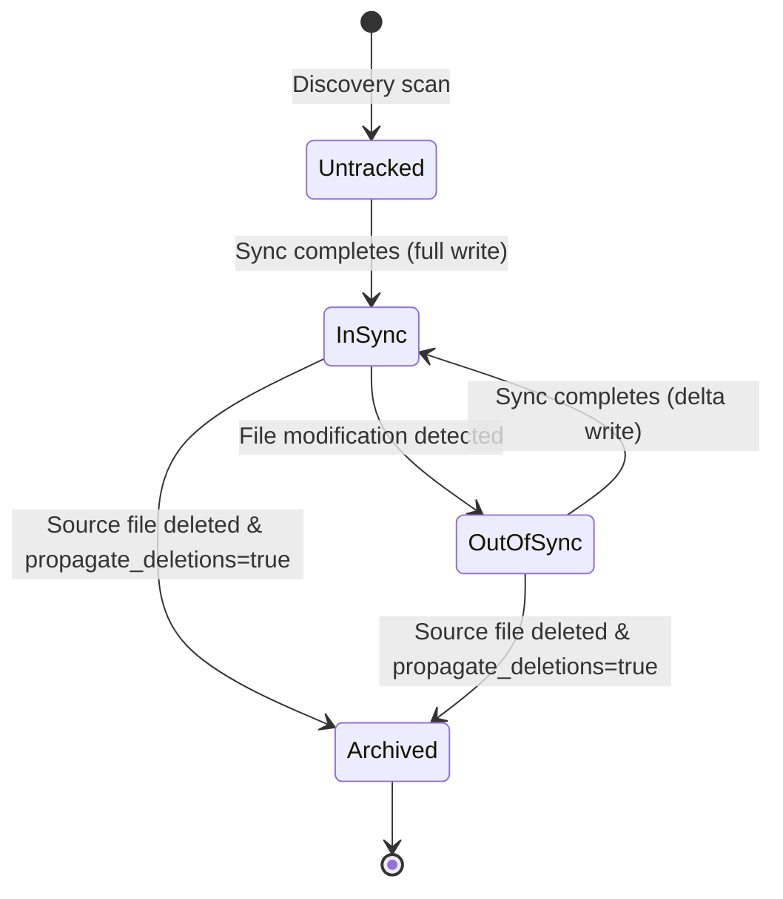
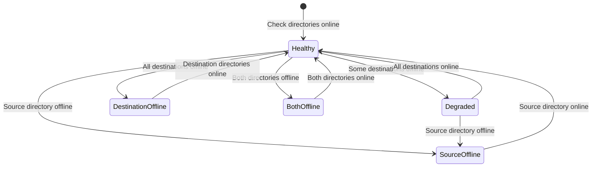

# Behavioral Specification: syncdir
 
> Last verified against: 8e6f4a7
 
| Field | Value |
|-------|-------|
| **Project** | syncdir |
| **Version** | 0.1.13 |
| **Last Updated** | 2026-09-08 |


---

## Module/Component Contracts

### 1. Config Module
 
> Handles configuration file loading, path sanitization, and invariant validation.
 
#### Public API
 
| Function / Struct | Signature | Returns | Errors |
|-------------------|-----------|---------|--------|
| `Config::load` | `(path: &Path) -> Result<Config, SyncError>` | `Config` | `SyncError::Io` (read failed), `SyncError::Config` (parse failure) |
| `Config::validate` | `(&self) -> Result<(), SyncError>` | `()` | `SyncError::Validation` (invalid parameters, relative paths, or missing destination directories) |
| `Config::resolved_source_dir` | `(&self) -> &Path` | `&Path` | — (pure non-blocking getter) |
| `Config::resolved_dest_dirs` | `(&self) -> Vec<PathBuf>` | `Vec<PathBuf>` | — |
| `Config::target_configs` | `(&self) -> Vec<TargetSyncConfig>` | `Vec<TargetSyncConfig>` | — |
| `Config::builder` | `(source_dir: impl Into<PathBuf>) -> ConfigBuilder` | `ConfigBuilder` | — |
| `ConfigBuilder::new` | `(source_dir: impl Into<PathBuf>) -> Self` | `ConfigBuilder` | — |
| `ConfigBuilder::dest_dir` | `(mut self, dest: impl Into<PathBuf>) -> Self` | `ConfigBuilder` | — |
| `ConfigBuilder::dest_dirs` | `(mut self, dirs: Vec<PathBuf>) -> Self` | `ConfigBuilder` | — |
| `ConfigBuilder::add_dest_dir` | `(mut self, dir: impl Into<PathBuf>) -> Self` | `ConfigBuilder` | — |
| `ConfigBuilder::build` | `(self) -> Config` | `Config` | — |
| `ConfigBuilder::try_build` | `(self) -> Result<Config, SyncError>` | `Config` | `SyncError::Validation` |
| `system_root` | `() -> PathBuf` | `PathBuf` | — |
| `TargetSyncConfig::new` | `(...) -> Self` | `TargetSyncConfig` | — |
 
#### Behavioral Scenarios
 
[HAPPY] Config file successfully loaded and validated
GIVEN a configuration file at a valid path with source "C:/Src" and destination "D:/Dest" (both accessible folders)
WHEN `load` is called followed by `validate`
THEN a valid `Config` struct is returned
AND validation succeeds

[HAPPY] Single-backslash UNC path normalization
GIVEN a destination path configured with a single leading backslash `"\172.16.0.60\scada_data"`
WHEN `resolved_dest_dirs` is called
THEN the path is automatically normalized to double-backslash UNC `"\\172.16.0.60\scada_data"`
AND a warning is logged

[HAPPY] Missing source directory at startup (soft validation)
GIVEN a config where `source_dir` points to a non-existent path "X:/Invalid"
WHEN `validate` is called
THEN validation succeeds
AND a warning is logged
 
[ERROR] Zero debounce seconds
GIVEN a config where `debounce_seconds` is zero
WHEN `validate` is called
THEN `SyncError::Validation("Debounce seconds must be greater than zero")` is returned

[ERROR] Zero retry interval seconds
GIVEN a config where `retry_interval_seconds` is zero
WHEN `validate` is called
THEN `SyncError::Validation("Retry interval seconds must be greater than zero")` is returned

[ERROR] No destination directory specified
GIVEN a config where `dest_dir` is `None` and `dest_dirs` is `None` (or empty)
WHEN `validate` is called
THEN `SyncError::Validation("At least one destination directory must be specified (via dest_dir or dest_dirs)")` is returned

[ERROR] Invalid relative destination path
GIVEN a config where destination path is a relative path "relative/folder/path" (not starting with `C:\` or `\\`)
WHEN `validate` is called
THEN `SyncError::Validation` is returned rejecting the invalid destination path format


### 2. DB Module (HashStore)

> Manages the local persistence of file signatures and metadata via SQLite.

#### Public API

| Function / Trait | Signature | Returns | Errors |
|------------------|-----------|---------|--------|
| `HashStore::get_file` | `(&self, path: &Path) -> Result<Option<FileRecord>, SyncError>` | `Option<FileRecord>` | `SyncError::Db` |
| `HashStore::save_file` | `(&self, record: &FileRecord, hashes: &[BlockHash]) -> Result<(), SyncError>` | `()` | `SyncError::Db` |
| `HashStore::get_block_hashes` | `(&self, file_id: i64) -> Result<Vec<BlockHash>, SyncError>` | `Vec<BlockHash>` | `SyncError::Db` |
| `HashStore::delete_file` | `(&self, path: &Path) -> Result<(), SyncError>` | `()` | `SyncError::Db` |
| `HashStore::list_files` | `(&self) -> Result<Vec<PathBuf>, SyncError>` | `Vec<PathBuf>` | `SyncError::Db` |
| `SqliteHashStore::new` | `(db_path: &Path, config: impl Into<StoreConfig>) -> Result<Self, SyncError>` | `SqliteHashStore` | `SyncError::Db` |
| `path_to_sqlite_key` | `(path: &Path) -> Result<String, SyncError>` | `String` | `SyncError::Validation` |
| `StoreConfig::new` | `(block_size_bytes: u64, block_sync_threshold_bytes: u64) -> Self` | `StoreConfig` | — |

#### Behavioral Scenarios

[HAPPY] Canonical path key conversion for SQLite
GIVEN a relative path with Windows backslashes `r"documents\subfolder\notes.txt"`
WHEN `path_to_sqlite_key` is called
THEN the path is returned as a forward-slash key `"documents/subfolder/notes.txt"`

[HAPPY] Retrieve existing file signatures
GIVEN a SQLite database containing file metadata and hashes for "documents/notes.txt"
WHEN `get_file` is called with path `Path::new("documents/notes.txt")`
THEN a `FileRecord` is returned containing the matching file size, last modified time, and block hashes

[HAPPY] Save new file signatures with cached statements and transactions
GIVEN a file "notes.txt" with size 1500 bytes and two block hashes
WHEN `save_file` is called
THEN the record is written to `file_metadata` and the hashes are written to `block_hashes` using prepared cached statements
AND subsequent calls to `get_file` return the written data

[HAPPY] Delete file metadata with cascade
GIVEN an existing record for "notes.txt" in the database
WHEN `delete_file` is called with `Path::new("notes.txt")`
THEN the metadata record and all associated block hashes are deleted (cascaded) from the database

### 3. Sync Module (SyncEngine)
 
> Performs streaming delta sync, single-pass I/O, contiguous block coalescing, and worker queue processing.
 
#### Public API
 
| Function / Component | Signature | Returns | Errors |
|----------------------|-----------|---------|--------|
| `sync_file` | `(&self, path: &Path) -> Result<(), SyncError>` | `()` | `SyncError::Io`, `SyncError::Db` |
| `delete_file` | `(&self, path: &Path) -> Result<(), SyncError>` | `()` | `SyncError::Io` |
| `run_full_scan` | `(&self) -> Result<ScanOutcome, SyncError>` | `ScanOutcome` | `SyncError::Io`, `SyncError::Db` |
| `start_sync_worker` | `(target_index: usize, config: TargetSyncConfig, db: S, rx: Receiver<SyncCommand>, event_proxy: Option<EventLoopProxy<UserEvent>>, source_online: Arc<AtomicBool>) -> JoinHandle<()>` | `JoinHandle<()>` | — |
| `DirtyBlockRange::new` | `() -> Self` | `DirtyBlockRange` | — |
| `DirtyBlockRange::add_block` | `(&mut self, block_idx: u64, bytes: &[u8], writer: &mut W, block_size: u64) -> Result<(), SyncError>` | `()` | `SyncError::Io` |
| `DirtyBlockRange::flush` | `(&mut self, writer: &mut W, block_size: u64) -> Result<(), SyncError>` | `()` | `SyncError::Io` |
| `is_safe_relative_path` | `(path: &Path) -> bool` | `bool` | — |
 
#### Behavioral Scenarios
 
[HAPPY] Single-pass streaming delta sync with contiguous block coalescing
GIVEN a source file $\ge$ 10MB where blocks 2 and 3 were modified
AND the destination file exists
WHEN `sync_file` is called
THEN the file is read in a single streaming pass
AND modified blocks 2 and 3 are coalesced into a single contiguous `DirtyBlockRange` write (2MB seek and 2MB write)
AND destination file length is trimmed via `set_len` to avoid tail remnants

[HAPPY] Truncated destination file recovery
GIVEN a destination file that was truncated (size is smaller than expected)
AND the local database has matching hashes for all blocks
WHEN `sync_file` is called
THEN `dest_len < expected_offset` detects the truncation
AND missing blocks are written to the target rather than zero-filled

[HAPPY] Small file fast-path bypasses block hashing
GIVEN a source file smaller than 10MB
WHEN `sync_file` is called
THEN block chunking and hashing is skipped entirely
AND the file is copied via `fs::copy` directly
AND metadata timestamps are updated in the SQLite cache

[HAPPY] Symlink and NTFS reparse point rejection
GIVEN a file or directory that is a symlink or reparse point
WHEN `sync_file` inspects the file using `fs::symlink_metadata`
THEN symlinks are skipped to prevent path traversal outside root

[HAPPY] Recursive directory rename synchronization
GIVEN a directory containing nested child files is renamed in the source
WHEN `sync_file` is invoked for the directory path
THEN `fs::create_dir_all` creates the target directory
AND descendant files are traversed via `scan_dir` and synchronized recursively

[HAPPY] Offline deletion protection
GIVEN queued deletion commands for destination targets
AND `source_online` is `false` (source network share disconnected)
WHEN the worker processes the pending deletion queue
THEN deletions are deferred and not executed until the source recovers

[HAPPY] Timestamp alignment on successful sync
GIVEN a successful file sync operation
WHEN all sync writes complete
THEN the engine sets the destination file's last-modified timestamp to match the source file's last-modified timestamp
AND the local SQLite cache is updated with this matching timestamp
AND a structured `tracing::info!` log event is emitted containing `path`, `target`, and `size`

[HAPPY] SMB 2-second timestamp tolerance fast-path match
GIVEN a source file whose metadata `record.last_modified == src_mod`
AND the destination file timestamp on an SMB share is within ±2000 ms of `src_mod` due to SMB 1-2 second rounding
WHEN `sync_file` is called
THEN the fast-path check evaluates to true and skips re-copying the file

[HAPPY] Handle source deletion with propagate_deletions enabled
GIVEN `propagate_deletions = true` in config
AND a file "documents/notes.txt" was deleted in the source
WHEN `delete_file` is called for `Path::new("documents/notes.txt")`
THEN the destination file is moved to `.syncdir_archive/<timestamp>_documents/notes.txt`
AND the metadata record is deleted from the database

[EDGE] Destination file is missing on share
GIVEN a source file "notes.txt" with signatures in the local database
AND the destination file is missing on the network share
WHEN `sync_file` is called
THEN a full copy of the file is created at the destination
AND the destination file's last-modified timestamp is set to match the source file's
AND the local database signatures are regenerated and saved

[HAPPY] Status signaling on directory state change
GIVEN a running background worker
WHEN the source or destination directory changes state (e.g., source goes offline)
THEN `EngineStatus` is updated
AND a `UserEvent::StatusUpdate(...)` message is dispatched to the system tray event proxy

[HAPPY] Delay sync operation when source or destination is offline
GIVEN a modified file event is queued
AND the destination or source directory is offline when the debounce deadline expires
THEN the sync operation is skipped
AND the sync is re-inserted into the pending queue with a new debounce deadline

[HAPPY] Skip full scan when source directory is offline
GIVEN a `SyncCommand::TriggerFullScan` command is received
AND the source directory is offline
WHEN the command is processed
THEN the full scan execution is skipped
AND a warning is logged

[HAPPY] DOS device name rejection
GIVEN a path containing reserved names (`CON`, `PRN`, `AUX`, `NUL`, `COM1`-`COM9`, `LPT1`-`LPT9`, `CONIN$`, `CONOUT$`, `CLOCK$`)
WHEN `is_safe_relative_path` is evaluated
THEN it returns `false` and the path is rejected

[HAPPY] Empty source safety threshold check
GIVEN a source directory that is empty (0 files)
AND the local SQLite cache contains tracked files
AND `propagate_deletions = true` in configuration
WHEN a full scan is executed
THEN deletion propagation is skipped to prevent accidental target wipe
AND a warning is logged


### 4. Startup Module

> Manages Windows startup registry integration.

#### Public API

| Function / Trait | Signature | Returns | Errors |
|------------------|-----------|---------|--------|
| `StartupRegistry::is_registered` | `() -> Result<bool, SyncError>` | `bool` | `SyncError::Io` (failed to get current exe path) |
| `StartupRegistry::register` | `() -> Result<(), SyncError>` | `()` | `SyncError::Config` (registry write failure) |
| `StartupRegistry::unregister` | `() -> Result<(), SyncError>` | `()` | — |
| `RegistryBackend` | `trait` | — | — |
| `MockStartupRegistry` | `struct` | — | — |

#### Behavioral Scenarios

[HAPPY] Register application for startup on Windows
GIVEN the application is not registered in startup registry
WHEN `register` is called on Windows
THEN a registry value named "syncdir" is created under HKCU `Software\Microsoft\Windows\CurrentVersion\Run` containing the current executable path with the `--autostart` suffix
AND `is_registered` subsequently returns `true`

[HAPPY] Unregister application from startup on Windows
GIVEN the application is registered in startup registry
WHEN `unregister` is called on Windows
THEN the registry value named "syncdir" is deleted
AND `is_registered` subsequently returns `false`

### 5. Monitor Module
 
> Watches the source directory for file modifications, creations, deletions, and renames.
 
#### Public API
 
| Function | Signature | Returns | Errors |
|----------|-----------|---------|--------|
| `DirectoryWatcher::start` | `(config: &Config, tx: Sender<SyncCommand>) -> Result<DirectoryWatcher, SyncError>` | `DirectoryWatcher` | `SyncError::Watcher` (failed to set up watcher) |
 
#### Behavioral Scenarios
 
[HAPPY] Watcher generates modify sync command for created or modified files
GIVEN the watcher is running on the source directory
WHEN a file "notes.txt" is created or written to
THEN `SyncCommand::FileModified("notes.txt")` is sent to the sync channel
 
[HAPPY] Watcher generates deletion sync command for removed files
GIVEN the watcher is running on the source directory
WHEN a file "notes.txt" is deleted from the source directory
THEN `SyncCommand::FileDeleted("notes.txt")` is sent to the sync channel
 
[HAPPY] Watcher generates paired deletion and modification commands for rename events
GIVEN the watcher is running on the source directory
WHEN a file "old.txt" is renamed to "new.txt"
THEN `SyncCommand::FileDeleted("old.txt")` and `SyncCommand::FileModified("new.txt")` are sent to the sync channel

### 6. Tray Module

> Manages the system tray icon, tooltips, checkable context menus, and event notifications.

#### Public API

| Function / Component | Signature | Returns | Errors |
|----------------------|-----------|---------|--------|
| `run_tray` | `<H: TrayActionHandler + ?Sized>(event_loop: EventLoop<UserEvent>, action_handler: Arc<H>, dests: Vec<PathBuf>, initial_dest_online: Vec<bool>) -> Result<TrayExitReason, SyncError>` | `TrayExitReason` | `SyncError::Tray` |
| `TrayActionHandler` | `trait: Send + Sync + 'static` | — | — |
| `TrayState::new` | `(initial_dest_online: Vec<bool>) -> Self` | `TrayState` | — |
| `TrayState::update_target_status` | `(&mut self, target_index: usize, online: bool) -> bool` | `bool` (changed) | — |
| `TrayState::update_watcher_status` | `(&mut self, source_online: bool, watcher_active: bool) -> bool` | `bool` (changed) | — |
| `TrayState::overall_status` | `(&self) -> EngineStatus` | `EngineStatus` | — |
| `TrayState::online_dest_count` | `(&self) -> usize` | `usize` | — |
| `TrayState::tooltip_text` | `(&self) -> String` | `String` | — |
| `TrayExitReason` | `enum` | — | — |
| `EngineStatus` | `enum` | — | — |
| `UserEvent` | `enum` | — | — |

#### Behavioral Scenarios

[HAPPY] Single-instance execution enforcement
GIVEN an instance of syncdir is already running in the user session
WHEN a second syncdir process is launched
THEN `acquire_single_instance_mutex` detects existing mutex ownership
AND prints "syncdir is already running. Only one instance is allowed." to stderr
AND exits with code 0 without creating a second tray icon

[HAPPY] Update icon and tooltip on status change
GIVEN the system tray event loop receives a `UserEvent::StatusUpdate` or `UserEvent::WatcherStatus` event
WHEN the event is processed
THEN the tray icon is regenerated with status-specific colors (Healthy: Blue, Degraded: Orange, Source Offline: Red, Destination Offline: Yellow, Both Offline: Gray)
AND the hover tooltip is updated with the status description

[HAPPY] Toggle startup registry via menu click
GIVEN the startup menu item is toggled by the user
WHEN the menu click event is received
THEN `DaemonTrayHandler` delegates to `StartupRegistry` to register or unregister the startup path
AND if registry write fails, the checkable state of the menu item is restored to its previous value

[HAPPY] Reload Config menu item validates config and restarts daemon
GIVEN the user selects "Reload Config" from the system tray context menu
WHEN `config.toml` is valid
THEN `run_tray` returns `TrayExitReason::Restart` and exits the winit event loop cleanly
AND `main()` drops the single-instance mutex guard before spawning a fresh `syncdir.exe` process

[EDGE] Reload Config validation failure displays error dialog
GIVEN the user selects "Reload Config" from the system tray context menu
WHEN `config.toml` is invalid or unparseable
THEN a native Windows error dialog (`MessageBoxW` with `MB_ICONERROR`) is displayed showing the error details
AND the current daemon process remains running unaffected

[HAPPY] Pure TrayState status calculation and tooltip text generation
GIVEN a `TrayState` initialized with destination reachability states
WHEN `update_watcher_status` or `update_target_status` is called
THEN `overall_status()` calculates `Healthy`, `Degraded`, `SourceOffline`, `DestinationOffline`, or `BothOffline` without GUI event loop side effects
AND `tooltip_text()` formats the tooltip string `"syncdir — Src: <status> | Dests: N/M Online"`

---

### 7. Daemon Module (SyncDaemon)

> Coordinates daemon lifecycle, worker thread spawning, watcher event loops, and clean shutdown.

#### Public API

| Function / Struct | Signature | Returns | Errors |
|-------------------|-----------|---------|--------|
| `SyncDaemon::start` | `(config: Config, app_dir: &Path, observer: Option<Arc<dyn SyncStatusObserver>>) -> Result<Self, SyncError>` | `SyncDaemon` | `SyncError::Db` |
| `SyncDaemon::command_tx` | `(&self) -> Sender<SyncCommand>` | `Sender<SyncCommand>` | — |
| `SyncDaemon::config` | `(&self) -> &Config` | `&Config` | — |
| `SyncDaemon::shutdown` | `(mut self)` | `()` | — |
| `DaemonTrayHandler::new` | `(config_path: PathBuf, command_tx: Sender<SyncCommand>, registry: R) -> Self` | `DaemonTrayHandler` | — |

#### Behavioral Scenarios

[HAPPY] Reconnect full scan trigger
GIVEN a running `SyncDaemon` whose source directory was offline
WHEN the source directory comes back online
THEN `DirectoryWatcher` is dynamically restarted
AND `SyncCommand::TriggerFullScan` is dispatched to all workers to perform a catch-up scan

[HAPPY] RAII thread cleanup on drop
GIVEN a running `SyncDaemon`
WHEN `daemon.shutdown()` is called or the daemon instance is dropped
THEN the shutdown atomic flag is asserted
AND all background worker and broadcaster thread handles are cleanly joined

---

### 8. Net Module (Networking FFI)

> Manages Win32 UNC and SMB connection resolution, mapped drive lookup, and alternate path fallbacks.

#### Public API

| Function | Signature | Returns | Errors |
|----------|-----------|---------|--------|
| `resolve_mapped_drive_unc` | `(drive_prefix: &str) -> Option<String>` | `Option<String>` | — |
| `try_resolve_unc_path` | `(path: &Path) -> PathBuf` | `PathBuf` | — |
| `establish_smb_connection` | `(unc_path: &Path) -> Result<(), SyncError>` | `()` | `SyncError::Validation`, `SyncError::Io` |
| `find_mapped_drive_for_unc` | `(unc_path: &Path) -> Option<PathBuf>` | `Option<PathBuf>` | — |
| `try_resolve_alternate_path` | `(path: &Path) -> PathBuf` | `PathBuf` | — |

#### Behavioral Scenarios

[HAPPY] Bidirectional mapped drive and UNC path translation
GIVEN a destination path configured as a mapped drive `R:\data`
WHEN `try_resolve_alternate_path` is called and `R:\` is offline
THEN Win32 `WNetGetConnectionW` resolves the underlying UNC path `\\172.16.0.193\share\data`

[HAPPY] Automatic SMB authentication
GIVEN an unreachable UNC path `\\172.16.0.193\share`
WHEN `establish_smb_connection` is called
THEN `WNetAddConnection2W` authenticates against Windows Credential Manager

---

### 9. Error Module

> Defines application-wide typed error structures and causal source wrapping.

#### Public API

| Type | Signature / Variants | Notes |
|------|----------------------|-------|
| `SyncError::Io` | `(#[from] std::io::Error)` | Standard I/O errors |
| `SyncError::Db` | `(String, #[source] Option<Box<dyn Error + Send + Sync>>)` | SQLite database errors |
| `SyncError::Config` | `(String, #[source] Option<Box<dyn Error + Send + Sync>>)` | TOML parse or validation errors |
| `SyncError::Validation` | `(String)` | Semantic configuration validation errors |
| `SyncError::LockPoison` | `(String)` | Mutex poisoning errors |
| `SyncError::Watcher` | `(String, #[source] Option<Box<dyn Error + Send + Sync>>)` | Directory watcher errors |
| `SyncError::Tray` | `(String)` | GUI / Tray notification errors |
| `SyncError::Registry` | `(String)` | Windows registry errors |
| `is_network_offline_io` | `(io_err: &std::io::Error) -> bool` | Maps Win32 network error codes (53, 59, 64, 65, 67, 121, 1326) |

---
 
## Data Models
 
### Config
Represents the runtime parameters loaded from `config.toml`. Fields are private and accessed via getters.
- `source_dir`: PathBuf (validated to exist and be a directory)
- `dest_dir`: Option<PathBuf> (optional primary destination directory)
- `dest_dirs`: Option<Vec<PathBuf>> (optional additional destination directories)
- `debounce_seconds`: u64 (must be > 0)
- `retry_interval_seconds`: u64 (must be > 0)
- `propagate_deletions`: bool
- `block_sync_threshold_bytes`: u64
- `block_size_bytes`: u64
- `verify_writes`: bool

### TargetSyncConfig
Isolated target sync configuration for an individual worker.
- `source_dir`: PathBuf
- `dest_dir`: PathBuf
- `block_size_bytes`: u64
- `block_sync_threshold_bytes`: u64
- `verify_writes`: bool
- `debounce_seconds`: u64
- `retry_interval_seconds`: u64
- `propagate_deletions`: bool

### StoreConfig
Minimal configuration parameters required by `SqliteHashStore`.
- `block_size_bytes`: u64
- `block_sync_threshold_bytes`: u64
 
### FileRecord
Represents a file tracked in the signature database.
- `id`: Option<i64> (database rowid)
- `relative_path`: PathBuf (unique identifier)
- `file_size`: i64
- `last_modified`: i64

### DirtyBlockRange
Coalesced contiguous dirty block range for batched delta writes.
- `start_block`: u64 (private)
- `block_count`: u64 (private)
- `data`: Vec<u8> (private)

### EngineStatus
Represents the online/offline presence state of sync directories.
- `Healthy` (source and all destination directories are online — Blue icon)
- `Degraded` (source online, but some destination directories are offline — Orange icon)
- `SourceOffline` (source directory offline — Red icon)
- `DestinationOffline` (all destination directories offline — Yellow icon)
- `BothOffline` (source and all destination directories offline — Gray icon)

### TargetStatusUpdate
Per-target status report sent from worker threads.
- `target_index`: usize
- `dest_online`: bool

### UserEvent
Custom events processed by the winit main thread UI event loop.
- `Menu(MenuEvent)`
- `StatusUpdate(TargetStatusUpdate)`
- `WatcherStatus { source_online: bool, watcher_active: bool }`

### TrayExitReason
Represents the reason the system tray event loop exited.
- `UserExit` (user selected "Exit" from context menu)
- `Restart` (user selected "Reload Config", triggering process restart)

### TrayState
Pure state container tracking visual status and connectivity for system tray UI.
- `source_online`: bool
- `watcher_active`: bool
- `dest_online`: Vec<bool>

### SingleInstanceGuard
RAII guard holding the single-instance Windows named mutex handle (`Local\syncdir_single_instance`).
- `0`: `*mut c_void` (Win32 mutex handle, automatically closed via `CloseHandle` when dropped)

### SyncCommand
Commands passed to the worker channel.
- `FileModified(PathBuf)`
- `FileDeleted(PathBuf)`
- `TriggerFullScan`

---
 
## State Machines
 
### File Synchronization State
 

```mermaid
stateDiagram-v2
    [*] --> Untracked : Discovery scan
    Untracked --> InSync : Sync completes (full write)
    InSync --> OutOfSync : File modification detected
    OutOfSync --> InSync : Sync completes (delta write)
    InSync --> Archived : Source file deleted & propagate_deletions=true
    OutOfSync --> Archived : Source file deleted & propagate_deletions=true
    Archived --> [*]
```
 
| From | To | Trigger | Side Effects |
|------|----|---------|--------------|
| Untracked | InSync | First sync write success | Record size, mod-time, and hashes in SQLite |
| InSync | OutOfSync | Real-time file system notification | Queue for sync event debouncer |
| OutOfSync | InSync | Delta sync execution success | Overwrite changed blocks, update SQLite metadata |
| InSync | Archived | Source deletion event | Move target file to `.syncdir_archive/`, delete SQLite metadata |

### Tray Engine Status State Machine


```mermaid
stateDiagram-v2
    [*] --> Healthy : Check directories online
    Healthy --> Degraded : Some destinations offline
    Healthy --> SourceOffline : Source directory offline
    Healthy --> DestinationOffline : All destinations offline
    Healthy --> BothOffline : Both directories offline
    Degraded --> Healthy : All destinations online
    Degraded --> SourceOffline : Source directory offline
    SourceOffline --> Healthy : Source directory online
    DestinationOffline --> Healthy : Destination directories online
    BothOffline --> Healthy : Both directories online
```

| From | To | Trigger | Side Effects |
|------|----|---------|--------------|
| — | Healthy | Periodic check: all directories exist | Tray tooltip set to "Healthy", icon set to blue |
| Healthy | Degraded | Periodic check: some destinations missing | Tray tooltip set to "Degraded", icon set to orange |
| Healthy | SourceOffline | Periodic check: source directory missing | Drop DirectoryWatcher, tray tooltip set to warning, icon set to red |
| Healthy | DestinationOffline | Periodic check: all destinations missing | Tray tooltip set to warning, icon set to yellow |
| Healthy | BothOffline | Periodic check: all directories missing | Drop DirectoryWatcher, tray tooltip set to error, icon set to gray |
 
---
 
## Command/CLI Contracts
 
The daemon runs in the background. It is invoked with options:
```sh
syncdir [OPTIONS]
```
 
| Option | Description | Action | Exit Code |
|--------|-------------|--------|-----------|
| `--help`, `-h` | Prints version, description, copyright (`(c) 2026 Wendell Saligan`), repository URL, and usage options | Prints to stdout | `0` |
| `--version`, `-v` | Prints current package version and copyright | Prints to stdout | `0` |
| `--register-startup` | Registers the daemon in Windows startup registry | Writes HKCU run key (with `--autostart` suffix) | `0` (success), `1` (registry error) |
| `--unregister-startup` | Unregisters the daemon from Windows startup registry | Deletes HKCU run key | `0` (success), `1` (registry error) |
| `--autostart` | Windows Auto-Start trigger | Starts background sync daemon | — |

If no options are specified, the daemon starts the background sync. It defaults to looking for `%APPDATA%\syncdir\config.toml` (loading configuration and initializing DB / tray loop).

---

## Integration Points

### 1. SQLite Database (`sigcache_<hash>.db`)
Isolated local SQLite caches storing block hashes and file metadata per target destination. Validates configuration parameters `block_size_bytes` and `block_sync_threshold_bytes` to prevent database configuration drift.

### 2. Filesystem / Network Shares
Local network shares mounted as folder paths or UNC network shares. Delta synchronization reads 1MB block chunks, compares Blake3 hashes, coalesces contiguous writes into `DirtyBlockRange` batches, and writes verified offsets.

### 3. Windows Win32 API Networking (`mpr.lib`)
Integrates `WNetGetConnectionW` and `WNetAddConnection2W` to resolve mapped network drives to UNC paths and automatically establish authenticated SMB sessions using Windows Credential Manager.

### 4. Windows System Notification Area (System Tray)
User interface tray-icon utilizing `tray-icon` and `winit` for controlling and viewing background sync status. The context menu provides actions for opening configuration, viewing logs, forcing immediate sync, toggling Windows startup, and inspecting destination target statuses.

### 5. Windows Registry (`Software\Microsoft\Windows\CurrentVersion\Run`)
Integrates `StartupRegistry` under HKCU for automatic daemon launch on user login.

### 6. Development & Release Automation Scripts (`scripts/`)
Top-level, git-tracked PowerShell automation scripts:
* `scripts/check-quality.ps1`: 4-gate code quality pipeline executing `cargo fmt`, `cargo clippy`, `cargo test`, and `sg scan` unconditionally with structured Markdown summary reporting.
* `scripts/build-release.ps1`: Automated distribution builder that executes the quality gate pipeline, compiles release binaries (`cargo build --release` with MSVC `+crt-static` CRT linking), verifies zero dynamic CRT dependencies via `dumpbin`, stages `dist/syncdir.exe`, packages versioned ZIP archives (`syncdir-v{version}-x86_64-windows.zip`), and generates SHA256 checksums.
