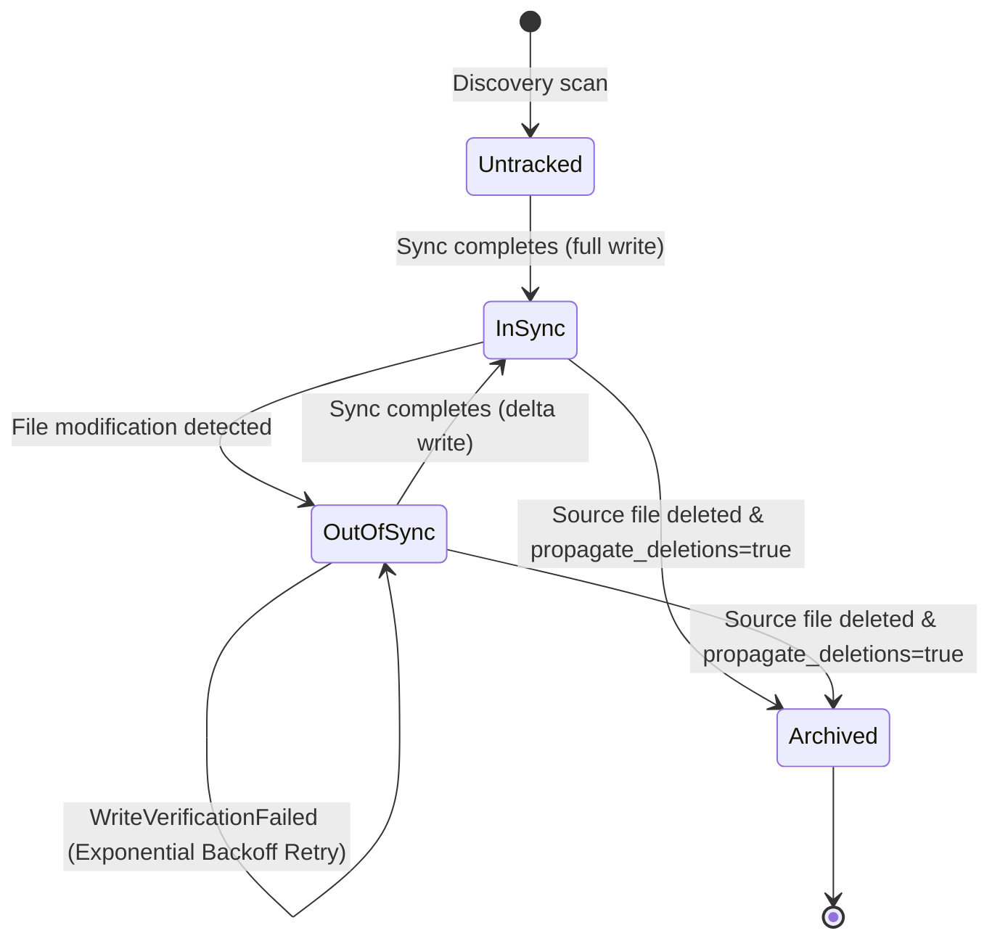
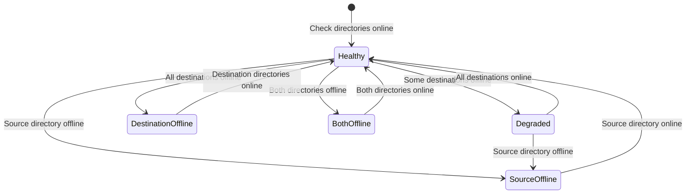

# Behavioral Specification: syncdir
 
> Last verified against: 7316ffc
 
| Field | Value |
|-------|-------|
| **Project** | syncdir |
| **Version** | 0.1.13 |
| **Last Updated** | 2026-09-10 |

---

## Module/Component Contracts

### 1. Config Module
 
> Handles configuration file loading, path sanitization, and invariant validation.
 
#### Public API
 
| Function / Struct | Signature | Returns | Errors |
|-------------------|-----------|---------|--------|
| `Config::load` | `(path: &Path) -> Result<Config, SyncError>` | `Config` | `SyncError::Io` (read failed), `SyncError::Config` (parse failure) |
| `Config::validate` | `(&self) -> Result<(), SyncError>` | `()` | `SyncError::Validation` (invalid parameters, relative paths, or missing destination directories) |
| `Config::resolved_source_dir` | `(&self) -> &Path` | `&Path` | — (pure non-blocking getter) |
| `Config::destinations` | `(&self) -> &DestinationCollection` | `&DestinationCollection` | — |
| `Config::resolved_dest_dirs` | `(&self) -> Vec<PathBuf>` | `Vec<PathBuf>` | — |
| `Config::target_configs` | `(&self) -> Vec<TargetSyncConfig>` | `Vec<TargetSyncConfig>` | — |
| `Config::builder` | `(source_dir: impl Into<PathBuf>) -> ConfigBuilder` | `ConfigBuilder` | — |
| `ConfigBuilder::new` | `(source_dir: impl Into<PathBuf>) -> Self` | `ConfigBuilder` | — |
| `ConfigBuilder::dest_dir` | `(mut self, dest: impl Into<PathBuf>) -> Self` | `ConfigBuilder` | — |
| `ConfigBuilder::dest_dirs` | `(mut self, dirs: impl IntoIterator<Item = impl Into<PathBuf>>) -> Self` | `ConfigBuilder` | — |
| `ConfigBuilder::add_dest_dir` | `(mut self, dir: impl Into<PathBuf>) -> Self` | `ConfigBuilder` | — |
| `ConfigBuilder::build` | `(self) -> Result<Config, SyncError>` | `Config` | `SyncError::Validation` (validates all configuration invariants) |
| `ConfigBuilder::build_unvalidated` | `(self) -> Config` | `Config` | — (bypasses invariant validation; test fixtures only) |
| `ConfigBuilder::try_build` | `(self) -> Result<Config, SyncError>` | `Config` | `SyncError::Validation` (alias for `build`) |
| `TargetDir::new` | `(path: impl Into<PathBuf>) -> Self` | `TargetDir` | — |
| `TargetDir::validate` | `(&self, role: &str) -> Result<(), SyncError>` | `()` | `SyncError::Validation` (invalid drive or UNC syntax) |
| `TargetDir::as_path` | `(&self) -> &Path` | `&Path` | — |
| `TargetDir::to_path_buf` | `(&self) -> PathBuf` | `PathBuf` | — |
| `DestinationCollection::new` | `(destinations: impl IntoIterator<Item = TargetDir>) -> Self` | `DestinationCollection` | — (case-insensitive dedup) |
| `DestinationCollection::iter` | `(&self) -> impl Iterator<Item = &TargetDir>` | `Iterator` | — |
| `DestinationCollection::len` | `(&self) -> usize` | `usize` | — |
| `DestinationCollection::is_empty` | `(&self) -> bool` | `bool` | — |
| `DestinationCollection::get` | `(&self, idx: usize) -> Option<&TargetDir>` | `Option<&TargetDir>` | — |
| `DestinationCollection::to_path_bufs` | `(&self) -> Vec<PathBuf>` | `Vec<PathBuf>` | — |
| `TargetSyncConfig::from_config` | `(config: &Config, dest_dir: PathBuf) -> Self` | `TargetSyncConfig` | — |
| `TargetSyncConfig::builder` | `(source_dir: impl Into<PathBuf>, dest_dir: impl Into<PathBuf>) -> TargetSyncConfigBuilder` | `TargetSyncConfigBuilder` | — |
| `TargetSyncConfig::block_size_nonzero` | `(&self) -> std::num::NonZeroU64` | `NonZeroU64` | — (safely defaults to 64KB on zero) |
| `TargetSyncConfigBuilder::build` | `(self) -> Result<TargetSyncConfig, SyncError>` | `TargetSyncConfig` | `SyncError::Validation` |
| `preprocess_config_toml` | `(raw_toml: &str) -> String` | `String` | — (preserves multi-line arrays and quotes) |
| `system_root` | `() -> PathBuf` | `PathBuf` | — |
 
#### Behavioral Scenarios
 
[HAPPY] Config file successfully loaded and validated
GIVEN a configuration file at a valid path with source "C:/Src" and destination "D:/Dest" (both accessible folders)
WHEN `load` is called followed by `validate`
THEN a valid `Config` struct is returned
AND validation succeeds

[HAPPY] Single-backslash UNC path normalization
GIVEN a destination path configured with a single leading backslash `"\172.16.0.60\scada_data"`
WHEN `resolved_dest_dirs` is called
THEN the path is automatically normalized to double-backslash UNC `"\\172.16.0.60\scada_data"`
AND a warning is logged

[HAPPY] Missing source directory at startup (soft validation)
GIVEN a config where `source_dir` points to a non-existent path "X:/Invalid"
WHEN `validate` is called
THEN validation succeeds
AND a warning is logged
 
[ERROR] Zero debounce seconds
GIVEN a config where `debounce_seconds` is zero
WHEN `validate` is called
THEN `SyncError::Validation("Debounce seconds must be greater than zero")` is returned

[ERROR] Zero retry interval seconds
GIVEN a config where `retry_interval_seconds` is zero
WHEN `validate` is called
THEN `SyncError::Validation("Retry interval seconds must be greater than zero")` is returned

[ERROR] No destination directory specified
GIVEN a config where `dest_dir` is `None` and `dest_dirs` is `None` (or empty)
WHEN `validate` is called
THEN `SyncError::Validation("At least one destination directory must be specified (via dest_dir or dest_dirs)")` is returned

[ERROR] Invalid relative destination path
GIVEN a config where destination path is a relative path "relative/folder/path" (not starting with `C:\` or `\\`)
WHEN `validate` is called
THEN `SyncError::Validation` is returned rejecting the invalid destination path format

[ERROR] Structural UNC path validation missing share name
GIVEN a destination path `\\hostname` without a share name component
WHEN `validate` is called on `TargetDir`
THEN `SyncError::Validation` is returned rejecting the path

[ERROR] TargetSyncConfigBuilder validation invariants failure
GIVEN a `TargetSyncConfigBuilder` configured with a recursive sync loop (`source == dest` or nested paths), zero timeouts, or `block_sync_threshold_bytes < block_size_bytes`
WHEN `build` is called
THEN `SyncError::Validation` is returned
AND construction fails

[ERROR] ConfigBuilder immediate invariant validation failure
GIVEN a `ConfigBuilder` configured with invalid parameters (zero debounce, zero retry interval, block size > 64MB, `block_sync_threshold_bytes < block_size_bytes`, missing destination, or recursive directory containment)
WHEN `build` is called
THEN `SyncError::Validation` is returned
AND construction fails immediately

---

### 2. Path Util Module
 
> Pure leaf module providing path canonicalization, slash normalization, component collapsing, and UNC parsing.
 
#### Public API
 
| Function | Signature | Returns | Notes |
|----------|-----------|---------|-------|
| `normalize_path` | `(path: impl AsRef<Path>) -> PathBuf` | `PathBuf` | Replaces `/` with `\`, normalizes root backslashes, collapses `.` |
| `parse_unc_host_and_share` | `(path: impl AsRef<Path>) -> Option<(&str, &str)>` | `Option<(&str, &str)>` | Extracts host and share from UNC paths |
| `collapse_components` | `(path: impl AsRef<Path>) -> PathBuf` | `PathBuf` | Lexically resolves `..` parent segments without disk I/O |

#### Behavioral Scenarios

[HAPPY] Root backslash normalization
GIVEN a single backslash path `"\\"` or `"/"`
WHEN `normalize_path` is called
THEN it returns `"\\"` without generating triple backslashes

[HAPPY] UNC Host and Share extraction
GIVEN a valid UNC path `"\\\\server\\share\\sub\\file.txt"`
WHEN `parse_unc_host_and_share` is called
THEN `Some(("server", "share"))` is returned

[HAPPY] Component collapsing of parent traversal
GIVEN a path `"C:\\source\\subdir\\..\\dest"`
WHEN `collapse_components` is called
THEN it returns `"C:\\source\\dest"`

---

### 3. DB Module (HashStore)

> Manages the local persistence of file signatures and metadata via SQLite.

#### Public API

| Function / Trait | Signature | Returns | Errors |
|------------------|-----------|---------|--------|
| `HashStore::get_file` | `(&self, path: &Path) -> Result<Option<FileRecord>, SyncError>` | `Option<FileRecord>` | `SyncError::Db` |
| `HashStore::save_file` | `(&self, record: &FileRecord, hashes: &[BlockHash]) -> Result<(), SyncError>` | `()` | `SyncError::Db` |
| `HashStore::get_block_hashes` | `(&self, file_id: i64) -> Result<Vec<BlockHash>, SyncError>` | `Vec<BlockHash>` | `SyncError::Db` |
| `HashStore::delete_file` | `(&self, path: &Path) -> Result<(), SyncError>` | `()` | `SyncError::Db` |
| `HashStore::list_files` | `(&self) -> Result<Vec<PathBuf>, SyncError>` | `Vec<PathBuf>` | `SyncError::Db` |
| `SqliteHashStore::new` | `(db_path: &Path, config: impl Into<StoreConfig>) -> Result<Self, SyncError>` | `SqliteHashStore` | `SyncError::Db` |
| `MockHashStore::new` | `() -> Self` | `MockHashStore` | — |
| `path_to_sqlite_key` | `(path: &Path) -> Result<String, SyncError>` | `String` | `SyncError::Validation` |
| `StoreConfig::new` | `(block_size_bytes: u64, block_sync_threshold_bytes: u64) -> Self` | `StoreConfig` | — |

#### Behavioral Scenarios

[HAPPY] Canonical path key conversion for SQLite
GIVEN a relative path with Windows backslashes `r"documents\subfolder\notes.txt"`
WHEN `path_to_sqlite_key` is called
THEN the path is returned as a forward-slash key `"documents/subfolder/notes.txt"`

[HAPPY] Safe directory deletion without wildcard expansion
GIVEN records for `"test_1/file.txt"` and `"test-1/file.txt"` in SQLite
WHEN `delete_file` is called for `"test_1"`
THEN only `"test_1/file.txt"` is removed using exact prefix `substr(relative_path, 1, length(?1) + 1) = ?1 || '/'`
AND `"test-1/file.txt"` remains intact

[HAPPY] Efficient UPSERT with RETURNING id
GIVEN a new file record saved via `save_file`
WHEN SQLite executes the UPSERT statement
THEN `RETURNING id` provides the row ID directly without an extra `SELECT id` query

---

### 4. Sync Module (SyncEngine)
 
> Performs streaming delta sync, single-pass I/O, contiguous block coalescing, reparse checks, and worker queue processing.
 
#### Public API
 
| Function / Component | Signature | Returns | Errors |
|----------------------|-----------|---------|--------|
| `SyncEngine::sync_file` | `(&self, path: &Path) -> Result<(), SyncError>` | `()` | `SyncError::Io`, `SyncError::Db`, `SyncError::WriteVerificationFailed` |
| `SyncEngine::sync_file_buffered` | `(&self, path: &Path, scratch: &mut [u8]) -> Result<(), SyncError>` | `()` | `SyncError::Io`, `SyncError::Db`, `SyncError::WriteVerificationFailed` |
| `SyncEngine::sync_file_to_dest_buffered` | `(&self, path: &Path, dest_dir: &Path, scratch: &mut [u8]) -> Result<(), SyncError>` | `()` | `SyncError::Io`, `SyncError::Db`, `SyncError::WriteVerificationFailed` |
| `SyncEngine::delete_file` | `(&self, path: &Path) -> Result<(), SyncError>` | `()` | `SyncError::Io` |
| `SyncEngine::delete_file_from_dest` | `(&self, path: &Path, dest_dir: &Path) -> Result<(), SyncError>` | `()` | `SyncError::Io` |
| `SyncEngine::prune_archive` | `(&self, dest_dir: &Path) -> Result<(), SyncError>` | `()` | `SyncError::Io` |
| `SyncEngine::run_full_scan` | `(&self) -> Result<ScanOutcome, SyncError>` | `ScanOutcome` | `SyncError::Io`, `SyncError::Db` |
| `SyncEngine::invalidate_verified_dirs` | `(&self)` | `()` | — (default no-op clearing directory safety cache) |
| `start_sync_worker` | `<E: SyncEngine + 'static>(context: SyncWorkerContext<E>) -> Result<JoinHandle<()>, SyncError>` | `Result<JoinHandle<()>, SyncError>` | `SyncError::Io` (thread spawn failure) |
| `SyncWorkerRunner::new` | `(context: SyncWorkerContext<E>) -> Self` | `SyncWorkerRunner<E>` | — (discrete, testable worker state machine) |
| `SyncWorkerRunner::handle_command` | `(&mut self, cmd: SyncCommand) -> bool` | `bool` | — (false indicates shutdown requested) |
| `SyncWorkerRunner::tick` | `(&mut self, now: Instant) -> Result<WorkerTickOutcome, SyncError>` | `WorkerTickOutcome` | `SyncError` |
| `LocalSyncEngine::new` | `(db: S, config: impl Into<TargetSyncConfig>) -> Self` | `LocalSyncEngine<S>` | — |
| `LocalSyncEngine::acquire_dirty_range_lease` | `(&self) -> DirtyRangeLease<'_>` | `DirtyRangeLease<'_>` | — (reusable scratch buffer lease for zero-lock streaming) |
| `LocalSyncEngine::invalidate_verified_dirs` | `(&self)` | `()` | — (clears reparse cache) |
| `LocalSyncEngine::evict_verified_dir` | `(&self, dir: &Path)` | `()` | — (evicts dir and descendants from cache) |
| `DirtyBlockRange::new` | `(block_size: NonZeroU64) -> Self` | `DirtyBlockRange` | — (infallible zero-panic constructor) |
| `DirtyBlockRange::new_nonzero` | `(block_size: NonZeroU64) -> Self` | `DirtyBlockRange` | — (alias for `new`) |
| `DirtyBlockRange::try_new` | `(block_size: u64) -> Result<Self, SyncError>` | `DirtyBlockRange` | `SyncError::Validation` (if `block_size == 0`) |
| `DirtyBlockRange::block_size_nonzero` | `(&self) -> NonZeroU64` | `NonZeroU64` | — |
| `MockSyncEngine::new` | `() -> Self` | `MockSyncEngine` | — |
| `SourceConnectivityTracker::new` | `(initial: bool) -> Self` | `SourceConnectivityTracker` | — |
| `DebounceQueue::new` | `(max_capacity: usize) -> Self` | `DebounceQueue` | — |
| `DebounceQueue::len` | `(&self) -> usize` | `usize` | — (total count of pending syncs and deletes) |
| `ReachabilityMonitor::new` | `(target_index: usize, configured_dest: PathBuf, retry_interval_seconds: u64, resolver: Arc<dyn NetworkResolver>) -> Self` | `ReachabilityMonitor` | — |
| `SyncWorkerState::new` | `(block_size_bytes: u64) -> Self` | `SyncWorkerState` | — |
| `calculate_exponential_backoff` | `(attempts: u32, base_interval: Duration) -> Duration` | `Duration` | Capped at 300s |
| `is_metadata_up_to_date_raw` | `(record_mod: i64, record_size: i64, src_mod: i64, src_size: i64, dest_mod: i64, dest_size: i64) -> bool` | `bool` | Evaluates SMB ±2000ms timestamp tolerance |
| `verify_destination_not_reparse` | `(dest_dir: &Path, rel_path: &Path) -> Result<(), SyncError>` | `()` | `SyncError::Validation` (rejects directory junctions in path) |
| `verify_destination_not_reparse_cached` | `(dest_dir: &Path, rel_path: &Path, verified_dirs: &mut HashSet<PathBuf>) -> Result<Option<Metadata>, SyncError>` | `Option<Metadata>` | `SyncError::Validation` (caches verified ancestor and root directories) |
| `is_safe_relative_path` | `(path: &Path) -> bool` | `bool` | — (rejects `..`, ADS, drive letters, reserved names) |
 
#### Behavioral Scenarios

[SECURITY] Archive prune root junction protection
GIVEN an archive directory that is an NTFS junction or symlink
WHEN `prune_archive` is called
THEN `fs::symlink_metadata` inspects the root path before traversal
AND `SyncError::Validation` is returned, refusing to prune arbitrary directories outside the destination tree

[RECOVERY] Truncated destination file detection and repair
GIVEN a destination file whose size does not match the source size (e.g. truncated or corrupted prior write)
WHEN `sync_file_to_dest_core` executes
THEN the size mismatch triggers re-synchronization rather than skipping
AND the destination file is overwritten and repaired to match the source file

[PERFORMANCE] Two-phase directory reparse verification
GIVEN a directory path verification check via `LocalSyncEngine::verify_destination_cached`
WHEN cache membership is verified
THEN the mutex lock is released before querying remote filesystem metadata
AND re-acquired only to record newly verified paths, preventing remote SMB lock contention

[TESTABILITY] SyncWorkerRunner discrete tick processing
GIVEN a `SyncWorkerRunner` state machine and an event queue
WHEN `tick(now)` is called with synthetic timestamps
THEN reachability, debounce expiry, file transfer, and retry backoff are processed deterministically without thread sleeps

[RECOVERY] Directory reparse cache invalidation
GIVEN a cached directory set in `LocalSyncEngine`
WHEN `invalidate_verified_dirs` is called (upon reconnect or full scan)
THEN all cached entries are cleared
AND when `evict_verified_dir(dir)` is called (upon file deletion)
THEN `dir` and all its descendants are purged from the cache

[HAPPY] Single-pass streaming delta sync with contiguous block coalescing
GIVEN a source file $\ge$ 10MB where blocks 2 and 3 were modified
AND the destination file exists
WHEN `sync_file` is called
THEN the file is read in a single streaming pass
AND modified blocks 2 and 3 are coalesced into a single contiguous `DirtyBlockRange` write (2MB seek and 2MB write)
AND destination file length is trimmed via `set_len` to avoid tail remnants

[HAPPY] Write verification retry with exponential backoff
GIVEN a file whose write verification fails (`SyncError::WriteVerificationFailed`)
WHEN the sync worker processes the error
THEN the file is retained in `DebounceQueue`
AND scheduled for retry with exponential backoff delay (capped at 300s)
AND not permanently evicted from the sync queue

[HAPPY] Streamed 64KB small-file write verification
GIVEN a small file (< 10MB) synchronized with `verify_writes = true`
WHEN `verify_small_file_write` executes
THEN the file is streamed in 64KB stack chunks into a Blake3 hasher without allocating a full-file heap buffer

[HAPPY] Ancestor directory reparse point traversal protection
GIVEN a destination path containing intermediate directory junctions or symlinks
WHEN `verify_destination_not_reparse` executes
THEN all ancestor directory components between `dest_dir` and the target file are verified
AND any directory junction is rejected with `SyncError::Validation`

[SECURITY/VALIDATION] DirtyBlockRange zero block size rejection
GIVEN an invocation of `DirtyBlockRange::try_new(0)`
WHEN the constructor validates the block size
THEN `SyncError::Validation("DirtyBlockRange block_size must be greater than zero")` is returned
AND `new` requires `NonZeroU64`, preventing zero block size values at compile time

[CONCURRENCY] SyncWorker non-spinning poll timeout during network offline
GIVEN a worker queue with expired debounce items
AND the target destination or source is detected as offline
WHEN `calculate_worker_poll_timeout` determines the receiver timeout
THEN a minimum sleep of 1 second is enforced to prevent 100% CPU busy-spinning

[PERFORMANCE] LocalSyncEngine signature cache hit fast-path
GIVEN a file synchronization task where the local SQLite record matches source file size and modification time
WHEN `sync_file_to_dest_core` executes
THEN `Ok(None)` is returned immediately without querying remote SMB file metadata or performing redundant reparse traversals

[CONCURRENCY] RAII DirtyRangeLease zero-lock streaming
GIVEN a multi-gigabyte delta sync operation
WHEN `acquire_dirty_range_lease` checks out a `DirtyBlockRange` buffer
THEN the engine mutex is released before disk reads, Blake3 hashing, and network I/O begin
AND the buffer is automatically returned to the pool upon lease drop

[HAPPY] Decoupled archive pruning with depth limit 32
GIVEN a deleted file operation
WHEN `delete_file_from_dest` executes
THEN the target file is renamed to `.syncdir_archive` without triggering an immediate full archive crawl
AND archive pruning is executed periodically (hourly) and post-full-scan
AND `prune_archive` ignores symlinks/junctions and enforces recursion depth $\le 32$

[HAPPY] Archive pruning filename timestamp anchor & nested directory inheritance
GIVEN an archive directory containing files moved via NTFS rename whose original filesystem creation timestamps are older than `max_age_days`
AND the filename prefix `{timestamp}_` reflects recent archival within retention limits
WHEN `prune_archive` executes
THEN the file is retained based on its filename timestamp anchor
AND files in nested subdirectories inherit the timestamp anchor from the top-level archived folder

[CONCURRENCY] DebounceQueue action replacement at capacity
GIVEN a `DebounceQueue` at maximum capacity (`pending_count >= max_capacity`)
AND a path currently pending in `pending_deletes` receives a sync notification (or vice-versa)
WHEN `enqueue_sync` is called
THEN the action replacement succeeds without rejecting the modification
AND dead queue entries in the min-heap are pruned via `compact_heaps`

[HAPPY] Resilient full directory scan
GIVEN a directory scan encountering locked or `PermissionDenied` folders
WHEN `scan_dir` executes
THEN the inaccessible folder is logged and skipped
AND the remainder of the directory tree continues to be scanned

[HAPPY] Windows case-insensitive deletion detection
GIVEN a file renamed from "Notes.txt" to "notes.txt" on Windows
WHEN `run_full_scan` executes
THEN case-insensitive path tracking recognizes the file as present
AND does not issue a false-positive file deletion command

[HAPPY] Disjoint path resolution worker routing
GIVEN a destination path whose mapped drive letter is disconnected
WHEN the worker processes sync and delete commands
THEN operations are executed against the active resolved UNC share path

---

### 5. Startup Module

> Manages Windows startup registry integration.

#### Public API

| Function / Trait | Signature | Returns | Errors |
|------------------|-----------|---------|--------|
| `StartupRegistry::is_registered` | `() -> Result<bool, SyncError>` | `bool` | `SyncError::Io` (failed to get current exe path) |
| `StartupRegistry::register` | `() -> Result<(), SyncError>` | `()` | `SyncError::Config` (registry write failure) |
| `StartupRegistry::unregister` | `() -> Result<(), SyncError>` | `()` | — |
| `RegistryBackend` | `trait: Send + Sync` | — | — |
| `MockStartupRegistry::new` | `(initial: bool) -> Self` | `MockStartupRegistry` | — |

---

### 6. Monitor Module
 
> Watches the source directory for file modifications, creations, deletions, and renames.
 
#### Public API
 
| Function | Signature | Returns | Errors |
|----------|-----------|---------|--------|
| `DirectoryWatcher::start` | `(source_path: impl AsRef<Path>, tx: Sender<SyncCommand>) -> Result<DirectoryWatcher, SyncError>` | `DirectoryWatcher` | `SyncError::Watcher` (failed to set up watcher) |
| `DirectoryWatcher::handle_watcher_result` | `(res: Result<Event, notify::Error>, source_root: &Path, tx: &Sender<SyncCommand>)` | `()` | — (dispatches events or recovery scan) |

#### Behavioral Scenarios

[RECOVERY] Watcher buffer overflow recovery full scan trigger
GIVEN a directory watcher encountering an OS buffer overflow error (`notify::Error` from `ReadDirectoryChangesW`)
WHEN `handle_watcher_result` processes the error
THEN a warning is logged
AND `SyncCommand::TriggerFullScan` is dispatched to the sync worker channel to guarantee eventually consistent state

---

### 7. Tray Module

> Manages the system tray icon, tooltips, checkable context menus, and event notifications.

#### Public API

| Function / Component | Signature | Returns | Errors |
|----------------------|-----------|---------|--------|
| `run_tray` | `<H: TrayActionHandler + ?Sized>(event_loop: EventLoop<UserEvent>, action_handler: Arc<H>, dests: Vec<DestinationState>) -> Result<TrayExitReason, SyncError>` | `TrayExitReason` | `SyncError::Tray` |
| `open_path` | `(path: &Path) -> Result<(), SyncError>` | `()` | Requires verified `%SystemRoot%\explorer.exe` |
| `TrayController::new` | `(...) -> Result<Self, SyncError>` | `TrayController<H>` | `SyncError::Tray` |
| `DestinationState::new` | `(path: impl Into<PathBuf>, is_online: impl Into<ConnectivityState>) -> Self` | `DestinationState` | — |
| `DestinationState::with_resolved_unc` | `(mut self, resolved_unc: impl Into<Option<PathBuf>>) -> Self` | `DestinationState` | — |
| `TrayState::new` | `(initial_dest_online: Vec<ConnectivityState>) -> Self` | `TrayState` | — |
| `TrayState::empty` | `() -> Self` | `TrayState` | — |
| `TrayState::update_target_status` | `(&mut self, target_index: usize, online: ConnectivityState) -> bool` | `bool` (changed) | — |
| `TrayState::update_watcher_status` | `(&mut self, source_online: ConnectivityState, watcher_active: WatcherState) -> bool` | `bool` (changed) | — |
| `TrayState::set_scan_notice` | `(&mut self, notice: Option<String>) -> bool` | `bool` | — |
| `TrayState::overall_status` | `(&self) -> EngineStatus` | `EngineStatus` | — |
| `TrayState::tooltip_text` | `(&self) -> String` | `String` | — |

---

### 8. Daemon Module (SyncDaemon)

> Coordinates daemon lifecycle, worker thread spawning, watcher event loops, loop detection, and clean shutdown.

#### Public API

| Function / Struct | Signature | Returns | Errors |
|-------------------|-----------|---------|--------|
| `SyncDaemon::start` | `(config: Config, app_dir: &Path, observer: Option<Arc<dyn SyncStatusObserver>>) -> Result<Self, SyncError>` | `SyncDaemon` | `SyncError::Db`, `SyncError::Validation` |
| `SyncDaemon::start_with_factory` | `<F: SyncEngineFactory + 'static>(config: Config, app_dir: &Path, observer: Option<Arc<dyn SyncStatusObserver>>, factory: F) -> Result<Self, SyncError>` | `SyncDaemon` | `SyncError::Db`, `SyncError::Validation` |
| `SyncDaemon::validate_target_loops` | `(config: &Config, resolver: &dyn NetworkResolver) -> Result<(), SyncError>` | `()` | `SyncError::Validation` (non-blocking loop detection using `try_resolve_unc_path`) |
| `SyncDaemon::command_tx` | `(&self) -> Sender<SyncCommand>` | `Sender<SyncCommand>` | — |
| `SyncDaemon::config` | `(&self) -> &Config` | `&Config` | — |
| `SyncDaemon::shutdown` | `(mut self)` | `()` | — |
| `DaemonTrayHandler::new` | `(config_path: PathBuf, command_tx: Sender<SyncCommand>, registry: R) -> Self` | `DaemonTrayHandler` | — |

---

### 9. Net Module (Networking FFI)

> Manages Win32 UNC and SMB connection resolution, mapped drive lookup, and alternate path fallbacks.

#### Public API

| Function / Trait | Signature | Returns | Errors |
|----------|-----------|---------|--------|
| `trait NetworkResolver` | `Send + Sync` | — | Abstraction for network resolution and SMB sessions |
| `Win32NetworkResolver` | `struct` | `Win32NetworkResolver` | Production Win32 implementation |
| `MockNetworkResolver::new` | `() -> Self` | `MockNetworkResolver` | In-memory mock for testing |
| `resolve_mapped_drive_unc` | `(drive_prefix: &str) -> Option<String>` | `Option<String>` | Uses stack-allocated FFI buffers |
| `try_resolve_unc_path` | `(path: impl AsRef<Path>) -> PathBuf` | `PathBuf` | — |
| `establish_smb_connection` | `(unc_path: impl AsRef<Path>) -> Result<(), SyncError>` | `()` | `SyncError::Validation`, `SyncError::Io` |
| `find_mapped_drive_for_unc` | `(unc_path: impl AsRef<Path>) -> Option<PathBuf>` | `Option<PathBuf>` | — |
| `try_resolve_alternate_path` | `(path: impl AsRef<Path>) -> PathBuf` | `PathBuf` | — |

---

### 10. Error Module

> Defines application-wide typed error structures and causal source wrapping.

#### Public API

| Type | Signature / Variants | Notes |
|------|----------------------|-------|
| `SyncError` | `#[non_exhaustive] enum` | Crate-wide unified error type |
| `SyncError::Io` | `(#[from] std::io::Error)` | Standard I/O errors |
| `SyncError::Db` | `(String, #[source] Option<Box<dyn Error + Send + Sync>>)` | SQLite database errors |
| `SyncError::Config` | `(String, #[source] Option<Box<dyn Error + Send + Sync>>)` | TOML parse or validation errors |
| `SyncError::Validation` | `(String)` | Semantic configuration validation errors |
| `SyncError::WriteVerificationFailed` | `{ path: PathBuf }` | Distinct retryable write integrity failure |
| `SyncError::LockPoison` | `(String, #[source] Option<Box<dyn Error + Send + Sync>>)` | Mutex poisoning errors |
| `SyncError::Watcher` | `(String, #[source] Option<Box<dyn Error + Send + Sync>>)` | Directory watcher errors |
| `SyncError::Tray` | `(String, #[source] Option<Box<dyn Error + Send + Sync>>)` | GUI / Tray notification errors |
| `SyncError::Registry` | `(String, #[source] Option<Box<dyn Error + Send + Sync>>)` | Windows registry errors |
| `SyncError::validation` | `(msg: impl Into<String>) -> Self` | Semantic validation error constructor |
| `SyncError::validation_security` | `(msg: impl Into<String>) -> Self` | Security validation constructor (junctions, traversal) |
| `SyncError::validation_invariant` | `(msg: impl Into<String>) -> Self` | Domain invariant constructor (debounce, intervals) |
| `SyncError::is_permanent_validation_failure` | `(&self) -> bool` | Detects non-retryable fatal violations |
| `is_network_offline_io` | `(io_err: &std::io::Error) -> bool` | Maps 9 standard `ErrorKind` variants (TimedOut, ConnectionReset, ConnectionAborted, NotConnected, BrokenPipe, NetworkUnreachable, HostUnreachable, NetworkDown, ConnectionRefused) and 11 Win32 error codes (53, 59, 64, 65, 67, 121, 1326) |

#### Behavioral Scenarios

[ERROR] Permanent validation failure classification and queue eviction
GIVEN a `SyncError` produced during sync worker execution
WHEN `is_permanent_validation_failure` is evaluated
THEN permanent security and invariant violations (path traversal, directory junctions, reserved DOS names) return `true`
AND the item is evicted from the debounce retry queue without looping retries
AND transient errors return `false`, preserving exponential backoff retries

---
 
## Data Models
 
### Config
Represents the runtime parameters loaded from `config.toml`. Fields are private and accessed via getters.
- `source_dir`: PathBuf (validated to exist and be a directory)
- `dest_dir`: Option<PathBuf> (optional primary destination directory)
- `dest_dirs`: Option<Vec<PathBuf>> (optional additional destination directories)
- `debounce_seconds`: u64 (must be > 0)
- `retry_interval_seconds`: u64 (must be > 0)
- `propagate_deletions`: bool
- `block_sync_threshold_bytes`: u64
- `block_size_bytes`: u64
- `verify_writes`: bool

### TargetSyncConfig
Isolated target sync configuration for an individual worker with private fields and public getters.
- `source_dir`: PathBuf
- `dest_dir`: PathBuf
- `block_size_bytes`: u64
- `block_sync_threshold_bytes`: u64
- `verify_writes`: bool
- `debounce_seconds`: u64
- `retry_interval_seconds`: u64
- `propagate_deletions`: bool

### ConnectivityState
Explicit domain enum representing connection reachability.
- `Online`: Target or source directory is accessible.
- `Offline`: Target or source directory is unreachable.

### WatcherState
Explicit domain enum representing real-time filesystem watcher state.
- `Active`: DirectoryWatcher OS hook is actively monitoring events.
- `Degraded`: DirectoryWatcher encountered an error or was paused.

### DestinationState
Encapsulates destination path, current reachability, and optional resolved UNC path for UI.
- `path`: PathBuf
- `is_online`: ConnectivityState
- `resolved_unc`: Option<PathBuf>

### SourceConnectivityTracker
Encapsulates thread-safe source presence state wrapping an `Arc<AtomicBool>`.

### DebounceQueue
In-memory queue managing pending sync and delete paths with per-path debounce deadlines and capacity enforcement.

### ReachabilityMonitor
Worker sub-component managing target destination health probes, alternate UNC resolution, and observer notifications.

### SyncWorkerState
Worker execution state container tracking scratch buffer, failure counts, and archive pruning intervals.

### SyncWorkerRunner
Testable sync worker state machine orchestrating reachability, debouncing, and execution.
- `context`: SyncWorkerContext<E>
- `queue`: DebounceQueue
- `reachability`: ReachabilityMonitor
- `state`: SyncWorkerState
- `drain_threshold`: usize

### WorkerTickOutcome
Discrete tick outcome for `SyncWorkerRunner`.
- `Continue`: Continue processing events and commands.
- `ShutdownRequested`: Worker should terminate cleanly.

### StoreConfig
Minimal configuration parameters required by `SqliteHashStore`.
- `block_size_bytes`: u64
- `block_sync_threshold_bytes`: u64
 
### FileRecord
Represents a file tracked in the signature database.
- `id`: Option<i64> (database rowid)
- `relative_path`: PathBuf (unique identifier)
- `file_size`: i64
- `last_modified`: i64

### DirtyBlockRange
Coalesced contiguous dirty block range for batched delta writes with strongly typed non-zero block size.
- `start_block`: u64 (private)
- `block_count`: u64 (private)
- `block_size`: std::num::NonZeroU64 (private)
- `data`: Vec<u8> (private)

### DirtyRangeLease<'a>
RAII lease checked out from `LocalSyncEngine::dirty_range_pool` allowing mutable buffer access during large-file delta streaming without holding locks across disk or SMB network operations. Automatically clears and returns the buffer to the pool on `Drop`.

### EngineStatus
Represents the aggregated presence state across source and destination targets.
- `Healthy` (source and all destination directories are online — Blue icon)
- `Degraded` (source online, but some destination directories are offline — Orange icon)
- `SourceOffline` (source directory offline — Red icon)
- `DestinationOffline` (all destination directories offline — Yellow icon)
- `BothOffline` (source and all destination directories offline — Gray icon)

### TargetStatusUpdate
Per-target status report sent from worker threads to the tray event loop.
- `target_index`: usize
- `dest_online`: ConnectivityState

### UserEvent
Custom events processed by the winit main thread UI event loop.
- `Menu(MenuEvent)`
- `StatusUpdate(TargetStatusUpdate)`
- `WatcherStatus { source_online: ConnectivityState, watcher_active: WatcherState }`
- `ConfigReloadResult(Result<(), SyncError>)`

### TrayExitReason
Represents the reason the system tray event loop exited.
- `UserExit` (user selected "Exit" from context menu)
- `Restart` (user selected "Reload Config", triggering process restart)

### TrayState
Pure state container tracking visual status, notice messages, and connectivity for system tray UI.
- `source_online`: ConnectivityState
- `watcher_active`: WatcherState
- `dest_online`: Vec<ConnectivityState>
- `scan_notice`: Option<String>

### SingleInstanceGuard
RAII guard holding the single-instance Windows named mutex handle (`Local\syncdir_single_instance`).

### SyncCommand
Commands passed to the worker channel.
- `FileModified(PathBuf)`
- `FileDeleted(PathBuf)`
- `TriggerFullScan`

---
 
## State Machines
 
### File Synchronization State
 

```mermaid
stateDiagram-v2
    [*] --> Untracked : Discovery scan
    Untracked --> InSync : Sync completes (full write)
    InSync --> OutOfSync : File modification detected
    OutOfSync --> InSync : Sync completes (delta write)
    OutOfSync --> OutOfSync : WriteVerificationFailed (Exponential Backoff Retry)
    InSync --> Archived : Source file deleted & propagate_deletions=true
    OutOfSync --> Archived : Source file deleted & propagate_deletions=true
    Archived --> [*]
```

### Tray Engine Status State Machine


```mermaid
stateDiagram-v2
    [*] --> Healthy : Check directories online
    Healthy --> Degraded : Some destinations offline
    Healthy --> SourceOffline : Source directory offline
    Healthy --> DestinationOffline : All destinations offline
    Healthy --> BothOffline : Both directories offline
    Degraded --> Healthy : All destinations online
    Degraded --> SourceOffline : Source directory offline
    SourceOffline --> Healthy : Source directory online
    DestinationOffline --> Healthy : Destination directories online
    BothOffline --> Healthy : Both directories online
```

---
 
## Command/CLI Contracts
 
The daemon runs in the background. It is invoked with options:
```sh
syncdir [OPTIONS]
```
 
| Option | Description | Action | Exit Code |
|--------|-------------|--------|-----------|
| `--help`, `-h` | Prints version, description, copyright (`(c) 2026 Wendell Saligan`), repository URL, and usage options | Prints to stdout | `0` |
| `--version`, `-v` | Prints current package version and copyright | Prints to stdout | `0` |
| `--register-startup` | Registers the daemon in Windows startup registry | Writes HKCU run key (with `--autostart` suffix) | `0` (success), `1` (registry error) |
| `--unregister-startup` | Unregisters the daemon from Windows startup registry | Deletes HKCU run key | `0` (success), `1` (registry error) |
| `--autostart` | Windows Auto-Start trigger | Starts background sync daemon | — |

If no options are specified, the daemon starts the background sync. It defaults to looking for `%APPDATA%\syncdir\config.toml` (loading configuration and initializing DB / tray loop).

---

## Integration Points

### 1. SQLite Database (`sigcache_<hash>.db`)
Isolated local SQLite caches storing block hashes and file metadata per target destination. Validates configuration parameters `block_size_bytes` and `block_sync_threshold_bytes` to prevent database configuration drift. Uses SQLite WAL mode, `PRAGMA foreign_keys = ON`, exact prefix matching `substr(...) = ?1 || '/'`, and `RETURNING id` UPSERTs.

### 2. Filesystem / Network Shares
Local network shares mounted as folder paths or UNC network shares. Delta synchronization reads 1MB block chunks, compares Blake3 hashes, coalesces contiguous writes into `DirtyBlockRange` batches, and writes verified offsets.

### 3. Windows Win32 API Networking (`mpr.lib`)
Integrates `NetworkResolver` trait with `Win32NetworkResolver` invoking `WNetGetConnectionW` and `WNetAddConnection2W` to resolve mapped network drives to UNC paths and automatically establish authenticated SMB sessions using Windows Credential Manager.

### 4. Windows System Notification Area (System Tray)
User interface tray-icon utilizing `tray-icon` and `winit` with `TrayController` for controlling and viewing background sync status. The context menu provides actions for opening configuration, viewing logs, forcing immediate sync, toggling Windows startup, and inspecting destination target statuses.

### 5. Windows Registry (`Software\Microsoft\Windows\CurrentVersion\Run`)
Integrates `StartupRegistry` under HKCU for automatic daemon launch on user login.

### 6. Automated Testing Frameworks
289 automated test cases verifying engine behavior:
- Unit test suite across all modules (235 unit tests in `src/lib.rs`, 3 tests in `src/main.rs`).
- Integration test suite (`tests/integration_tests.rs`: 12 tests).
- Generative property test suite (`tests/property_tests.rs`: 8 proptest suites verifying `is_metadata_up_to_date_raw` and `DirtyBlockRange` chunk coalescing).
- Snapshot regression test suite (`tests/snapshot_tests.rs`: 20 insta golden snapshots).
- Documentation tests (`cargo test --doc`: 11 doctests).

### 7. Development & Release Automation Scripts (`scripts/`)
- `scripts/check-quality.ps1`: Code quality pipeline executing formatting, linter, tests, and static analysis.
- `scripts/build-release.ps1`: Release compilation and artifact packaging with static MSVC CRT linking.
